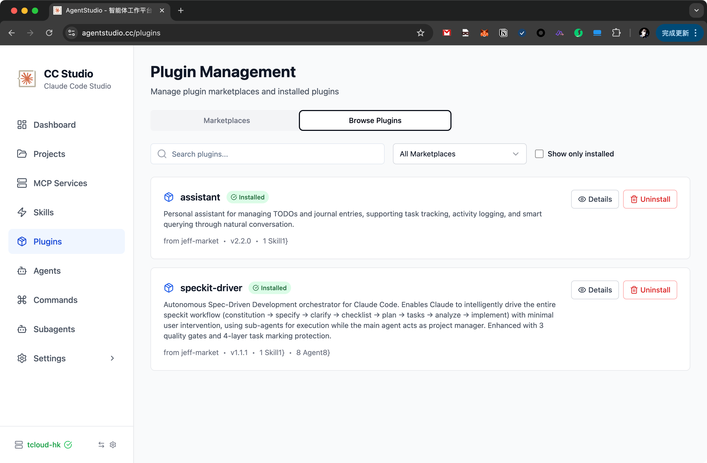

# Agent Studio

<div align="center">


**🤖 Your Personal AI Agent Workspace**

A modern agent workspace platform built on Claude agent SDK

[](https://choosealicense.com/licenses/mit/)
[](https://github.com/okguitar/agentstudio/stargazers)
[](https://github.com/okguitar/agentstudio/issues)

[English](#english) | [中文](#中文)

</div>

---

## English

### 📖 Overview

Agent Studio is a modern web-based personal agent workspace platform built on top of [Claude Code SDK](https://github.com/anthropics/anthropic-quickstarts/tree/main/computer-use-demo). It provides a professional interface to harness the power of AI agents for various tasks, from content editing to code assistance.

Screenshot:

 

### ✨ Key Features

#### 🎨 Modern Web Interface
- **Professional UI**: Clean, intuitive interface designed for productivity
- **Real-time Streaming**: Instant AI responses with streaming support
- **Responsive Design**: Works seamlessly on desktop and mobile devices
- **Dark Mode**: Eye-friendly theme for extended work sessions
- **Multi-language**: Full support for English and Chinese

#### 🤖 Advanced Agent System
- **Built-in Agents**: Ready-to-use agents for slides, chat, and more
- **Custom Agents**: Create specialized agents with custom system prompts
- **Subagents**: Configure AI subagents with specific tool permissions
- **Plugin Architecture**: Extensible agent system with community plugins
- **Session Management**: Persistent conversation history per agent

#### 🔌 MCP Integration
- **MCP Servers**: Integrate with Model Context Protocol servers
- **Tool Discovery**: Automatic detection of available MCP tools
- **Status Monitoring**: Real-time health checks for MCP services
- **Flexible Configuration**: Support for both stdio and HTTP MCP servers

#### 📦 Plugin Marketplace
- **Plugin System**: Install agents, commands, skills, and MCP servers as plugins
- **Marketplace Management**: Add custom or community marketplaces
- **One-Click Install**: Easy installation and management of plugins
- **Version Control**: Track and update plugin versions

#### 📁 Project Management
- **Project-aware**: Organize work into separate project contexts
- **File Browser**: Integrated file explorer for project files
- **Git Integration**: Version control awareness
- **Multi-project**: Switch seamlessly between different projects

#### 🛠️ Developer Tools
- **Skills System**: Reusable code skills for agents
- **Commands**: Custom slash commands for quick actions
- **Tool Renderer**: Visual feedback for AI tool usage
- **API Access**: RESTful API for programmatic integration

#### 🔐 Security & Privacy
- **Local First**: All data stored locally on your machine
- **API Key Management**: Secure storage of API credentials
- **Permission Control**: Fine-grained control over agent capabilities
- **No Telemetry**: Your data never leaves your infrastructure

### 🚀 Quick Start

#### Option 1: Docker (Recommended)

The fastest way to get started:

```bash
# Build and run with Docker Compose
docker build -t agentstudio:latest .
docker-compose up -d

# Access at http://localhost
```

**What you get:**
- ✅ All-in-one container (frontend + backend)
- ✅ Data persistence via Docker volumes
- ✅ Zero configuration needed
- ✅ Easy updates and rollbacks

📖 See [DOCKER.md](DOCKER.md) for detailed Docker deployment guide.

#### Option 2: One-Click Installation

**For Linux & macOS** (User space installation, no sudo required):

```bash
# Install for current user
curl -fsSL https://raw.githubusercontent.com/okguitar/agentstudio/main/scripts/install-macos.sh | bash

# Or for Linux
curl -fsSL https://raw.githubusercontent.com/okguitar/agentstudio/main/scripts/install-linux.sh | bash
```

**For Windows** (PowerShell):

```powershell
# Download and run installer
irm https://raw.githubusercontent.com/okguitar/agentstudio/main/scripts/windows-install.ps1 | iex
```

#### Option 3: Manual Development Setup

**Prerequisites:**
- Node.js 18+ (with npm or pnpm)
- Git

**Installation Steps:**

```bash
# 1. Clone the repository
git clone https://github.com/okguitar/agentstudio.git
cd agentstudio

# 2. Install dependencies (using pnpm recommended)
pnpm install
# or: npm run setup

# 3. Configure environment variables
cp backend/.env.example backend/.env
# Edit backend/.env and add your API keys

# 4. Start development servers
pnpm run dev
# Frontend: http://localhost:3000
# Backend: http://localhost:4936
```


### 📚 Core Concepts

#### Agents
Agents are AI assistants configured with specific:
- **System Prompts**: Define agent personality and behavior
- **Allowed Tools**: Control what the agent can do
- **Permission Mode**: Set approval requirements for actions
- **Claude Version**: Choose which Claude model to use

#### Projects
Projects are workspaces containing:
- Files and directories
- Project-specific agents
- Session histories
- Custom configurations

#### Plugins
Plugins extend Agent Studio with:
- **Agents**: Pre-configured AI agents
- **Commands**: Slash commands for quick actions
- **Skills**: Reusable code snippets
- **MCP Servers**: Additional tool integrations

#### MCP (Model Context Protocol)
MCP servers provide additional capabilities to agents:
- File system operations
- Database access
- API integrations
- Custom tools

### 📖 Usage Examples

#### Creating a Custom Agent

1. Navigate to **Agents** page
2. Click **Create Agent**
3. Configure agent properties:
   - Name and description
   - System prompt
   - Allowed tools
   - Permission mode
4. Start chatting with your agent!

#### Installing Plugins

1. Go to **Plugins** page
2. Add a marketplace (e.g., community marketplace)
3. Browse available plugins
4. Click **Install** on desired plugins
5. Enable plugins in agent configuration

#### Managing Projects

1. Visit **Projects** page
2. Create or select a project
3. Associate agents with the project
4. Work within project context

### 🧪 Development

```bash
# Development mode (frontend + backend)
pnpm run dev

# Run tests
pnpm run test

# Type checking
pnpm run type-check

# Linting
pnpm run lint

# Build for production
pnpm run build
```

### 📦 Tech Stack

**Frontend:**
- React 19 + TypeScript
- Vite (build tool)
- TailwindCSS (styling)
- Zustand (state management)
- React Query (server state)
- React Router (routing)

**Backend:**
- Node.js + Express
- TypeScript
- Claude Agent SDK
- JWT authentication
- File-based storage

### 🤝 Contributing

Contributions are welcome! Please feel free to submit a Pull Request. For major changes, please open an issue first to discuss what you would like to change.

### 📄 License

This project is licensed under the MIT License - see the [LICENSE](LICENSE) file for details.

### 🙏 Acknowledgments

- Built on [Claude Code SDK](https://github.com/anthropics/anthropic-quickstarts)
- Inspired by the Claude Code project
- Community plugin marketplace contributors

### 📮 Support

- 🐛 [Report Issues](https://github.com/okguitar/agentstudio/issues)
- 💬 [Discussions](https://github.com/okguitar/agentstudio/discussions)
- 📧 Email: okguitar@gmail.com
