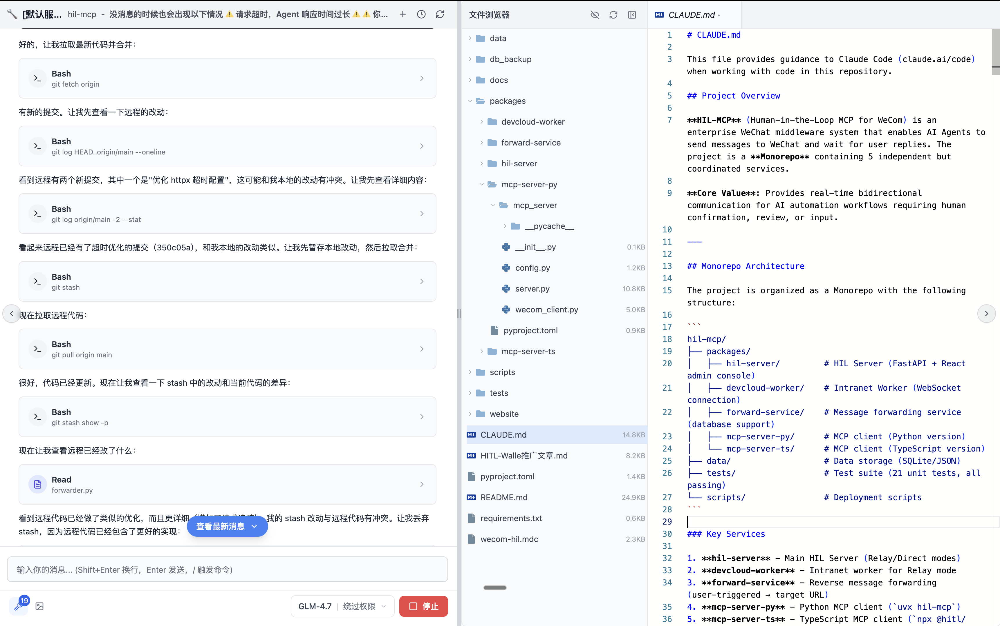

# AgentStudio

<div align="center">


**Agent for Work — Your Local Agent Workspace**

Powered by Claude Agent SDK

[](https://opensource.org/licenses/GPL-3.0)
[](https://github.com/okguitar/agentstudio/stargazers)
[](https://github.com/okguitar/agentstudio/issues)

[English](README.md) | [中文](README.zh-CN.md)

</div>

---

## 📖 Overview

AgentStudio is a **local Agent workspace** running on your computer — a true personal AI assistant. Your data stays completely private, secure, and under your control. It supports scheduled task automation and multi-agent collaboration.

Built on Claude Agent SDK, AgentStudio transforms the CLI experience into a friendly Web interface, making AI agents accessible to everyone, not just developers.

<div align="center">



</div>

## 🚀 Quick Start

Install and run with npm:

```bash
# Install globally
npm install -g agentstudio

# Start the server
agentstudio start
```

Then open [http://localhost:4936](http://localhost:4936) in your browser.

**More commands:**

```bash
agentstudio start --port 8080  # Custom port
agentstudio install            # Install as system service (auto-start)
agentstudio upgrade            # Upgrade to latest version
agentstudio doctor             # Check system status
agentstudio --help             # Show all commands
```

## ✨ Core Features

### 🖥️ Local Agent Workspace

- **Runs on your computer** — A true local workspace
- **Data stays private** — Nothing uploaded to the cloud
- **Full control** — Files, code, and conversations remain in your hands

### 🌐 Web-Based Experience

- **Say goodbye to CLI** — Embrace a friendly Web interface
- **Visual tool execution** — See what your Agent is doing in real-time
- **Built-in file browser** — View project files alongside conversations

### 🧰 Claude Agent SDK Full Stack

Everything from Claude Code, and more:

| Feature | Description |
|---------|-------------|
| **MCP** | One-click import of Claude Code MCP configurations |
| **Skills** | Reusable code skill library |
| **Commands** | Custom slash commands for quick actions |
| **Plugin Ecosystem** | Install agents, commands, skills, and MCP servers |
| **Project Memory** | Each project has independent memory (CLAUDE.md) |
| **Subagents** | Configure nested AI agents with specific capabilities |
| **Multi-Model** | Claude, GLM, DeepSeek, Kimi K2, MiniMax, and more |

### ⏰ Scheduled Tasks

Let your Agent work automatically on a schedule — true AI work automation!

**Example scenarios:**
- 📊 **Daily progress reports** — Generate project updates every morning at 9am
- 🔍 **Automated code review** — Check repositories every 2 hours
- 📝 **Weekly meeting notes** — Summarize and archive every Friday
- 📈 **Monthly analytics** — Generate business data reports on the 1st

### 🔗 A2A Protocol (Agent-to-Agent)

Build a collaborative network of intelligent agents:

- **Secretary Agent dispatch** — One Agent receives tasks and delegates to project-specific Agents
- **Local ↔ Remote collaboration** — Agents on your computer communicate with Agents on remote dev machines
- **Mobile access** — Interact with local Agents from mobile messaging apps (beta)

### 🎨 Custom Agents

Create your own specialized Agents without writing code:

- **PPT creation Agent**
- **Secretary Agent**
- **Document writing Agent**
- **Code review Agent**
- And any other workflow you need!

## 📊 AgentStudio vs Claude Code

| Feature | AgentStudio | Claude Code |
|---------|-------------|-------------|
| Interface | Web UI | Command Line (CLI) |
| Target Users | Everyone | Primarily developers |
| Tool Display | Visual rendering | Plain text |
| File Browser | ✅ | ❌ |
| Agent Customization | ✅ | ❌ |
| Scheduled Tasks | ✅ | ❌ |
| A2A Protocol | ✅ | ❌ |
| Mobile Access | Beta | ❌ |

Same Claude Agent SDK, friendlier experience.

## 📦 Alternative Installation

### Docker

```bash
docker build -t agentstudio:latest .
docker-compose up -d
```

See [DOCKER.md](DOCKER.md) for details.

### One-Click Install

**macOS/Linux:**

```bash
curl -fsSL https://raw.githubusercontent.com/okguitar/agentstudio/main/scripts/install-macos.sh | bash
```

**Windows (PowerShell):**

```powershell
irm https://raw.githubusercontent.com/okguitar/agentstudio/main/scripts/windows-install.ps1 | iex
```

### Development Setup

```bash
git clone https://github.com/okguitar/agentstudio.git
cd agentstudio
pnpm install
cp backend/.env.example backend/.env
# Edit backend/.env with your API keys
pnpm run dev
```

## 🧪 Development

```bash
pnpm run dev          # Start development servers
pnpm run test         # Run tests
pnpm run type-check   # Type checking
pnpm run lint         # Linting
pnpm run build        # Production build
```

## 📦 Tech Stack

**Frontend:** React 19, TypeScript, Vite, TailwindCSS, Zustand, React Query

**Backend:** Node.js, Express, TypeScript, Claude Agent SDK, JWT

## 🤝 Contributing

Contributions are welcome! Please feel free to submit a Pull Request.

## 📄 License

GPL v3 License — see [LICENSE](LICENSE) for details.

## 📮 Support

- 🐛 [Report Issues](https://github.com/okguitar/agentstudio/issues)
- 💬 [Discussions](https://github.com/okguitar/agentstudio/discussions)
- 📧 Email: okguitar@gmail.com

---

<div align="center">

Made with ❤️ by the AgentStudio Team

</div>
