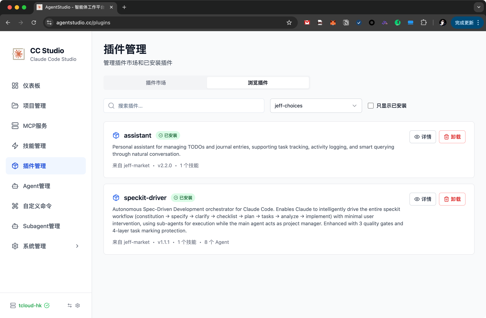

# Agent Studio

<div align="center">


**🤖 您的个人 AI 智能体工作平台**

基于 Claude Agent SDK 构建的现代化智能体工作平台

[](https://choosealicense.com/licenses/mit/)
[](https://github.com/okguitar/agentstudio/stargazers)
[](https://github.com/okguitar/agentstudio/issues)

[English](README.md) | [中文](README.zh-CN.md)

</div>

---

## 📖 项目简介

Agent Studio 是一个基于 [Claude Code SDK](https://github.com/anthropics/anthropic-quickstarts/tree/main/computer-use-demo) 构建的现代化智能体工作平台。它提供专业的 Web 界面，让您能够轻松使用 AI 智能体完成各种任务，从内容编辑到代码辅助。

截图：

 

## ✨ 核心特性

### 🎨 现代化界面
- **专业 UI**：简洁直观的界面设计，提升工作效率
- **实时流式响应**：即时获得 AI 反馈，支持流式输出
- **响应式设计**：完美适配桌面和移动设备
- **暗黑模式**：护眼主题，适合长时间工作
- **多语言支持**：完整支持中文和英文

### 🤖 高级智能体系统
- **内置智能体**：开箱即用的幻灯片、聊天等智能体
- **自定义智能体**：创建专门的智能体，配置自定义系统提示词
- **子智能体**：配置具有特定工具权限的 AI 子智能体
- **插件架构**：可扩展的智能体系统，支持社区插件
- **会话管理**：每个智能体的持久对话历史

### 🔌 MCP 集成
- **MCP 服务器**：集成模型上下文协议（MCP）服务器
- **工具发现**：自动检测可用的 MCP 工具
- **状态监控**：实时健康检查 MCP 服务
- **灵活配置**：支持 stdio 和 HTTP 两种 MCP 服务器

### 📦 插件市场
- **插件系统**：以插件形式安装智能体、命令、技能和 MCP 服务器
- **市场管理**：添加自定义或社区市场
- **一键安装**：轻松安装和管理插件
- **版本控制**：跟踪和更新插件版本

### 📁 项目管理
- **项目感知**：将工作组织到独立的项目上下文中
- **文件浏览器**：集成的项目文件浏览器
- **Git 集成**：版本控制感知
- **多项目支持**：在不同项目间无缝切换

### 🛠️ 开发者工具
- **技能系统**：可复用的代码技能库
- **命令系统**：自定义斜杠命令，快速执行操作
- **工具渲染器**：可视化展示 AI 工具使用情况
- **API 访问**：RESTful API 支持编程集成

### 🔐 安全与隐私
- **本地优先**：所有数据存储在本地机器
- **API 密钥管理**：安全存储 API 凭证
- **权限控制**：细粒度控制智能体能力
- **无遥测**：您的数据永不离开本地

## 🚀 快速开始

### 方式 1：Docker 部署（推荐）

最快的启动方式：

```bash
# 使用 Docker Compose 构建和运行
docker build -t agentstudio:latest .
docker-compose up -d

# 访问 http://localhost
```

**您将获得：**
- ✅ 一体化容器（前端 + 后端）
- ✅ 通过 Docker 卷实现数据持久化
- ✅ 零配置即可使用
- ✅ 便捷的更新和回滚

📖 详细的 Docker 部署指南请参阅 [DOCKER.md](DOCKER.md)

### 方式 2：一键安装

**适用于 Linux & macOS**（用户空间安装，无需 sudo）：

```bash
# 为当前用户安装
curl -fsSL https://raw.githubusercontent.com/okguitar/agentstudio/main/scripts/install-macos.sh | bash

# 或 Linux 系统
curl -fsSL https://raw.githubusercontent.com/okguitar/agentstudio/main/scripts/install-linux.sh | bash
```

**适用于 Windows**（PowerShell）：

```powershell
# 下载并运行安装程序
irm https://raw.githubusercontent.com/okguitar/agentstudio/main/scripts/windows-install.ps1 | iex
```

### 方式 3：手动开发环境搭建

**前置要求：**
- Node.js 18+ (推荐使用 pnpm)
- Git

**安装步骤：**

```bash
# 1. 克隆仓库
git clone https://github.com/okguitar/agentstudio.git
cd agentstudio

# 2. 安装依赖（推荐使用 pnpm）
pnpm install
# 或: npm run setup

# 3. 配置环境变量
cp backend/.env.example backend/.env
# 编辑 backend/.env 添加您的 API 密钥

# 4. 启动开发服务器
pnpm run dev
# 前端: http://localhost:3000
# 后端: http://localhost:4936
```

## 📚 核心概念

### 智能体（Agents）
智能体是配置了特定属性的 AI 助手：
- **系统提示词**：定义智能体的个性和行为
- **允许的工具**：控制智能体可以使用的功能
- **权限模式**：设置操作的审批要求
- **Claude 版本**：选择使用的 Claude 模型

### 项目（Projects）
项目是包含以下内容的工作空间：
- 文件和目录
- 项目特定的智能体
- 会话历史
- 自定义配置

### 插件（Plugins）
插件扩展 Agent Studio 的功能：
- **智能体**：预配置的 AI 智能体
- **命令**：快速操作的斜杠命令
- **技能**：可复用的代码片段
- **MCP 服务器**：额外的工具集成

### MCP（模型上下文协议）
MCP 服务器为智能体提供额外能力：
- 文件系统操作
- 数据库访问
- API 集成
- 自定义工具

## 📖 使用示例

### 创建自定义智能体

1. 导航到**智能体**页面
2. 点击**创建智能体**
3. 配置智能体属性：
   - 名称和描述
   - 系统提示词
   - 允许的工具
   - 权限模式
4. 开始与您的智能体对话！

### 安装插件

1. 前往**插件**页面
2. 添加市场（例如社区市场）
3. 浏览可用插件
4. 点击所需插件的**安装**按钮
5. 在智能体配置中启用插件

### 管理项目

1. 访问**项目**页面
2. 创建或选择项目
3. 将智能体关联到项目
4. 在项目上下文中工作

## 🧪 开发

```bash
# 开发模式（前端 + 后端）
pnpm run dev

# 运行测试
pnpm run test

# 类型检查
pnpm run type-check

# 代码检查
pnpm run lint

# 生产构建
pnpm run build
```

## 📦 技术栈

**前端：**
- React 19 + TypeScript
- Vite（构建工具）
- TailwindCSS（样式）
- Zustand（状态管理）
- React Query（服务器状态）
- React Router（路由）

**后端：**
- Node.js + Express
- TypeScript
- Claude Agent SDK
- JWT 认证
- 基于文件的存储

## 🗺️ 路线图

- [ ] 支持更多 AI 提供商
- [ ] 增强插件市场功能
- [ ] 移动端应用
- [ ] 协作功能
- [ ] 云同步选项
- [ ] 更多内置智能体模板

## 🤝 贡献

欢迎贡献！请随时提交 Pull Request。对于重大更改，请先开 issue 讨论您想要改变的内容。

### 贡献指南

1. Fork 本仓库
2. 创建特性分支 (`git checkout -b feature/AmazingFeature`)
3. 提交更改 (`git commit -m 'Add some AmazingFeature'`)
4. 推送到分支 (`git push origin feature/AmazingFeature`)
5. 开启 Pull Request

## 📄 许可证

本项目采用 MIT 许可证 - 详见 [LICENSE](LICENSE) 文件

## 🙏 致谢

- 基于 [Claude Code SDK](https://github.com/anthropics/anthropic-quickstarts) 构建
- 受 Claude Code 项目启发
- 感谢社区插件市场贡献者
- 感谢所有贡献者的支持

## 📮 支持

- 🐛 [报告问题](https://github.com/okguitar/agentstudio/issues)
- 💬 [讨论区](https://github.com/okguitar/agentstudio/discussions)
- 📧 邮箱：okguitar@gmail.com
- 🌐 网站：[https://agentstudio.cc](https://agentstudio.cc)

## ❓ 常见问题

### 如何更新 Agent Studio？

**Docker 用户：**
```bash
docker-compose down
docker build -t agentstudio:latest .
docker-compose up -d
```

**一键安装用户：**
```bash
# 重新运行安装脚本即可
curl -fsSL https://raw.githubusercontent.com/okguitar/agentstudio/main/scripts/install-macos.sh | bash
```

### 数据存储在哪里？

- **Docker**：`/app/data` 卷
- **一键安装**：`~/.agentstudio/`
- **手动安装**：项目根目录

### 支持哪些 AI 模型？

Agent Studio 支持：
- Anthropic Claude（Sonnet, Opus, Haiku）
- OpenAI（GPT-4, GPT-3.5）
- GLM（智谱 AI）
- DeepSeek
- 其他兼容 OpenAI API 的模型

### 如何创建自定义插件？

请参阅 [Plugin Development Guide](docs/plugin-development.md)（即将推出）

---

<div align="center">

**[⬆ 返回顶部](#agent-studio)**

Made with ❤️ by the Agent Studio Team

</div>
