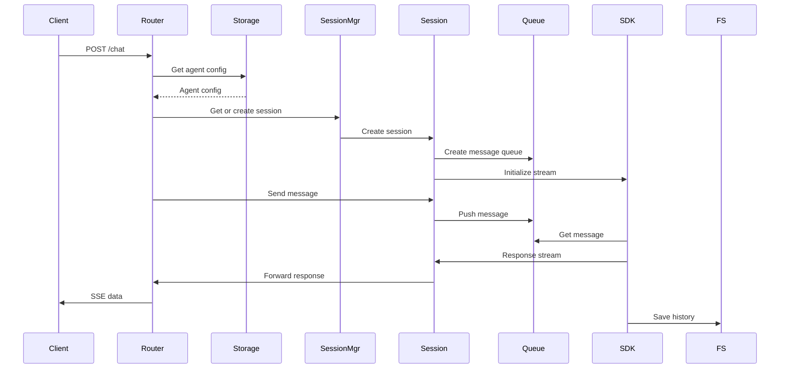

# 后端 /chat 接口时序图

## 时序图说明

这个时序图展示了后端 `/chat` 接口的核心流程：

### 主要参与者
- **Client**: 前端客户端
- **Router**: 聊天路由处理器 (agents.ts)
- **Storage**: Agent配置存储
- **SessionMgr**: 会话管理器
- **Session**: Claude会话实例
- **Queue**: 消息队列
- **SDK**: Claude Code SDK
- **FS**: 文件系统

### 关键流程
1. 客户端发送聊天请求
2. 路由器获取Agent配置
3. 会话管理器创建或获取会话
4. 初始化消息队列和SDK流
5. 处理消息并返回流式响应
6. 自动保存会话历史

### 技术特点
- 使用Streaming Input Mode
- SSE实时响应
- 会话持久化
- 资源自动管理
