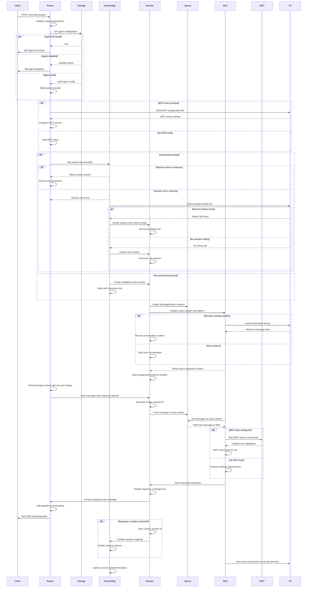

# 后端 /chat 接口完整时序图



## 完整业务场景分析

### 🎯 核心执行路径详解

#### 路径1: 全新用户首次对话
```
无sessionId → 创建新会话 → 初始化SDK → 处理消息 → 确认sessionId → 保存历史
```

#### 路径2: 用户继续现有对话  
```
有sessionId且在内存 → 复用会话 → 直接处理 → 更新历史
```

#### 路径3: 用户恢复中断会话
```
有sessionId但不在内存 → 检查历史 → 恢复会话上下文 → 处理新消息
```

#### 路径4: 使用外部工具的对话
```
检测MCP工具 → 读取配置 → 连接服务器 → 工具调用可用 → 处理带工具的对话
```

#### 路径5: 错误和异常情况
```
Agent验证失败 → 立即返回错误
会话创建失败 → 错误响应  
SDK处理异常 → 错误事件推送
```

### 🔧 技术架构特性

#### 会话生命周期管理
- **三级查找策略**: 内存缓存 → 文件历史 → 新建会话
- **状态同步机制**: 内存索引与文件系统双重保障  
- **自动清理策略**: 定期清理空闲和过期会话

#### 流式处理架构
- **Streaming Input Mode**: 一次构造query，持续接收输入
- **异步消息队列**: 解耦用户输入和AI处理逻辑
- **Server-Sent Events**: 实时推送响应数据到前端

#### 外部工具集成
- **MCP协议支持**: 动态加载和管理外部工具服务器
- **工具生命周期**: 按需连接，自动管理连接状态
- **错误隔离机制**: 工具错误不影响核心对话流程

这个版本完整展示了后端chat接口的所有主要业务分支和技术实现细节！
