# 命令识别逻辑时序图

```mermaid
sequenceDiagram
    participant Client as 前端客户端
    participant AgentRoute as agents.ts 路由
    participant FileSystem as 文件系统
    participant CommandParser as 命令解析器
    participant MessageConverter as 消息转换器

    Note over Client, MessageConverter: 会话历史读取和命令识别流程

    Client->>AgentRoute: GET /api/agents/history/sessions?projectPath={path}
    
    AgentRoute->>FileSystem: 读取 Claude 历史目录
    Note right of FileSystem: ~/.claude/projects/.../*.jsonl
    
    FileSystem-->>AgentRoute: 返回历史文件列表
    
    loop 遍历每个历史文件
        AgentRoute->>FileSystem: readFile(historyFile)
        FileSystem-->>AgentRoute: 原始 JSON 行数据
        
        AgentRoute->>AgentRoute: 解析 JSON 行数据
        Note right of AgentRoute: 过滤无效消息
        
        loop 遍历每条消息
            AgentRoute->>MessageConverter: 消息过滤检查
            
            alt 消息类型为 summary 或 thinking
                MessageConverter-->>AgentRoute: 跳过消息
            else 消息类型为 tool_result 且包含 local-command-stdout
                MessageConverter->>MessageConverter: 检查父消息是否为 /clear 命令
                alt 父消息是 /clear 命令
                    MessageConverter-->>AgentRoute: 跳过消息
                else 父消息不是 /clear 命令
                    MessageConverter-->>AgentRoute: 保留消息
                end
            else 消息类型为 user
                MessageConverter->>MessageConverter: 检查是否只包含 tool_result
                alt 只包含 tool_result
                    MessageConverter-->>AgentRoute: 跳过消息
                else 包含其他内容
                    MessageConverter-->>AgentRoute: 保留消息
                end
            else 消息类型为 assistant
                MessageConverter-->>AgentRoute: 保留消息
            end
        end
        
        loop 处理保留的消息
            AgentRoute->>MessageConverter: extractContentFromClaudeMessage(msg)
            
            MessageConverter->>MessageConverter: 检查消息内容类型
            
            alt 内容为字符串
                MessageConverter->>CommandParser: 正则匹配命令格式
                Note right of CommandParser: /<command-message>.*?<\/command-message>\s*<command-name>(.+?)<\/command-name>/
                
                alt 匹配到命令格式
                    CommandParser-->>MessageConverter: 返回命令名称
                    MessageConverter-->>AgentRoute: 返回命令名称
                else 未匹配命令格式
                    CommandParser-->>MessageConverter: 返回原始内容
                    MessageConverter-->>AgentRoute: 返回原始内容
                end
                
            else 内容为数组
                MessageConverter->>MessageConverter: 过滤 text 类型块
                MessageConverter->>MessageConverter: 拼接文本内容
                MessageConverter-->>AgentRoute: 返回拼接后的内容
            end
            
            AgentRoute->>MessageConverter: convertClaudeMessageToMessageParts(msg)
            
            alt 内容为字符串且匹配命令格式
                MessageConverter->>MessageConverter: 创建 command 类型部分
                Note right of MessageConverter: type: 'command', content: 命令名称
                MessageConverter-->>AgentRoute: 返回命令消息部分
            else 内容为字符串但非命令格式
                MessageConverter->>MessageConverter: 创建 text 类型部分
                MessageConverter-->>AgentRoute: 返回文本消息部分
            else 内容为数组
                loop 遍历内容块
                    alt 块类型为 text
                        MessageConverter->>MessageConverter: 创建 text 部分
                    else 块类型为 tool_use
                        MessageConverter->>MessageConverter: 创建 tool 部分
                        Note right of MessageConverter: 包含工具名称、输入、结果等
                    else 块类型为 tool_result
                        MessageConverter->>MessageConverter: 跳过（将合并到 tool_use）
                    else 块类型为 image
                        MessageConverter->>MessageConverter: 创建 image 部分
                    else 其他类型
                        MessageConverter->>MessageConverter: 创建 unknown 部分
                    end
                end
                MessageConverter-->>AgentRoute: 返回消息部分数组
            end
        end
        
        AgentRoute->>AgentRoute: 合并连续的 assistant 消息
        Note right of AgentRoute: 优化对话展示
        
        AgentRoute->>AgentRoute: 构建会话对象
        Note right of AgentRoute: 包含会话元数据和处理后的消息
    end
    
    AgentRoute-->>Client: 返回处理后的会话历史
    Note left of Client: 包含识别出的命令和其他消息类型

    Note over Client, MessageConverter: 命令文件扫描和管理流程（独立流程）

    Client->>AgentRoute: GET /api/commands?projectPath={path}
    
    AgentRoute->>FileSystem: 扫描项目命令目录
    Note right of FileSystem: {projectPath}/.ai-commands/
    
    AgentRoute->>FileSystem: 扫描用户命令目录  
    Note right of FileSystem: ~/.ai-commands/
    
    loop 遍历命令目录
        FileSystem->>FileSystem: 递归扫描子目录
        
        loop 遍历 .md 文件
            FileSystem->>CommandParser: readFile(commandFile)
            CommandParser->>CommandParser: parseCommandContent()
            Note right of CommandParser: 解析 frontmatter 和内容
            
            CommandParser->>CommandParser: 构建命令对象
            Note right of CommandParser: 包含 id, name, description, scope 等
            
            CommandParser-->>FileSystem: 返回解析后的命令
        end
        
        FileSystem-->>AgentRoute: 返回目录下所有命令
    end
    
    AgentRoute-->>Client: 返回所有可用命令列表
```

## 关键流程说明

### 1. 消息过滤阶段
- **目的**: 从原始 Claude 历史中筛选出有价值的对话消息
- **规则**: 
  - 排除 `summary` 和 `thinking` 类型消息
  - 排除纯工具结果消息（除非包含用户内容）
  - 特殊处理 `/clear` 命令的输出消息

### 2. 命令识别阶段
- **触发条件**: 消息内容包含特定的 XML 标签格式
- **识别模式**: `<command-message>` + `<command-name>` 标签组合
- **结果**: 提取出实际的命令名称，创建 `command` 类型的消息部分

### 3. 消息转换阶段
- **目的**: 将 Claude 原始消息格式转换为系统内部格式
- **处理类型**:
  - 文本消息 → `text` 部分
  - 命令消息 → `command` 部分  
  - 工具使用 → `tool` 部分
  - 图片内容 → `image` 部分

### 4. 会话重构阶段
- **消息合并**: 合并连续的 assistant 消息以优化展示
- **层次建立**: 基于 `parentUuid` 建立消息间的父子关系
- **会话组织**: 按 `sessionId` 组织完整的对话会话

### 5. 命令管理阶段（独立流程）
- **文件扫描**: 递归扫描项目和用户命令目录
- **内容解析**: 解析 Markdown 文件的 frontmatter 和内容
- **命令构建**: 创建完整的命令对象，包含元数据和权限信息

## 性能优化点

1. **异步处理**: 所有文件操作都采用异步方式
2. **并行扫描**: 同时扫描多个命令目录
3. **增量解析**: 只处理发生变化的历史文件
4. **内存管理**: 及时释放大型历史文件的内存占用

## 错误处理机制

1. **文件不存在**: 优雅降级，返回空结果
2. **格式错误**: 跳过格式错误的消息，继续处理其他消息
3. **权限问题**: 记录错误日志，但不中断整个流程
4. **解析异常**: 使用默认值填充缺失的字段
