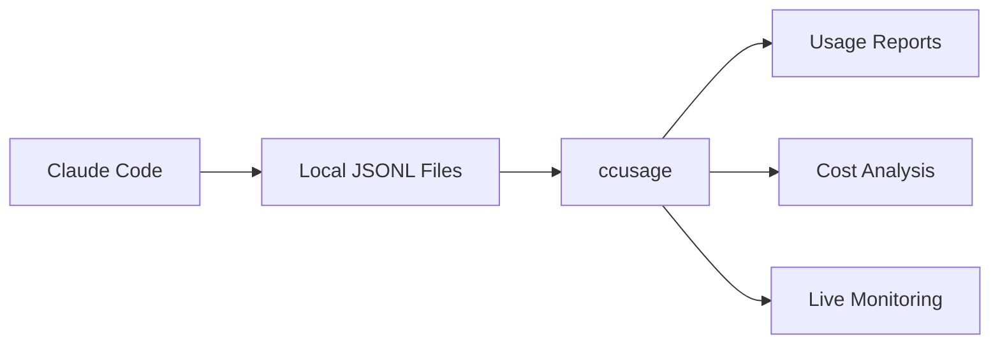

[ccusage](../index.md) / \_consts

# \_consts

> **Note**: These constants are internal implementation details and are not exported in the public API. They are documented here for reference purposes only.

## Variables

| Variable | Description |
| ------ | ------ |
| [LITELLM\_PRICING\_URL](variables/LITELLM_PRICING_URL.md) | URL for LiteLLM's model pricing and context window data |
| [DEFAULT\_RECENT\_DAYS](variables/DEFAULT_RECENT_DAYS.md) | Default number of recent days to include when filtering blocks Used in both session blocks and commands for consistent behavior |
| [BLOCKS\_WARNING\_THRESHOLD](variables/BLOCKS_WARNING_THRESHOLD.md) | Threshold percentage for showing usage warnings in blocks command (80%) When usage exceeds this percentage of limits, warnings are displayed |
| [BLOCKS\_COMPACT\_WIDTH\_THRESHOLD](variables/BLOCKS_COMPACT_WIDTH_THRESHOLD.md) | Terminal width threshold for switching to compact display mode in blocks command Below this width, tables use more compact formatting |
| [BLOCKS\_DEFAULT\_TERMINAL\_WIDTH](variables/BLOCKS_DEFAULT_TERMINAL_WIDTH.md) | Default terminal width when stdout.columns is not available in blocks command Used as fallback for responsive table formatting |
| [DEBUG\_MATCH\_THRESHOLD\_PERCENT](variables/DEBUG_MATCH_THRESHOLD_PERCENT.md) | Threshold percentage for considering costs as matching (0.1% tolerance) Used in debug cost validation to allow for minor calculation differences |
| [USER\_HOME\_DIR](variables/USER_HOME_DIR.md) | User's home directory path Centralized access to OS home directory for consistent path building |
| [DEFAULT\_CLAUDE\_CODE\_PATH](variables/DEFAULT_CLAUDE_CODE_PATH.md) | Default Claude data directory path (~/.claude) Used as base path for loading usage data from JSONL files |
| [DEFAULT\_CLAUDE\_CONFIG\_PATH](variables/DEFAULT_CLAUDE_CONFIG_PATH.md) | Default Claude data directory path using XDG config directory Uses XDG\_CONFIG\_HOME if set, otherwise falls back to ~/.config/claude |
| [CLAUDE\_CONFIG\_DIR\_ENV](variables/CLAUDE_CONFIG_DIR_ENV.md) | Environment variable for specifying multiple Claude data directories Supports comma-separated paths for multiple locations |
| [CLAUDE\_PROJECTS\_DIR\_NAME](variables/CLAUDE_PROJECTS_DIR_NAME.md) | Claude projects directory name within the data directory Contains subdirectories for each project with usage data |
| [USAGE\_DATA\_GLOB\_PATTERN](variables/USAGE_DATA_GLOB_PATTERN.md) | JSONL file glob pattern for finding usage data files Used to recursively find all JSONL files in project directories |
| [MCP\_DEFAULT\_PORT](variables/MCP_DEFAULT_PORT.md) | Default port for MCP server HTTP transport Used when no port is specified for MCP server communication |
| [DEFAULT\_REFRESH\_INTERVAL\_SECONDS](variables/DEFAULT_REFRESH_INTERVAL_SECONDS.md) | Default refresh interval in seconds for live monitoring mode Used in blocks command for real-time updates |
| [MIN\_REFRESH\_INTERVAL\_SECONDS](variables/MIN_REFRESH_INTERVAL_SECONDS.md) | Minimum refresh interval in seconds for live monitoring mode Prevents too-frequent updates that could impact performance |
| [MAX\_REFRESH\_INTERVAL\_SECONDS](variables/MAX_REFRESH_INTERVAL_SECONDS.md) | Maximum refresh interval in seconds for live monitoring mode Prevents too-slow updates that reduce monitoring effectiveness |
| [MIN\_RENDER\_INTERVAL\_MS](variables/MIN_RENDER_INTERVAL_MS.md) | Frame rate limit for live monitoring (16ms = ~60fps) Prevents terminal flickering and excessive CPU usage during rapid updates |
| [BURN\_RATE\_THRESHOLDS](variables/BURN_RATE_THRESHOLDS.md) | Burn rate thresholds for indicator display (tokens per minute) |
| [DEFAULT\_CONTEXT\_USAGE\_THRESHOLDS](variables/DEFAULT_CONTEXT_USAGE_THRESHOLDS.md) | Context usage percentage thresholds for color coding |
| [WEEK\_DAYS](variables/WEEK_DAYS.md) | Days of the week for weekly aggregation |
| [CONFIG\_FILE\_NAME](variables/CONFIG_FILE_NAME.md) | Default configuration file name for storing usage data Used to load and save configuration settings |
| [DEFAULT\_LOCALE](variables/DEFAULT_LOCALE.md) | Default locale for date formatting (en-CA provides YYYY-MM-DD ISO format) Used consistently across the application for date parsing and display |

## Type Aliases

| Type Alias | Description |
| ------ | ------ |
| [WeekDay](type-aliases/WeekDay.md) | Week day names type |
| [DayOfWeek](type-aliases/DayOfWeek.md) | Day of week as number (0 = Sunday, 1 = Monday, ..., 6 = Saturday) |

---

---
url: /guide/blocks-reports.md
---
# Blocks Reports

Blocks reports show your Claude Code usage grouped by 5-hour billing windows, helping you understand Claude's billing cycle and track active session progress.

## Basic Usage

```bash
ccusage blocks
```

## Example Output

```
╭──────────────────────────────────────────────────╮
│                                                  │
│  Claude Code Token Usage Report - Session Blocks │
│                                                  │
╰──────────────────────────────────────────────────╯

┌─────────────────────┬──────────────────┬────────┬─────────┬──────────────┬────────────┬──────────────┬────────────┐
│ Block Start Time    │ Models           │ Input  │ Output  │ Cache Create │ Cache Read │ Total Tokens │ Cost (USD) │
├─────────────────────┼──────────────────┼────────┼─────────┼──────────────┼────────────┼──────────────┼────────────┤
│ 2025-06-21 09:00:00 │ • opus-4         │  4,512 │ 285,846 │          512 │      1,024 │      291,894 │    $156.40 │
│ ⏰ Active (2h 15m)  │ • sonnet-4       │        │         │              │            │              │            │
│ 🔥 Rate: 2.1k/min   │                  │        │         │              │            │              │            │
│ 📊 Projected: 450k  │                  │        │         │              │            │              │            │
├─────────────────────┼──────────────────┼────────┼─────────┼──────────────┼────────────┼──────────────┼────────────┤
│ 2025-06-21 04:00:00 │ • sonnet-4       │  2,775 │ 186,645 │          256 │        768 │      190,444 │     $98.45 │
│ ✅ Completed (3h 42m)│                  │        │         │              │            │              │            │
├─────────────────────┼──────────────────┼────────┼─────────┼──────────────┼────────────┼──────────────┼────────────┤
│ 2025-06-20 15:30:00 │ • opus-4         │  1,887 │ 183,055 │          128 │        512 │      185,582 │     $81.73 │
│ ✅ Completed (4h 12m)│                  │        │         │              │            │              │            │
├─────────────────────┼──────────────────┼────────┼─────────┼──────────────┼────────────┼──────────────┼────────────┤
│ Total               │                  │  9,174 │ 655,546 │          896 │      2,304 │      667,920 │    $336.58 │
└─────────────────────┴──────────────────┴────────┴─────────┴──────────────┴────────────┴──────────────┴────────────┘
```

## Understanding Blocks

### Session Block Concept

Claude Code uses **5-hour billing windows** for session tracking:

* **Block Start**: Triggered by your first message
* **Block Duration**: Lasts exactly 5 hours from start time
* **Rolling Windows**: New blocks start with activity after previous block expires
* **Billing Relevance**: Matches Claude's internal session tracking
* **UTC Time Handling**: Block boundaries are calculated in UTC to ensure consistent behavior across time zones

### Block Status Indicators

* **⏰ Active**: Currently running block with time remaining
* **✅ Completed**: Finished block that ran its full duration or ended naturally
* **⌛ Gap**: Time periods with no activity (shown when relevant)
* **🔥 Rate**: Token burn rate (tokens per minute) for active blocks
* **📊 Projected**: Estimated total tokens if current rate continues

## Command Options

### Show Active Block Only

Focus on your current session with detailed projections:

```bash
ccusage blocks --active
```

This shows only the currently active block with:

* Time remaining in the 5-hour window
* Current token burn rate
* Projected final token count and cost

### Show Recent Blocks

Display blocks from the last 3 days (including active):

```bash
ccusage blocks --recent
```

Perfect for understanding recent usage patterns without scrolling through all historical data.

### Token Limit Tracking

Set token limits to monitor quota usage:

```bash
# Set explicit token limit
ccusage blocks --token-limit 500000

# Use highest previous block as limit
ccusage blocks --token-limit max
# or short form:
ccusage blocks -t max
```

When limits are set, blocks display:

* ⚠️ **Warning indicators** when approaching limits
* 🚨 **Alert indicators** when exceeding limits
* **Progress bars** showing usage relative to limit

### Live Monitoring

Real-time dashboard with automatic updates:

```bash
# Basic live monitoring (uses -t max automatically)
ccusage blocks --live

# Live monitoring with explicit token limit
ccusage blocks --live --token-limit 500000

# Custom refresh interval (1-60 seconds)
ccusage blocks --live --refresh-interval 5
```

Live monitoring features:

* **Real-time updates** every 1-60 seconds (configurable)
* **Automatic token limit** detection from usage history
* **Progress bars** with color coding (green/yellow/red)
* **Burn rate calculations** with trend analysis
* **Time remaining** in current block
* **Graceful shutdown** with Ctrl+C

### Custom Session Duration

Change the block duration (default is 5 hours):

```bash
# 3-hour blocks
ccusage blocks --session-length 3

# 8-hour blocks
ccusage blocks --session-length 8
```

### Date Filtering

Filter blocks by date range:

```bash
# Show blocks from specific date range
ccusage blocks --since 20250620 --until 20250621

# Show blocks from last week
ccusage blocks --since $(date -d '7 days ago' +%Y%m%d)
```

### Sort Order

```bash
# Show newest blocks first (default)
ccusage blocks --order desc

# Show oldest blocks first
ccusage blocks --order asc
```

### Cost Calculation Modes

```bash
# Use pre-calculated costs when available (default)
ccusage blocks --mode auto

# Always calculate costs from tokens
ccusage blocks --mode calculate

# Only show pre-calculated costs
ccusage blocks --mode display
```

### JSON Output

Export block data for analysis:

```bash
ccusage blocks --json
```

```json
{
	"blocks": [
		{
			"id": "2025-06-21T09:00:00.000Z",
			"startTime": "2025-06-21T09:00:00.000Z",
			"endTime": "2025-06-21T14:00:00.000Z",
			"actualEndTime": "2025-06-21T11:15:00.000Z",
			"isActive": true,
			"tokenCounts": {
				"inputTokens": 4512,
				"outputTokens": 285846,
				"cacheCreationInputTokens": 512,
				"cacheReadInputTokens": 1024
			},
			"costUSD": 156.40,
			"models": ["opus-4", "sonnet-4"]
		}
	]
}
```

### Offline Mode

Use cached pricing data without network access:

```bash
ccusage blocks --offline
# or short form:
ccusage blocks -O
```

## Analysis Use Cases

### Session Planning

Understanding 5-hour windows helps with:

```bash
# Check current active block
ccusage blocks --active
```

* **Time Management**: Know how much time remains in current session
* **Usage Pacing**: Monitor if you're on track for reasonable usage
* **Break Planning**: Understand when current session will expire

### Usage Optimization

```bash
# Find your highest usage patterns
ccusage blocks -t max --recent
```

* **Peak Usage Identification**: Which blocks consumed the most tokens
* **Efficiency Patterns**: Compare block efficiency (tokens per hour)
* **Model Selection Impact**: How model choice affects block costs

### Live Session Tracking

```bash
# Monitor active sessions in real-time
ccusage blocks --live -t max
```

Perfect for:

* **Long coding sessions**: Track progress against historical limits
* **Budget management**: Watch costs accumulate in real-time
* **Productivity tracking**: Understand work intensity patterns

### Historical Analysis

```bash
# Export data for detailed analysis
ccusage blocks --json > blocks-history.json

# Analyze patterns over time
ccusage blocks --since 20250601 --until 20250630
```

## Block Analysis Tips

### 1. Understanding Block Efficiency

Look for patterns in your block data:

* **High-efficiency blocks**: Lots of output tokens for minimal input
* **Exploratory blocks**: High input/output ratios (research, debugging)
* **Focused blocks**: Steady token burn rates with clear objectives

### 2. Time Management

Use blocks to optimize your Claude usage:

* **Session planning**: Start important work at the beginning of blocks
* **Break timing**: Use block boundaries for natural work breaks
* **Batch processing**: Group similar tasks within single blocks

### 3. Cost Optimization

Blocks help identify cost patterns:

* **Model switching**: When to use Opus vs Sonnet within blocks
* **Cache efficiency**: How cache usage affects block costs
* **Usage intensity**: Whether short focused sessions or long exploratory ones are more cost-effective

### 4. Quota Management

When working with token limits:

* **Rate monitoring**: Watch burn rates to avoid exceeding limits
* **Early warning**: Set limits below actual quotas for safety margin
* **Usage spreading**: Distribute heavy usage across multiple blocks

## Responsive Display

Blocks reports adapt to your terminal width:

* **Wide terminals (≥100 chars)**: Shows all columns with full timestamps
* **Narrow terminals (<100 chars)**: Compact mode with abbreviated times and essential data

## Advanced Features

### Gap Detection

Blocks reports automatically detect and display gaps:

```
┌─────────────────────┬──────────────────┬────────┬─────────┬────────────┐
│ 2025-06-21 09:00:00 │ • opus-4         │  4,512 │ 285,846 │    $156.40 │
│ ⏰ Active (2h 15m)  │ • sonnet-4       │        │         │            │
├─────────────────────┼──────────────────┼────────┼─────────┼────────────┤
│ 2025-06-20 22:00:00 │ ⌛ 11h gap       │      0 │       0 │      $0.00 │
│ 2025-06-21 09:00:00 │                  │        │         │            │
├─────────────────────┼──────────────────┼────────┼─────────┼────────────┤
│ 2025-06-20 15:30:00 │ • opus-4         │  1,887 │ 183,055 │     $81.73 │
│ ✅ Completed (4h 12m)│                  │        │         │            │
└─────────────────────┴──────────────────┴────────┴─────────┴────────────┘
```

### Burn Rate Calculations

For active blocks, the tool calculates:

* **Tokens per minute**: Based on activity within the block
* **Cost per hour**: Projected hourly spend rate
* **Projected totals**: Estimated final tokens/cost if current rate continues

### Progress Visualization

When using token limits, blocks show visual progress:

* **Green**: Usage well below limit (< 70%)
* **Yellow**: Approaching limit (70-90%)
* **Red**: At or exceeding limit (≥ 90%)

## Related Commands

* [Daily Reports](/guide/daily-reports) - Usage aggregated by calendar date
* [Monthly Reports](/guide/monthly-reports) - Monthly usage summaries
* [Session Reports](/guide/session-reports) - Individual conversation analysis
* [Live Monitoring](/guide/live-monitoring) - Real-time session tracking

## Next Steps

After understanding block patterns, consider:

1. [Live Monitoring](/guide/live-monitoring) for real-time active session tracking
2. [Session Reports](/guide/session-reports) to analyze individual conversations within blocks
3. [Daily Reports](/guide/daily-reports) to see how blocks aggregate across days

---

---
url: /api/calculate-cost.md
---
[ccusage](../index.md) / calculate-cost

# calculate-cost

## Fileoverview

Cost calculation utilities for usage data analysis

This module provides functions for calculating costs and aggregating token usage
across different time periods and models. It handles both pre-calculated costs
and dynamic cost calculations based on model pricing.

## Functions

| Function | Description |
| ------ | ------ |
| [getTotalTokens](functions/getTotalTokens.md) | Calculates the total number of tokens across all token types Supports both raw usage data format and aggregated data format |
| [calculateTotals](functions/calculateTotals.md) | Calculates total token usage and cost across multiple usage data entries |
| [createTotalsObject](functions/createTotalsObject.md) | Creates a complete totals object by adding total token count to existing totals |

---

---
url: /api.md
---
# ccusage

## Modules

| Module | Description |
| ------ | ------ |
| [\_consts](consts/index.md) | - |
| [calculate-cost](calculate-cost/index.md) | Cost calculation utilities for usage data analysis |
| [data-loader](data-loader/index.md) | Data loading utilities for Claude Code usage analysis |
| [debug](debug/index.md) | Debug utilities for cost calculation validation |
| [index](index/index.md) | Main entry point for ccusage CLI tool |
| [logger](logger/index.md) | Logging utilities for the ccusage application |
| [mcp](mcp/index.md) | MCP (Model Context Protocol) server implementation |
| [pricing-fetcher](pricing-fetcher/index.md) | Model pricing data fetcher for cost calculations |

---

---
url: /api/pricing-fetcher/classes/PricingFetcher.md
---
[ccusage](../../index.md) / [pricing-fetcher](../index.md) / PricingFetcher

# Class: PricingFetcher

Fetches and caches model pricing information from LiteLLM
Implements Disposable pattern for automatic resource cleanup

## Implements

* `Disposable`

## Constructors

### Constructor

```ts
new PricingFetcher(offline): PricingFetcher;
```

Creates a new PricingFetcher instance

#### Parameters

| Parameter | Type | Default value | Description |
| ------ | ------ | ------ | ------ |
| `offline` | `boolean` | `false` | Whether to use pre-fetched pricing data instead of fetching from API |

#### Returns

`PricingFetcher`

## Methods

### \[dispose]\()

```ts
dispose: void;
```

Implements Disposable interface for automatic cleanup

#### Returns

`void`

#### Implementation of

```ts
Disposable.[dispose]
```

***

### clearCache()

```ts
clearCache(): void;
```

Clears the cached pricing data

#### Returns

`void`

***

### fetchModelPricing()

```ts
fetchModelPricing(): ResultAsync<Map<string, {
  input_cost_per_token?: number;
  output_cost_per_token?: number;
  cache_creation_input_token_cost?: number;
  cache_read_input_token_cost?: number;
  max_tokens?: number;
  max_input_tokens?: number;
  max_output_tokens?: number;
}>, Error>;
```

Fetches all available model pricing data

#### Returns

`ResultAsync`<`Map`<`string`, {
`input_cost_per_token?`: `number`;
`output_cost_per_token?`: `number`;
`cache_creation_input_token_cost?`: `number`;
`cache_read_input_token_cost?`: `number`;
`max_tokens?`: `number`;
`max_input_tokens?`: `number`;
`max_output_tokens?`: `number`;
}>, `Error`>

Map of model names to pricing information

***

### getModelPricing()

```ts
getModelPricing(modelName): ResultAsync<
  | null
  | {
  input_cost_per_token?: number;
  output_cost_per_token?: number;
  cache_creation_input_token_cost?: number;
  cache_read_input_token_cost?: number;
  max_tokens?: number;
  max_input_tokens?: number;
  max_output_tokens?: number;
}, Error>;
```

Gets pricing information for a specific model with fallback matching
Tries exact match first, then provider prefixes, then partial matches

#### Parameters

| Parameter | Type | Description |
| ------ | ------ | ------ |
| `modelName` | `string` | Name of the model to get pricing for |

#### Returns

`ResultAsync`<
| `null`
| {
`input_cost_per_token?`: `number`;
`output_cost_per_token?`: `number`;
`cache_creation_input_token_cost?`: `number`;
`cache_read_input_token_cost?`: `number`;
`max_tokens?`: `number`;
`max_input_tokens?`: `number`;
`max_output_tokens?`: `number`;
}, `Error`>

Model pricing information or null if not found

***

### getModelContextLimit()

```ts
getModelContextLimit(modelName): ResultAsync<null | number, Error>;
```

Gets context window limit for a specific model from LiteLLM data

#### Parameters

| Parameter | Type | Description |
| ------ | ------ | ------ |
| `modelName` | `string` | The model name to get context limit for |

#### Returns

`ResultAsync`<`null` | `number`, `Error`>

The context limit in tokens, or null if not found

***

### calculateCostFromTokens()

```ts
calculateCostFromTokens(tokens, modelName): ResultAsync<number, Error>;
```

Calculates the cost for given token usage and model

#### Parameters

| Parameter | Type | Description |
| ------ | ------ | ------ |
| `tokens` | { `input_tokens`: `number`; `output_tokens`: `number`; `cache_creation_input_tokens?`: `number`; `cache_read_input_tokens?`: `number`; } | Token usage breakdown |
| `tokens.input_tokens` | `number` | Number of input tokens |
| `tokens.output_tokens` | `number` | Number of output tokens |
| `tokens.cache_creation_input_tokens?` | `number` | Number of cache creation tokens |
| `tokens.cache_read_input_tokens?` | `number` | Number of cache read tokens |
| `modelName` | `string` | Name of the model used |

#### Returns

`ResultAsync`<`number`, `Error`>

Total cost in USD

***

### calculateCostFromPricing()

```ts
calculateCostFromPricing(tokens, pricing): number;
```

Calculates cost from token usage and pricing information

#### Parameters

| Parameter | Type | Description |
| ------ | ------ | ------ |
| `tokens` | { `input_tokens`: `number`; `output_tokens`: `number`; `cache_creation_input_tokens?`: `number`; `cache_read_input_tokens?`: `number`; } | Token usage breakdown |
| `tokens.input_tokens` | `number` | Number of input tokens |
| `tokens.output_tokens` | `number` | Number of output tokens |
| `tokens.cache_creation_input_tokens?` | `number` | Number of cache creation tokens |
| `tokens.cache_read_input_tokens?` | `number` | Number of cache read tokens |
| `pricing` | { `input_cost_per_token?`: `number`; `output_cost_per_token?`: `number`; `cache_creation_input_token_cost?`: `number`; `cache_read_input_token_cost?`: `number`; `max_tokens?`: `number`; `max_input_tokens?`: `number`; `max_output_tokens?`: `number`; } | Model pricing rates |
| `pricing.input_cost_per_token?` | `number` | - |
| `pricing.output_cost_per_token?` | `number` | - |
| `pricing.cache_creation_input_token_cost?` | `number` | - |
| `pricing.cache_read_input_token_cost?` | `number` | - |
| `pricing.max_tokens?` | `number` | - |
| `pricing.max_input_tokens?` | `number` | - |
| `pricing.max_output_tokens?` | `number` | - |

#### Returns

`number`

Total cost in USD

---

---
url: /guide/cli-options.md
---
# Command-Line Options

ccusage provides extensive command-line options to customize its behavior. These options take precedence over configuration files and environment variables.

## Global Options

All ccusage commands support these global options:

### Date Filtering

Filter usage data by date range:

```bash
# Filter by date range
ccusage daily --since 20250101 --until 20250630

# Show data from a specific date
ccusage monthly --since 20250101

# Show data up to a specific date
ccusage session --until 20250630
```

### Output Format

Control how data is displayed:

```bash
# JSON output for programmatic use
ccusage daily --json
ccusage daily -j

# Show per-model breakdown
ccusage daily --breakdown
ccusage daily -b

# Combine options
ccusage daily --json --breakdown
```

### Cost Calculation Mode

Choose how costs are calculated:

```bash
# Auto mode (default) - use costUSD when available
ccusage daily --mode auto

# Calculate mode - always calculate from tokens
ccusage daily --mode calculate

# Display mode - only show pre-calculated costUSD
ccusage daily --mode display
```

### Sort Order

Control the ordering of results:

```bash
# Newest first (default)
ccusage daily --order desc

# Oldest first
ccusage daily --order asc
```

### Offline Mode

Run without network connectivity:

```bash
# Use cached pricing data
ccusage daily --offline
ccusage daily -O
```

### Timezone

Set the timezone for date calculations:

```bash
# Use UTC timezone
ccusage daily --timezone UTC

# Use specific timezone
ccusage daily --timezone America/New_York
ccusage daily -z Asia/Tokyo

# Short alias
ccusage monthly -z Europe/London
```

#### Timezone Effect

The timezone affects how usage is grouped by date. For example, usage at 11 PM UTC on January 1st would appear on:

* **January 1st** when `--timezone UTC`
* **January 1st** when `--timezone America/New_York` (6 PM EST)
* **January 2nd** when `--timezone Asia/Tokyo` (8 AM JST next day)

### Locale

Control date and time formatting:

```bash
# US English (12-hour time format)
ccusage daily --locale en-US

# Japanese (24-hour time format)
ccusage blocks --locale ja-JP

# German (24-hour time format)
ccusage session -l de-DE

# Short alias
ccusage daily -l fr-FR
```

#### Locale Effects

The locale affects display formatting:

**Date Format:**

* `en-US`: 08/04/2025
* `en-CA`: 2025-08-04 (ISO format, default)
* `ja-JP`: 2025/08/04
* `de-DE`: 04.08.2025

**Time Format:**

* `en-US`: 3:30:00 PM (12-hour)
* Others: 15:30:00 (24-hour)

### Debug Options

Get detailed debugging information:

```bash
# Debug mode - show pricing mismatches and config loading
ccusage daily --debug

# Show sample discrepancies
ccusage daily --debug --debug-samples 10
```

### Configuration File

Use a custom configuration file:

```bash
# Specify custom config file
ccusage daily --config ./my-config.json
ccusage monthly --config /path/to/team-config.json
```

## Command-Specific Options

### Daily Command

Additional options for daily reports:

```bash
# Group by project
ccusage daily --instances
ccusage daily -i

# Filter to specific project
ccusage daily --project myproject
ccusage daily -p myproject

# Combine project filtering
ccusage daily --instances --project myproject
```

### Weekly Command

Options for weekly reports:

```bash
# Set week start day
ccusage weekly --start-of-week monday
ccusage weekly --start-of-week sunday
```

### Session Command

Options for session reports:

```bash
# Filter by session ID
ccusage session --id abc123-session

# Filter by project
ccusage session --project myproject
```

### Blocks Command

Options for 5-hour billing blocks:

```bash
# Show only active block
ccusage blocks --active
ccusage blocks -a

# Show recent blocks (last 3 days)
ccusage blocks --recent
ccusage blocks -r

# Set token limit for warnings
ccusage blocks --token-limit 500000
ccusage blocks --token-limit max

# Live monitoring mode
ccusage blocks --live
ccusage blocks --live --refresh-interval 2

# Customize session length
ccusage blocks --session-length 5
```

### MCP Server

Options for MCP server:

```bash
# Default stdio transport
ccusage mcp

# HTTP transport
ccusage mcp --type http --port 8080

# Custom cost mode
ccusage mcp --mode calculate
```

### Statusline

Options for statusline display:

```bash
# Basic statusline
ccusage statusline

# Force offline mode
ccusage statusline --offline

# Enable caching
ccusage statusline --cache

# Custom refresh interval
ccusage statusline --refresh-interval 5
```

## JSON Output Options

When using `--json` output, additional processing options are available:

```bash
# Apply jq filter to JSON output
ccusage daily --json --jq ".data[]"

# Filter high-cost days
ccusage daily --json --jq ".data[] | select(.cost > 10)"

# Extract specific fields
ccusage session --json --jq ".data[] | {date, cost}"
```

## Option Precedence

Options are applied in this order (highest to lowest priority):

1. **Command-line arguments** - Direct CLI options
2. **Custom config file** - Via `--config` flag
3. **Local project config** - `.ccusage/ccusage.json`
4. **User config** - `~/.config/claude/ccusage.json`
5. **Legacy config** - `~/.claude/ccusage.json`
6. **Built-in defaults**

## Examples

### Development Workflow

```bash
# Daily development check
ccusage daily --instances --breakdown

# Check specific project costs
ccusage daily --project myapp --since 20250101

# Export for reporting
ccusage monthly --json > monthly-report.json
```

### Team Collaboration

```bash
# Use team configuration
ccusage daily --config ./team-config.json

# Consistent timezone for remote team
ccusage daily --timezone UTC --locale en-CA

# Generate shareable report
ccusage weekly --json --jq ".summary"
```

### Cost Monitoring

```bash
# Monitor active usage
ccusage blocks --active --live

# Check if approaching limits
ccusage blocks --token-limit 500000

# Historical analysis
ccusage monthly --mode calculate --breakdown
```

### Debugging Issues

```bash
# Debug configuration loading
ccusage daily --debug --config ./test-config.json

# Check pricing discrepancies
ccusage daily --debug --debug-samples 20

# Silent mode for scripts
LOG_LEVEL=0 ccusage daily --json
```

## Short Aliases

Many options have short aliases for convenience:

| Long Option | Short | Description |
|------------|-------|-------------|
| `--json` | `-j` | JSON output |
| `--breakdown` | `-b` | Per-model breakdown |
| `--offline` | `-O` | Offline mode |
| `--timezone` | `-z` | Set timezone |
| `--locale` | `-l` | Set locale |
| `--instances` | `-i` | Group by project |
| `--project` | `-p` | Filter project |
| `--active` | `-a` | Active block only |
| `--recent` | `-r` | Recent blocks |

## Related Documentation

* [Environment Variables](/guide/environment-variables) - Configure via environment
* [Configuration Files](/guide/config-files) - Persistent configuration
* [Cost Calculation Modes](/guide/cost-modes) - Understanding cost modes

---

---
url: /guide/config-files.md
---
# Configuration Files

ccusage supports JSON configuration files for persistent settings. Configuration files allow you to set default options for all commands or customize behavior for specific commands without repeating options every time.

## Quick Start

### 1. Use Schema for IDE Support

Always include the schema for autocomplete and validation:

```json
{
  "$schema": "https://ccusage.com/config-schema.json"
}
```

### 2. Set Common Defaults

Put frequently used options in `defaults`:

```json
{
  "$schema": "https://ccusage.com/config-schema.json",
  "defaults": {
    "timezone": "UTC",
    "locale": "en-CA",
    "breakdown": true
  }
}
```

### 3. Override for Specific Commands

```json
{
  "$schema": "https://ccusage.com/config-schema.json",
  "defaults": {
    "breakdown": false
  },
  "commands": {
    "daily": {
      "breakdown": true  // Only daily needs breakdown
    }
  }
}
```

### 4. Convert CLI Arguments to Config

If you find yourself repeating CLI arguments:

```bash
# Before (repeated CLI arguments)
ccusage daily --breakdown --instances --timezone UTC
ccusage monthly --breakdown --timezone UTC
```

Convert them to a config file:

```json
// ccusage.json
{
  "$schema": "https://ccusage.com/config-schema.json",
  "defaults": {
    "breakdown": true,
    "timezone": "UTC"
  },
  "commands": {
    "daily": {
      "instances": true
    }
  }
}
```

Now simpler commands:

```bash
ccusage daily
ccusage monthly
```

## Configuration File Locations

ccusage searches for configuration files in these locations (in priority order):

1. **Local project**: `.ccusage/ccusage.json` (higher priority)
2. **User config**: `~/.claude/ccusage.json` or `~/.config/claude/ccusage.json` (lower priority)

Configuration files are merged in priority order, with local project settings overriding user settings.
If you pass a custom config file using `--config`, it will override both local and user configs.
Note that configuration files are not required; if none are found, ccusage will use built-in defaults.
Also, if you have multiple config files, only the first one found will be used.

## Basic Configuration

Create a `ccusage.json` file with your preferred defaults:

```json
{
  "$schema": "https://ccusage.com/config-schema.json",
  "defaults": {
    "json": false,
    "mode": "auto",
    "offline": false,
    "timezone": "Asia/Tokyo",
    "locale": "ja-JP",
    "breakdown": true
  }
}
```

## Configuration Structure

### Schema Support

Add the `$schema` property to get IntelliSense and validation in your IDE:

```json
{
  "$schema": "https://ccusage.com/config-schema.json"
}
```

You can also reference a local schema file after installing ccusage:

```json
{
  "$schema": "./node_modules/ccusage/config-schema.json"
}
```

### Global Defaults

The `defaults` section sets default values for all commands:

```json
{
  "$schema": "https://ccusage.com/config-schema.json",
  "defaults": {
    "since": "20250101",
    "until": "20250630",
    "json": false,
    "mode": "auto",
    "debug": false,
    "debugSamples": 5,
    "order": "asc",
    "breakdown": false,
    "offline": false,
    "timezone": "UTC",
    "locale": "en-CA",
    "jq": ".data[]"
  }
}
```

### Command-Specific Configuration

Override defaults for specific commands using the `commands` section:

```json
{
  "$schema": "https://ccusage.com/config-schema.json",
  "defaults": {
    "mode": "auto",
    "offline": false
  },
  "commands": {
    "daily": {
      "instances": true,
      "breakdown": true
    },
    "blocks": {
      "active": true,
      "tokenLimit": "500000"
    }
  }
}
```

## Command-Specific Options

### Daily Command

```json
{
  "commands": {
    "daily": {
      "instances": true,
      "project": "my-project",
      "breakdown": true,
      "since": "20250101",
      "until": "20250630"
    }
  }
}
```

### Weekly Command

```json
{
  "commands": {
    "weekly": {
      "startOfWeek": "monday",
      "breakdown": true,
      "timezone": "Europe/London"
    }
  }
}
```

### Monthly Command

```json
{
  "commands": {
    "monthly": {
      "breakdown": true,
      "mode": "calculate",
      "locale": "en-US"
    }
  }
}
```

### Session Command

```json
{
  "commands": {
    "session": {
      "id": "abc123-session",
      "project": "my-project",
      "json": true
    }
  }
}
```

### Blocks Command

```json
{
  "commands": {
    "blocks": {
      "active": true,
      "recent": false,
      "tokenLimit": "max",
      "sessionLength": 5,
      "live": false,
      "refreshInterval": 1
    }
  }
}
```

### MCP Server

```json
{
  "commands": {
    "mcp": {
      "type": "stdio",
      "port": 8080,
      "mode": "auto"
    }
  }
}
```

### Statusline

```json
{
  "commands": {
    "statusline": {
      "offline": true,
      "cache": true,
      "refreshInterval": 2
    }
  }
}
```

## Custom Configuration Files

Use the `--config` option to specify a custom configuration file:

```bash
# Use a specific configuration file
ccusage daily --config ./my-config.json

# Works with all commands
ccusage blocks --config /path/to/team-config.json
```

This is useful for:

* **Team configurations** - Share configuration files across team members
* **Environment-specific settings** - Different configs for development/production
* **Project-specific overrides** - Use different settings for different projects

## Configuration Example

For a complete configuration example, see [`/ccusage.example.json`](/ccusage.example.json) in the repository root, which demonstrates:

* Global defaults configuration
* Command-specific overrides
* All available options with proper types

## Configuration Priority

Settings are applied in this priority order (highest to lowest):

1. **Command-line arguments** (e.g., `--json`, `--offline`)
2. **Custom config file** (specified with `--config /path/to/config.json`)
3. **Local project config** (`.ccusage/ccusage.json`)
4. **User config** (`~/.config/claude/ccusage.json`)
5. **Legacy config** (`~/.claude/ccusage.json`)
6. **Built-in defaults**

Example:

```json
// .ccusage/ccusage.json
{
  "defaults": {
    "mode": "calculate"
  }
}
```

```bash
# Config file sets mode to "calculate"
ccusage daily  # Uses mode: calculate

# But CLI argument overrides it
ccusage daily --mode display  # Uses mode: display
```

## Debugging Configuration

Use the `--debug` flag to see configuration loading details:

```bash
# Debug configuration loading
ccusage daily --debug

# Debug custom config file
ccusage daily --debug --config ./my-config.json
```

Debug output shows:

* Which config files are checked and found
* Schema and option details from loaded configs
* How options are merged from different sources
* Final values used for each option

Example debug output:

```
[ccusage] ℹ Debug mode enabled - showing config loading details

[ccusage] ℹ Searching for config files:
  • Checking: .ccusage/ccusage.json (found ✓)
  • Checking: ~/.config/claude/ccusage.json (found ✓)
  • Checking: ~/.claude/ccusage.json (not found)

[ccusage] ℹ Loaded config from: .ccusage/ccusage.json
  • Schema: https://ccusage.com/config-schema.json
  • Has defaults: yes (3 options)
  • Has command configs: yes (daily)

[ccusage] ℹ Merging options for 'daily' command:
  • From defaults: mode="auto", offline=false
  • From command config: instances=true
  • From CLI args: debug=true
  • Final merged options: {
      mode: "auto" (from defaults),
      offline: false (from defaults),
      instances: true (from command config),
      debug: true (from CLI)
    }
```

## Best Practices

### Version Control

For project configs, commit `.ccusage/ccusage.json` to version control:

```bash
# Add to git
git add .ccusage/ccusage.json
git commit -m "Add ccusage configuration"
```

### Document Team Configs

Add comments using a README alongside team configs:

```
team-configs/
├── ccusage.json
└── README.md  # Explain configuration choices
```

## Troubleshooting

### Config Not Being Applied

1. Check file location is correct
2. Verify JSON syntax is valid
3. Use `--debug` to see loading details
4. Ensure option names match exactly

### Invalid JSON

Use a JSON validator or IDE with JSON support:

```bash
# Validate JSON syntax
jq . < ccusage.json
```

### Schema Validation Errors

Ensure option values match expected types:

```json
{
  "defaults": {
    "tokenLimit": "500000",  // ✅ String or number
    "active": true,          // ✅ Boolean
    "refreshInterval": 2     // ✅ Number
  }
}
```

## Related Documentation

* [Command-Line Options](/guide/cli-options) - Available CLI arguments
* [Environment Variables](/guide/environment-variables) - Environment configuration
* [Configuration Overview](/guide/configuration) - Complete configuration guide

---

---
url: /guide/configuration.md
---
# Configuration Overview

ccusage provides multiple ways to configure its behavior, allowing you to customize it for your specific needs. Configuration can be done through command-line options, environment variables, configuration files, or a combination of all three.

## Configuration Methods

ccusage supports four configuration methods, each with its own use case:

1. **[Command-Line Options](/guide/cli-options)** - Direct control for individual commands
2. **[Environment Variables](/guide/environment-variables)** - System-wide or session settings
3. **[Configuration Files](/guide/config-files)** - Persistent, shareable settings
4. **[Directory Detection](/guide/directory-detection)** - Automatic Claude data discovery

## Configuration Priority

Settings are applied in this priority order (highest to lowest):

1. **Command-line arguments** (e.g., `--json`, `--offline`)
2. **Custom config file** (via `--config` flag)
3. **Environment variables** (e.g., `CLAUDE_CONFIG_DIR`, `LOG_LEVEL`)
4. **Local project config** (`.ccusage/ccusage.json`)
5. **User config** (`~/.config/claude/ccusage.json`)
6. **Legacy config** (`~/.claude/ccusage.json`)
7. **Built-in defaults**

### Priority Example

```bash
# Configuration file sets mode to "calculate"
# .ccusage/ccusage.json
{
  "defaults": {
    "mode": "calculate"
  }
}

# Environment variable sets timezone
export CCUSAGE_TIMEZONE="Asia/Tokyo"

# Command-line argument takes highest priority
ccusage daily --mode display --timezone UTC
# Result: mode=display (CLI), timezone=UTC (CLI)
```

## Quick Start

### Basic Setup

1. **Set your Claude directory** (if not using defaults):

```bash
export CLAUDE_CONFIG_DIR="$HOME/.config/claude"
```

2. **Create a configuration file** for your preferences:

```json
{
  "$schema": "https://ccusage.com/config-schema.json",
  "defaults": {
    "timezone": "America/New_York",
    "locale": "en-US",
    "breakdown": true
  }
}
```

3. **Use command-line options** for one-off changes:

```bash
ccusage daily --since 20250101 --json
```

## Common Configuration Scenarios

### Personal Development

For individual developers working on multiple projects:

```json
// ~/.config/claude/ccusage.json
{
  "$schema": "https://ccusage.com/config-schema.json",
  "defaults": {
    "breakdown": true,
    "timezone": "local"
  },
  "commands": {
    "daily": {
      "instances": true
    }
  }
}
```

### Team Collaboration

For teams sharing configuration:

```json
// .ccusage/ccusage.json (committed to repo)
{
  "$schema": "https://ccusage.com/config-schema.json",
  "defaults": {
    "timezone": "UTC",
    "locale": "en-CA",
    "mode": "auto"
  }
}
```

### CI/CD Pipeline

For automated environments:

```bash
# Environment variables
export CLAUDE_CONFIG_DIR="/ci/claude-data"
export LOG_LEVEL=1  # Warnings only

# Run with specific options
ccusage daily --offline --json > report.json
```

### Multiple Claude Installations

For users with multiple Claude Code versions:

```bash
# Aggregate from multiple directories
export CLAUDE_CONFIG_DIR="$HOME/.claude,$HOME/.config/claude"
ccusage daily
```

## Configuration by Feature

### Cost Calculation

Control how costs are calculated:

* **Mode**: `auto` (default), `calculate`, or `display`
* **Offline**: Use cached pricing data
* **Breakdown**: Show per-model costs

```bash
ccusage daily --mode calculate --breakdown --offline
```

### Date and Time

Customize date/time handling:

* **Timezone**: Any valid timezone (e.g., `UTC`, `America/New_York`)
* **Locale**: Format preferences (e.g., `en-US`, `ja-JP`)
* **Date Range**: Filter with `--since` and `--until`

```bash
ccusage daily --timezone UTC --locale en-CA --since 20250101
```

### Output Format

Control output presentation:

* **JSON**: Machine-readable output with `--json`
* **JQ Filtering**: Process JSON with `--jq`
* **Debug**: Show detailed information with `--debug`

```bash
ccusage daily --json --jq ".data[] | select(.cost > 10)"
```

### Project Analysis

Analyze usage by project:

* **Instances**: Group by project with `--instances`
* **Project Filter**: Focus on specific project with `--project`
* **Aliases**: Set custom names via configuration file

```json
// .ccusage/ccusage.json
{
  "commands": {
    "daily": {
      "projectAliases": "uuid-123=My App,long-name=Backend"
    }
  }
}
```

```bash
ccusage daily --instances --project "My App"
```

## Debugging Configuration

Use debug mode to understand configuration loading:

```bash
# See which config files are loaded
ccusage daily --debug

# Check environment variables
env | grep -E "CLAUDE|CCUSAGE|LOG_LEVEL"

# Verbose logging
LOG_LEVEL=5 ccusage daily
```

### Debug Output

Debug mode shows:

* Config file discovery and loading
* Option merging from different sources
* Final configuration values
* Pricing calculation details

## Best Practices

### 1. Layer Your Configuration

Use different configuration methods for different scopes:

* **Environment variables**: Machine-specific settings (paths)
* **User config**: Personal preferences (timezone, locale)
* **Project config**: Team standards (mode, formatting)
* **CLI arguments**: One-off overrides

### 2. Use Configuration Files for Teams

Share consistent settings across team members:

```bash
# Commit to version control
git add .ccusage/ccusage.json
git commit -m "Add team ccusage configuration"
```

### 3. Document Your Configuration

Add comments or README files explaining configuration choices:

```markdown
# ccusage Configuration

Our team uses:
- UTC timezone for consistency
- JSON output for automated processing
- Calculate mode for accurate cost tracking
```

### 4. Validate Configuration

Use the schema for validation:

```json
{
  "$schema": "https://ccusage.com/config-schema.json"
}
```

### 5. Keep Secrets Secure

Never put sensitive information in configuration files:

* ❌ API keys or tokens
* ❌ Personal identifiers
* ✅ Timezone preferences
* ✅ Output formats

## Migration Guide

### From v1 to v2

If upgrading from older versions:

1. Update directory paths (now supports `~/.config/claude`)
2. Migrate environment variables to config files
3. Update any scripts using old CLI options

### From Manual Commands

Convert repeated commands to configuration:

```bash
# Before: Repeated commands
ccusage daily --breakdown --instances --timezone UTC

# After: Configuration file
{
  "defaults": {
    "breakdown": true,
    "timezone": "UTC"
  },
  "commands": {
    "daily": {
      "instances": true
    }
  }
}

# Simplified command
ccusage daily
```

## Troubleshooting

### Common Issues

1. **Configuration not applied**: Check priority order
2. **Invalid JSON**: Validate syntax with `jq`
3. **Directory not found**: Verify `CLAUDE_CONFIG_DIR`
4. **No data**: Check directory permissions

### Getting Help

If configuration issues persist:

1. Run with debug mode: `ccusage daily --debug`
2. Check verbose logs: `LOG_LEVEL=5 ccusage daily`
3. Validate JSON config: `jq . < ccusage.json`
4. Report issues on [GitHub](https://github.com/ryoppippi/ccusage/issues)

## Next Steps

Explore specific configuration topics:

* [Command-Line Options](/guide/cli-options) - All available CLI arguments
* [Environment Variables](/guide/environment-variables) - System configuration
* [Configuration Files](/guide/config-files) - Persistent settings
* [Directory Detection](/guide/directory-detection) - Claude data discovery
* [Cost Modes](/guide/cost-modes) - Understanding calculation modes
* [Custom Paths](/guide/custom-paths) - Advanced path management

---

---
url: /guide/cost-modes.md
---
# Cost Modes

ccusage supports three different cost calculation modes to handle various scenarios and data sources. Understanding these modes helps you get the most accurate cost estimates for your usage analysis.

## Overview

Claude Code stores usage data in JSONL files with both token counts and pre-calculated cost information. ccusage can handle this data in different ways depending on your needs:

* **`auto`** - Smart mode using the best available data
* **`calculate`** - Always calculate from token counts
* **`display`** - Only show pre-calculated costs

## Mode Details

### auto (Default)

The `auto` mode intelligently chooses the best cost calculation method for each entry:

```bash
ccusage daily --mode auto
# or simply:
ccusage daily
```

#### How it works:

1. **Pre-calculated costs available** → Uses Claude's `costUSD` values
2. **No pre-calculated costs** → Calculates from token counts using model pricing
3. **Mixed data** → Uses the best method for each entry

#### Best for:

* ✅ **General usage** - Works well for most scenarios
* ✅ **Mixed data sets** - Handles old and new data properly
* ✅ **Accuracy** - Uses official costs when available
* ✅ **Completeness** - Shows estimates for all entries

#### Example output:

```
┌──────────────┬─────────────┬────────┬─────────┬────────────┐
│ Date         │ Models      │ Input  │ Output  │ Cost (USD) │
├──────────────┼─────────────┼────────┼─────────┼────────────┤
│ 2025-01-15   │ • opus-4    │  1,245 │  28,756 │    $12.45  │ ← Pre-calculated
│ 2024-12-20   │ • sonnet-4  │    856 │  19,234 │     $8.67  │ ← Calculated
│ 2024-11-10   │ • opus-4    │    634 │  15,678 │     $7.23  │ ← Calculated
└──────────────┴─────────────┴────────┴─────────┴────────────┘
```

### calculate

The `calculate` mode always computes costs from token counts using model pricing:

```bash
ccusage daily --mode calculate
ccusage monthly --mode calculate --breakdown
```

#### How it works:

1. **Ignores `costUSD` values** from Claude Code data
2. **Uses token counts** (input, output, cache) for all entries
3. **Applies current model pricing** from LiteLLM database
4. **Consistent methodology** across all time periods

#### Best for:

* ✅ **Consistent comparisons** - Same calculation method for all data
* ✅ **Token analysis** - Understanding pure token-based costs
* ✅ **Historical analysis** - Comparing costs across different time periods
* ✅ **Pricing research** - Analyzing cost per token trends

#### Example output:

```
┌──────────────┬─────────────┬────────┬─────────┬────────────┐
│ Date         │ Models      │ Input  │ Output  │ Cost (USD) │
├──────────────┼─────────────┼────────┼─────────┼────────────┤
│ 2025-01-15   │ • opus-4    │  1,245 │  28,756 │    $12.38  │ ← Calculated
│ 2024-12-20   │ • sonnet-4  │    856 │  19,234 │     $8.67  │ ← Calculated
│ 2024-11-10   │ • opus-4    │    634 │  15,678 │     $7.23  │ ← Calculated
└──────────────┴─────────────┴────────┴─────────┴────────────┘
```

### display

The `display` mode only shows pre-calculated costs from Claude Code:

```bash
ccusage daily --mode display
ccusage session --mode display --json
```

#### How it works:

1. **Uses only `costUSD` values** from Claude Code data
2. **Shows $0.00** for entries without pre-calculated costs
3. **No token-based calculations** performed
4. **Exact Claude billing data** when available

#### Best for:

* ✅ **Official costs only** - Shows exactly what Claude calculated
* ✅ **Billing verification** - Comparing with actual Claude charges
* ✅ **Recent data** - Most accurate for newer usage entries
* ✅ **Audit purposes** - Verifying pre-calculated costs

#### Example output:

```
┌──────────────┬─────────────┬────────┬─────────┬────────────┐
│ Date         │ Models      │ Input  │ Output  │ Cost (USD) │
├──────────────┼─────────────┼────────┼─────────┼────────────┤
│ 2025-01-15   │ • opus-4    │  1,245 │  28,756 │    $12.45  │ ← Pre-calculated
│ 2024-12-20   │ • sonnet-4  │    856 │  19,234 │     $0.00  │ ← No cost data
│ 2024-11-10   │ • opus-4    │    634 │  15,678 │     $0.00  │ ← No cost data
└──────────────┴─────────────┴────────┴─────────┴────────────┘
```

## Practical Examples

### Scenario 1: Mixed Data Analysis

You have data from different time periods with varying cost information:

```bash
# Auto mode handles mixed data intelligently
ccusage daily --mode auto --since 20241201

# Shows:
# - Pre-calculated costs for recent entries (Jan 2025)
# - Calculated costs for older entries (Dec 2024)
```

### Scenario 2: Consistent Cost Comparison

You want to compare costs across different months using the same methodology:

```bash
# Calculate mode ensures consistent methodology
ccusage monthly --mode calculate --breakdown

# All months use the same token-based calculation
# Useful for trend analysis and cost projections
```

### Scenario 3: Billing Verification

You want to verify Claude's official cost calculations:

```bash
# Display mode shows only official Claude costs
ccusage daily --mode display --since 20250101

# Compare with your Claude billing dashboard
# Entries without costs show $0.00
```

### Scenario 4: Historical Analysis

Analyzing usage patterns over time:

```bash
# Auto mode for complete picture
ccusage daily --mode auto --since 20240101 --until 20241231

# Calculate mode for consistent comparison
ccusage monthly --mode calculate --order asc
```

## Cost Calculation Details

### Token-Based Calculation

When calculating costs from tokens, ccusage uses:

#### Model Pricing Sources

* **LiteLLM database** - Up-to-date model pricing
* **Automatic updates** - Pricing refreshed regularly
* **Multiple models** - Supports Claude Opus, Sonnet, and other models

#### Token Types

```typescript
type TokenCosts = {
	input: number; // Input tokens
	output: number; // Output tokens
	cacheCreate: number; // Cache creation tokens
	cacheRead: number; // Cache read tokens
};
```

#### Calculation Formula

```typescript
totalCost
	= (inputTokens * inputPrice)
		+ (outputTokens * outputPrice)
		+ (cacheCreateTokens * cacheCreatePrice)
		+ (cacheReadTokens * cacheReadPrice);
```

### Pre-calculated Costs

Claude Code provides `costUSD` values in JSONL files:

```json
{
	"timestamp": "2025-01-15T10:30:00Z",
	"model": "claude-opus-4-20250514",
	"usage": {
		"input_tokens": 1245,
		"output_tokens": 28756,
		"cache_creation_input_tokens": 512,
		"cache_read_input_tokens": 256
	},
	"costUSD": 12.45
}
```

## Debug Mode

Use debug mode to understand cost calculation discrepancies:

```bash
ccusage daily --mode auto --debug
```

Shows:

* **Pricing mismatches** between calculated and pre-calculated costs
* **Missing cost data** entries
* **Calculation details** for each entry
* **Sample discrepancies** for investigation

```bash
# Show more sample discrepancies
ccusage daily --debug --debug-samples 10
```

## Mode Selection Guide

### When to use `auto` mode:

* **General usage** - Default for most scenarios
* **Mixed data sets** - Combining old and new usage data
* **Maximum accuracy** - Best available cost information
* **Regular reporting** - Daily/monthly usage tracking

### When to use `calculate` mode:

* **Consistent analysis** - Comparing different time periods
* **Token cost research** - Understanding pure token costs
* **Pricing validation** - Verifying calculated vs actual costs
* **Historical comparison** - Analyzing cost trends over time

### When to use `display` mode:

* **Billing verification** - Comparing with Claude charges
* **Official costs only** - Trusting Claude's calculations
* **Recent data analysis** - Most accurate for new usage
* **Audit purposes** - Verifying pre-calculated costs

## Advanced Usage

### Combining with Other Options

```bash
# Calculate mode with breakdown by model
ccusage daily --mode calculate --breakdown

# Display mode with JSON output for analysis
ccusage session --mode display --json | jq '.[] | select(.totalCost > 0)'

# Auto mode with date filtering
ccusage monthly --mode auto --since 20240101 --order asc
```

### Performance Considerations

* **`display` mode** - Fastest (no calculations)
* **`auto` mode** - Moderate (conditional calculations)
* **`calculate` mode** - Slowest (always calculates)

### Offline Mode Compatibility

```bash
# All modes work with offline pricing data
ccusage daily --mode calculate --offline
ccusage monthly --mode auto --offline
```

## Common Issues and Solutions

### Issue: Costs showing as $0.00

**Cause**: Using `display` mode with data that lacks pre-calculated costs

**Solution**:

```bash
# Switch to auto or calculate mode
ccusage daily --mode auto
ccusage daily --mode calculate
```

### Issue: Inconsistent cost calculations

**Cause**: Mixed use of different modes or pricing changes

**Solution**:

```bash
# Use calculate mode for consistency
ccusage daily --mode calculate --since 20240101
```

### Issue: Large discrepancies in debug mode

**Cause**: Pricing updates or model changes

**Solution**:

```bash
# Check for pricing updates
ccusage daily --mode auto  # Updates pricing cache
ccusage daily --mode calculate --debug  # Compare calculations
```

### Issue: Missing cost data for recent entries

**Cause**: Claude Code hasn't calculated costs yet

**Solution**:

```bash
# Use calculate mode as fallback
ccusage daily --mode calculate
```

## Next Steps

After understanding cost modes:

* Explore [Configuration](/guide/configuration) for environment setup
* Learn about [Custom Paths](/guide/custom-paths) for multiple data sources
* Try [Live Monitoring](/guide/live-monitoring) with different cost modes

---

---
url: /guide/custom-paths.md
---
# Custom Paths

ccusage supports flexible path configuration to handle various Claude Code installation scenarios and custom data locations.

## Overview

By default, ccusage automatically detects Claude Code data in standard locations. However, you can customize these paths for:

* **Multiple Claude installations** - Different versions or profiles
* **Custom data locations** - Non-standard installation directories
* **Shared environments** - Team or organization setups
* **Backup/archive analysis** - Analyzing historical data from different locations

## CLAUDE\_CONFIG\_DIR Environment Variable

The primary method for specifying custom paths is the `CLAUDE_CONFIG_DIR` environment variable.

### Single Custom Path

Specify one custom directory:

```bash
# Set environment variable
export CLAUDE_CONFIG_DIR="/path/to/your/claude/data"

# Use with any command
ccusage daily
ccusage monthly --breakdown
ccusage blocks --live
```

Example scenarios:

```bash
# Custom installation location
export CLAUDE_CONFIG_DIR="/opt/claude-code/.claude"

# User-specific directory
export CLAUDE_CONFIG_DIR="/home/username/Documents/claude-data"

# Network drive
export CLAUDE_CONFIG_DIR="/mnt/shared/claude-usage"
```

### Multiple Custom Paths

Specify multiple directories separated by commas:

```bash
# Multiple installations
export CLAUDE_CONFIG_DIR="/path/to/claude1,/path/to/claude2"

# Current and archived data
export CLAUDE_CONFIG_DIR="~/.claude,/backup/claude-archive"

# Team member data aggregation
export CLAUDE_CONFIG_DIR="/team/alice/.claude,/team/bob/.claude,/team/charlie/.claude"
```

When multiple paths are specified:

* ✅ **Data aggregation** - Usage from all paths is automatically combined
* ✅ **Automatic filtering** - Invalid or empty directories are silently skipped
* ✅ **Consistent reporting** - All reports show unified data across paths

## Default Path Detection

### Standard Locations

When `CLAUDE_CONFIG_DIR` is not set, ccusage searches these locations automatically:

1. **`~/.config/claude/projects/`** - New default (Claude Code v1.0.30+)
2. **`~/.claude/projects/`** - Legacy location (pre-v1.0.30)

### Version Compatibility

::: info Breaking Change
Claude Code v1.0.30 moved data from `~/.claude` to `~/.config/claude` without documentation. ccusage handles both locations automatically for seamless compatibility.
:::

#### Migration Scenarios

**Scenario 1: Fresh Installation**

```bash
# Claude Code v1.0.30+ - uses new location
ls ~/.config/claude/projects/

# ccusage automatically finds data
ccusage daily
```

**Scenario 2: Upgraded Installation**

```bash
# Old data still exists
ls ~/.claude/projects/

# New data in new location
ls ~/.config/claude/projects/

# ccusage combines both automatically
ccusage daily  # Shows data from both locations
```

**Scenario 3: Manual Migration**

```bash
# If you moved data manually
export CLAUDE_CONFIG_DIR="/custom/location/claude"
ccusage daily
```

## Path Structure Requirements

### Expected Directory Structure

ccusage expects this directory structure:

```
claude-data-directory/
├── projects/
│   ├── project-1/
│   │   ├── session-1/
│   │   │   ├── file1.jsonl
│   │   │   └── file2.jsonl
│   │   └── session-2/
│   │       └── file3.jsonl
│   └── project-2/
│       └── session-3/
│           └── file4.jsonl
```

### Validation

ccusage validates paths by checking:

* **Directory exists** and is readable
* **Contains `projects/` subdirectory**
* **Has JSONL files** in the expected structure

Invalid paths are automatically skipped with debug information available.

## Common Use Cases

### Multiple Claude Profiles

If you use multiple Claude profiles or installations:

```bash
# Work profile
export CLAUDE_CONFIG_DIR="/Users/username/.config/claude-work"

# Personal profile
export CLAUDE_CONFIG_DIR="/Users/username/.config/claude-personal"

# Combined analysis
export CLAUDE_CONFIG_DIR="/Users/username/.config/claude-work,/Users/username/.config/claude-personal"
```

### Team Environments

For team usage analysis:

```bash
# Individual analysis
export CLAUDE_CONFIG_DIR="/shared/claude-data/$USER"
ccusage daily

# Team aggregate
export CLAUDE_CONFIG_DIR="/shared/claude-data/alice,/shared/claude-data/bob"
ccusage monthly --breakdown
```

### Development vs Production

Separate environments:

```bash
# Development environment
export CLAUDE_CONFIG_DIR="/dev/claude-data"
ccusage daily --since 20250101

# Production environment
export CLAUDE_CONFIG_DIR="/prod/claude-data"
ccusage daily --since 20250101
```

### Historical Analysis

Analyzing archived or backup data:

```bash
# Current month
export CLAUDE_CONFIG_DIR="~/.config/claude"
ccusage monthly

# Compare with previous month backup
export CLAUDE_CONFIG_DIR="/backup/claude-2024-12"
ccusage monthly --since 20241201 --until 20241231

# Combined analysis
export CLAUDE_CONFIG_DIR="~/.config/claude,/backup/claude-2024-12"
ccusage monthly --since 20241201
```

## Shell Integration

### Setting Persistent Environment Variables

#### Bash/Zsh

Add to `~/.bashrc`, `~/.zshrc`, or `~/.profile`:

```bash
# Default Claude data directory
export CLAUDE_CONFIG_DIR="$HOME/.config/claude"

# Or multiple directories
export CLAUDE_CONFIG_DIR="$HOME/.config/claude,$HOME/.claude"
```

#### Fish Shell

Add to `~/.config/fish/config.fish`:

```fish
# Default Claude data directory
set -gx CLAUDE_CONFIG_DIR "$HOME/.config/claude"

# Or multiple directories
set -gx CLAUDE_CONFIG_DIR "$HOME/.config/claude,$HOME/.claude"
```

### Temporary Path Override

For one-time analysis without changing environment:

```bash
# Temporary override for single command
CLAUDE_CONFIG_DIR="/tmp/claude-backup" ccusage daily

# Multiple commands with temporary override
(
  export CLAUDE_CONFIG_DIR="/archive/claude-2024"
  ccusage daily --json > 2024-report.json
  ccusage monthly --breakdown > 2024-monthly.txt
)
```

### Aliases and Functions

Create convenient aliases:

```bash
# ~/.bashrc or ~/.zshrc
alias ccu-work="CLAUDE_CONFIG_DIR='/work/claude' ccusage"
alias ccu-personal="CLAUDE_CONFIG_DIR='/personal/claude' ccusage"
alias ccu-archive="CLAUDE_CONFIG_DIR='/archive/claude' ccusage"

# Usage
ccu-work daily
ccu-personal monthly --breakdown
ccu-archive session --since 20240101
```

Or use functions for more complex setups:

```bash
# Function to analyze specific time periods
ccu-period() {
  local period=$1
  local path="/archive/claude-$period"

  if [[ -d "$path" ]]; then
    CLAUDE_CONFIG_DIR="$path" ccusage daily --since "${period}01" --until "${period}31"
  else
    echo "Archive not found: $path"
  fi
}

# Usage
ccu-period 202412  # December 2024
ccu-period 202501  # January 2025
```

## MCP Integration with Custom Paths

When using ccusage as an MCP server with custom paths:

### Claude Desktop Configuration

```json
{
	"mcpServers": {
		"ccusage": {
			"command": "ccusage",
			"args": ["mcp"],
			"env": {
				"CLAUDE_CONFIG_DIR": "/path/to/your/claude/data"
			}
		},
		"ccusage-archive": {
			"command": "ccusage",
			"args": ["mcp"],
			"env": {
				"CLAUDE_CONFIG_DIR": "/archive/claude-2024,/archive/claude-2025"
			}
		}
	}
}
```

This allows you to have multiple MCP servers analyzing different data sets.

## Troubleshooting Custom Paths

### Path Validation

Check if your custom path is valid:

```bash
# Test path manually
ls -la "$CLAUDE_CONFIG_DIR/projects/"

# Run with debug output
ccusage daily --debug
```

### Common Issues

#### Path Not Found

```bash
# Error: Directory doesn't exist
export CLAUDE_CONFIG_DIR="/nonexistent/path"
ccusage daily
# Result: No data found

# Solution: Verify path exists
ls -la /nonexistent/path
```

#### Permission Issues

```bash
# Error: Permission denied
export CLAUDE_CONFIG_DIR="/root/.claude"
ccusage daily  # May fail if no read permission

# Solution: Check permissions
ls -la /root/.claude
```

#### Multiple Paths Syntax

```bash
# Wrong: Using semicolon or space
export CLAUDE_CONFIG_DIR="/path1;/path2"  # ❌
export CLAUDE_CONFIG_DIR="/path1 /path2"  # ❌

# Correct: Using comma
export CLAUDE_CONFIG_DIR="/path1,/path2"  # ✅
```

#### Data Structure Issues

```bash
# Wrong structure
/custom/claude/
├── file1.jsonl  # ❌ Files in wrong location
└── data/
    └── file2.jsonl

# Correct structure
/custom/claude/
└── projects/
    └── project1/
        └── session1/
            └── file1.jsonl
```

### Debug Mode

Use debug mode to troubleshoot path issues:

```bash
ccusage daily --debug

# Shows:
# - Which paths are being searched
# - Which paths are valid/invalid
# - How many files are found in each path
# - Any permission or structure issues
```

## Performance Considerations

### Large Data Sets

When using multiple paths with large data sets:

```bash
# Filter by date to improve performance
ccusage daily --since 20250101 --until 20250131

# Use JSON output for programmatic processing
ccusage daily --json | jq '.[] | select(.totalCost > 10)'
```

### Network Paths

For network-mounted directories:

```bash
# Ensure network path is mounted
mount | grep claude-data

# Consider local caching for frequently accessed data
rsync -av /network/claude-data/ /local/cache/claude-data/
export CLAUDE_CONFIG_DIR="/local/cache/claude-data"
```

## Next Steps

After setting up custom paths:

* Learn about [Configuration](/guide/configuration) for additional options
* Explore [Cost Modes](/guide/cost-modes) for different calculation methods
* Set up [Live Monitoring](/guide/live-monitoring) with your custom data

---

---
url: /guide/daily-reports.md
---
# Daily Reports


Daily reports show token usage and costs aggregated by calendar date, giving you a clear view of your Claude Code usage patterns over time.

## Basic Usage

Show all daily usage:

```bash
ccusage daily
# or simply:
ccusage
```

The daily command is the default, so you can omit it when running ccusage.

## Example Output


## Understanding the Columns

### Basic Columns

* **Date**: Calendar date in YYYY-MM-DD format
* **Models**: Claude models used that day (shown as bulleted list)
* **Input**: Total input tokens sent to Claude
* **Output**: Total output tokens received from Claude
* **Cost (USD)**: Estimated cost for that day

### Cache Columns

* **Cache Create**: Tokens used to create cache entries
* **Cache Read**: Tokens read from cache (typically cheaper)

### Responsive Display

ccusage automatically adapts to your terminal width:

* **Wide terminals (≥100 chars)**: Shows all columns
* **Narrow terminals (<100 chars)**: Compact mode with essential columns only

## Command Options

### Date Filtering

Filter reports by date range:

```bash
# Show usage from December 2024
ccusage daily --since 20241201 --until 20241231

# Show last week
ccusage daily --since 20241215 --until 20241222

# Show usage since a specific date
ccusage daily --since 20241201
```

### Sort Order

Control the order of dates:

```bash
# Newest dates first (default)
ccusage daily --order desc

# Oldest dates first
ccusage daily --order asc
```

### Cost Calculation Modes

Control how costs are calculated:

```bash
# Use pre-calculated costs when available (default)
ccusage daily --mode auto

# Always calculate costs from tokens
ccusage daily --mode calculate

# Only show pre-calculated costs
ccusage daily --mode display
```

### Model Breakdown

See per-model cost breakdown:

```bash
ccusage daily --breakdown
```

This shows costs split by individual models:

```
┌──────────────┬──────────────────┬────────┬─────────┬────────────┐
│ Date         │ Models           │ Input  │ Output  │ Cost (USD) │
├──────────────┼──────────────────┼────────┼─────────┼────────────┤
│ 2025-06-21   │ opus-4, sonnet-4 │    277 │  31,456 │     $17.58 │
├──────────────┼──────────────────┼────────┼─────────┼────────────┤
│   └─ opus-4  │                  │    100 │  15,000 │     $10.25 │
├──────────────┼──────────────────┼────────┼─────────┼────────────┤
│   └─ sonnet-4│                  │    177 │  16,456 │      $7.33 │
└──────────────┴──────────────────┴────────┴─────────┴────────────┘
```

### JSON Output

Export data as JSON for further analysis:

```bash
ccusage daily --json
```

```json
{
	"type": "daily",
	"data": [
		{
			"date": "2025-06-21",
			"models": ["claude-opus-4-20250514", "claude-sonnet-4-20250514"],
			"inputTokens": 277,
			"outputTokens": 31456,
			"cacheCreationTokens": 512,
			"cacheReadTokens": 1024,
			"totalTokens": 33269,
			"costUSD": 17.58
		}
	],
	"summary": {
		"totalInputTokens": 277,
		"totalOutputTokens": 31456,
		"totalCacheCreationTokens": 512,
		"totalCacheReadTokens": 1024,
		"totalTokens": 33269,
		"totalCostUSD": 17.58
	}
}
```

### Offline Mode

Use cached pricing data without network access:

```bash
ccusage daily --offline
# or short form:
ccusage daily -O
```

### Project Analysis

Group usage by project instead of aggregating across all projects:

```bash
# Group daily usage by project
ccusage daily --instances
ccusage daily -i
```

When using `--instances`, the report shows usage for each project separately:

```
┌──────────────┬────────────────────────────────────────────────────────────────────────────────────────────┐
│ Project: my-project                                                                                     │
├──────────────┬──────────────────┬────────┬─────────┬────────────┬────────────┬─────────────┬──────────┤
│ Date         │ Models           │ Input  │ Output  │ Cache Create│ Cache Read │ Total Tokens│ Cost (USD)│
├──────────────┼──────────────────┼────────┼─────────┼────────────┼────────────┼─────────────┼──────────┤
│ 2025-06-21   │ • sonnet-4       │    277 │  31,456 │         512│      1,024 │      33,269 │     $7.33│
└──────────────┴──────────────────┴────────┴─────────┴────────────┴────────────┴─────────────┴──────────┘

┌──────────────┬────────────────────────────────────────────────────────────────────────────────────────────┐
│ Project: other-project                                                                                  │
├──────────────┬──────────────────┬────────┬─────────┬────────────┬────────────┬─────────────┬──────────┤
│ Date         │ Models           │ Input  │ Output  │ Cache Create│ Cache Read │ Total Tokens│ Cost (USD)│
├──────────────┼──────────────────┼────────┼─────────┼────────────┼────────────┼─────────────┼──────────┤
│ 2025-06-21   │ • opus-4         │    100 │  15,000 │         256│        512 │      15,868 │    $10.25│
└──────────────┴──────────────────┴────────┴─────────┴────────────┴────────────┴─────────────┴──────────┘
```

Filter to a specific project:

```bash
# Show only usage from "my-project"
ccusage daily --project my-project
ccusage daily -p my-project

# Combine with instances flag
ccusage daily --instances --project my-project
```

## Common Use Cases

### Track Monthly Spending

```bash
# See December 2024 usage
ccusage daily --since 20241201 --until 20241231
```

### Find Expensive Days

```bash
# Sort by cost (highest first)
ccusage daily --order desc
```

### Export for Spreadsheet Analysis

```bash
ccusage daily --json > december-usage.json
```

### Compare Model Usage

```bash
# See which models you use most
ccusage daily --breakdown
```

### Check Recent Activity

```bash
# Last 7 days
ccusage daily --since $(date -d '7 days ago' +%Y%m%d)
```

### Analyze Project Usage

```bash
# See usage breakdown by project
ccusage daily --instances

# Track specific project costs
ccusage daily --project my-important-project --since 20250601

# Compare project usage with JSON export
ccusage daily --instances --json > project-analysis.json
```

### Team Usage Analysis

Use project aliases to replace cryptic or long project directory names with readable labels:

```json
// .ccusage/ccusage.json - Set custom project names for better reporting
{
  "commands": {
    "daily": {
      "projectAliases": "uuid-project=Frontend App,long-name=Backend API"
    }
  }
}
```

The `projectAliases` setting uses a comma-separated format of `original-name=display-name` pairs. This is especially useful when:

* Your projects have UUID-based names (e.g., `a2cd99ed-a586=My App`)
* Directory names are long paths that get truncated
* You want consistent naming across team reports

```bash
# Generate team report with readable project names
ccusage daily --instances --since 20250601
# Now shows "Frontend App" instead of "uuid-project"
```

## Tips

1. **Compact Mode**: If your terminal is narrow, expand it to see all columns
2. **Date Format**: Use YYYYMMDD format for date filters (e.g., 20241225)
3. **Regular Monitoring**: Run daily reports regularly to track usage patterns
4. **JSON Export**: Use `--json` for creating charts or additional analysis

## Related Commands

* [Monthly Reports](/guide/monthly-reports) - Aggregate by month
* [Session Reports](/guide/session-reports) - Per-conversation analysis
* [Blocks Reports](/guide/blocks-reports) - 5-hour billing windows
* [Live Monitoring](/guide/live-monitoring) - Real-time tracking

---

---
url: /api/data-loader.md
---
[ccusage](../index.md) / data-loader

# data-loader

## Fileoverview

Data loading utilities for Claude Code usage analysis

This module provides functions for loading and parsing Claude Code usage data
from JSONL files stored in Claude data directories. It handles data aggregation
for daily, monthly, and session-based reporting.

## Variables

| Variable | Description |
| ------ | ------ |
| [usageDataSchema](variables/usageDataSchema.md) | Zod schema for validating Claude usage data from JSONL files |
| [transcriptUsageSchema](variables/transcriptUsageSchema.md) | Zod schema for transcript usage data from Claude messages |
| [transcriptMessageSchema](variables/transcriptMessageSchema.md) | Zod schema for transcript message data |
| [modelBreakdownSchema](variables/modelBreakdownSchema.md) | Zod schema for model-specific usage breakdown data |
| [dailyUsageSchema](variables/dailyUsageSchema.md) | Zod schema for daily usage aggregation data |
| [sessionUsageSchema](variables/sessionUsageSchema.md) | Zod schema for session-based usage aggregation data |
| [monthlyUsageSchema](variables/monthlyUsageSchema.md) | Zod schema for monthly usage aggregation data |
| [weeklyUsageSchema](variables/weeklyUsageSchema.md) | Zod schema for weekly usage aggregation data |
| [bucketUsageSchema](variables/bucketUsageSchema.md) | Zod schema for bucket usage aggregation data |

## Functions

| Function | Description |
| ------ | ------ |
| [getClaudePaths](functions/getClaudePaths.md) | Get Claude data directories to search for usage data When CLAUDE\_CONFIG\_DIR is set: uses only those paths When not set: uses default paths (~/.config/claude and ~/.claude) |
| [extractProjectFromPath](functions/extractProjectFromPath.md) | Extract project name from Claude JSONL file path |
| [createUniqueHash](functions/createUniqueHash.md) | Create a unique identifier for deduplication using message ID and request ID |
| [getEarliestTimestamp](functions/getEarliestTimestamp.md) | Extract the earliest timestamp from a JSONL file Scans through the file until it finds a valid timestamp |
| [sortFilesByTimestamp](functions/sortFilesByTimestamp.md) | Sort files by their earliest timestamp Files without valid timestamps are placed at the end |
| [calculateCostForEntry](functions/calculateCostForEntry.md) | Calculates cost for a single usage data entry based on the specified cost calculation mode |
| [getUsageLimitResetTime](functions/getUsageLimitResetTime.md) | Get Claude Code usage limit expiration date |
| [globUsageFiles](functions/globUsageFiles.md) | Glob files from multiple Claude paths in parallel |
| [loadDailyUsageData](functions/loadDailyUsageData.md) | Loads and aggregates Claude usage data by day Processes all JSONL files in the Claude projects directory and groups usage by date |
| [loadSessionData](functions/loadSessionData.md) | Loads and aggregates Claude usage data by session Groups usage data by project path and session ID based on file structure |
| [loadMonthlyUsageData](functions/loadMonthlyUsageData.md) | Loads and aggregates Claude usage data by month Uses daily usage data as the source and groups by month |
| [loadWeeklyUsageData](functions/loadWeeklyUsageData.md) | - |
| [loadSessionUsageById](functions/loadSessionUsageById.md) | Load usage data for a specific session by sessionId Searches for a JSONL file named {sessionId}.jsonl in all Claude project directories |
| [loadBucketUsageData](functions/loadBucketUsageData.md) | - |
| [calculateContextTokens](functions/calculateContextTokens.md) | Calculate context tokens from transcript file using improved JSONL parsing Based on the Python reference implementation for better accuracy |
| [loadSessionBlockData](functions/loadSessionBlockData.md) | Loads usage data and organizes it into session blocks (typically 5-hour billing periods) Processes all usage data and groups it into time-based blocks for billing analysis |

## Type Aliases

| Type Alias | Description |
| ------ | ------ |
| [UsageData](type-aliases/UsageData.md) | Type definition for Claude usage data entries from JSONL files |
| [ModelBreakdown](type-aliases/ModelBreakdown.md) | Type definition for model-specific usage breakdown |
| [DailyUsage](type-aliases/DailyUsage.md) | Type definition for daily usage aggregation |
| [SessionUsage](type-aliases/SessionUsage.md) | Type definition for session-based usage aggregation |
| [MonthlyUsage](type-aliases/MonthlyUsage.md) | Type definition for monthly usage aggregation |
| [WeeklyUsage](type-aliases/WeeklyUsage.md) | Type definition for weekly usage aggregation |
| [BucketUsage](type-aliases/BucketUsage.md) | Type definition for bucket usage aggregation |
| [GlobResult](type-aliases/GlobResult.md) | Result of glob operation with base directory information |
| [DateFilter](type-aliases/DateFilter.md) | Date range filter for limiting usage data by date |
| [LoadOptions](type-aliases/LoadOptions.md) | Configuration options for loading usage data |

---

---
url: /api/debug.md
---
[ccusage](../index.md) / debug

# debug

## Fileoverview

Debug utilities for cost calculation validation

This module provides debugging tools for detecting mismatches between
pre-calculated costs and calculated costs based on token usage and model pricing.

## Functions

| Function | Description |
| ------ | ------ |
| [detectMismatches](functions/detectMismatches.md) | Analyzes usage data to detect pricing mismatches between stored and calculated costs Compares pre-calculated costUSD values with costs calculated from token usage |
| [printMismatchReport](functions/printMismatchReport.md) | Prints a detailed report of pricing mismatches to the console |

---

---
url: /guide/directory-detection.md
---
# Directory Detection

ccusage automatically detects and manages Claude Code data directories.

## Default Directory Locations

ccusage automatically searches for Claude Code data in these locations:

* **`~/.config/claude/projects/`** - New default location (Claude Code v1.0.30+)
* **`~/.claude/projects/`** - Legacy location (pre-v1.0.30)

When no custom directory is specified, ccusage searches both locations and aggregates data from all valid directories found.

::: info Breaking Change
The directory change from `~/.claude` to `~/.config/claude` in Claude Code v1.0.30 was an undocumented breaking change. ccusage handles both locations automatically to ensure backward compatibility.
:::

## Search Priority

When `CLAUDE_CONFIG_DIR` environment variable is not set, ccusage searches in this order:

1. **Primary**: `~/.config/claude/projects/` (preferred for newer installations)
2. **Fallback**: `~/.claude/projects/` (for legacy installations)

Data from all valid directories is automatically combined.

## Custom Directory Configuration

### Single Custom Directory

Override the default search with a specific directory:

```bash
export CLAUDE_CONFIG_DIR="/custom/path/to/claude"
ccusage daily
```

### Multiple Directories

Aggregate data from multiple Claude installations:

```bash
export CLAUDE_CONFIG_DIR="/path/to/claude1,/path/to/claude2"
ccusage daily
```

## Directory Structure

Claude Code stores usage data in a specific structure:

```
~/.config/claude/projects/
├── project-name-1/
│   ├── session-id-1.jsonl
│   ├── session-id-2.jsonl
│   └── session-id-3.jsonl
├── project-name-2/
│   └── session-id-4.jsonl
└── project-name-3/
    └── session-id-5.jsonl
```

Each:

* **Project directory** represents a different Claude Code project/workspace
* **JSONL file** contains usage data for a specific session
* **Session ID** in the filename matches the `sessionId` field within the file

## Troubleshooting

### No Data Found

If ccusage reports no data found:

```bash
# Check if directories exist
ls -la ~/.claude/projects/
ls -la ~/.config/claude/projects/

# Verify environment variable
echo $CLAUDE_CONFIG_DIR

# Test with explicit directory
export CLAUDE_CONFIG_DIR="/path/to/claude"
ccusage daily
```

### Permission Errors

```bash
# Check directory permissions
ls -la ~/.claude/
ls -la ~/.config/claude/

# Fix permissions if needed
chmod -R 755 ~/.claude/
chmod -R 755 ~/.config/claude/
```

### Wrong Directory Detection

```bash
# Force specific directory
export CLAUDE_CONFIG_DIR="/exact/path/to/claude"
ccusage daily

# Verify which directory is being used
LOG_LEVEL=4 ccusage daily
```

## Related Documentation

* [Environment Variables](/guide/environment-variables) - Configure with CLAUDE\_CONFIG\_DIR
* [Custom Paths](/guide/custom-paths) - Advanced path management
* [Configuration Overview](/guide/configuration) - Complete configuration guide

---

---
url: /guide/environment-variables.md
---
# Environment Variables

ccusage supports several environment variables for configuration and customization. Environment variables provide a way to configure ccusage without modifying command-line arguments or configuration files.

## CLAUDE\_CONFIG\_DIR

Specifies where ccusage should look for Claude Code data. This is the most important environment variable for ccusage.

### Single Directory

Set a single custom Claude data directory:

```bash
export CLAUDE_CONFIG_DIR="/path/to/your/claude/data"
ccusage daily
```

### Multiple Directories

Set multiple directories (comma-separated) to aggregate data from multiple sources:

```bash
export CLAUDE_CONFIG_DIR="/path/to/claude1,/path/to/claude2"
ccusage daily
```

When multiple directories are specified, ccusage automatically aggregates usage data from all valid locations.

### Default Behavior

When `CLAUDE_CONFIG_DIR` is not set, ccusage automatically searches in:

1. `~/.config/claude/projects/` (new default, Claude Code v1.0.30+)
2. `~/.claude/projects/` (legacy location, pre-v1.0.30)

Data from all valid directories is automatically combined.

::: info Directory Change
The directory change from `~/.claude` to `~/.config/claude` in Claude Code v1.0.30 was an undocumented breaking change. ccusage handles both locations automatically for backward compatibility.
:::

### Use Cases

#### Development Environment

```bash
# Set in your shell profile (.bashrc, .zshrc, config.fish)
export CLAUDE_CONFIG_DIR="$HOME/.config/claude"
```

#### Multiple Claude Installations

```bash
# Aggregate data from different Claude installations
export CLAUDE_CONFIG_DIR="$HOME/.claude,$HOME/.config/claude"
```

#### Team Shared Directory

```bash
# Use team-shared data directory
export CLAUDE_CONFIG_DIR="/team-shared/claude-data/$USER"
```

#### CI/CD Environment

```bash
# Use specific directory in CI pipeline
export CLAUDE_CONFIG_DIR="/ci-data/claude-logs"
ccusage daily --json > usage-report.json
```

## LOG\_LEVEL

Controls the verbosity of log output. ccusage uses [consola](https://github.com/unjs/consola) for logging under the hood.

### Log Levels

| Level | Value | Description | Use Case |
|-------|-------|-------------|----------|
| Silent | `0` | Errors only | Scripts, piping output |
| Warn | `1` | Warnings and errors | CI/CD environments |
| Log | `2` | Normal logs | General use |
| Info | `3` | Informational logs (default) | Standard operation |
| Debug | `4` | Debug information | Troubleshooting |
| Trace | `5` | All operations | Deep debugging |

### Usage Examples

```bash
# Silent mode - only show results
LOG_LEVEL=0 ccusage daily

# Warning level - for CI/CD
LOG_LEVEL=1 ccusage monthly

# Debug mode - troubleshooting
LOG_LEVEL=4 ccusage session

# Trace everything - deep debugging
LOG_LEVEL=5 ccusage blocks
```

### Practical Applications

#### Clean Output for Scripts

```bash
# Get clean JSON output without logs
LOG_LEVEL=0 ccusage daily --json | jq '.summary.totalCost'
```

#### CI/CD Pipeline

```bash
# Show only warnings and errors in CI
LOG_LEVEL=1 ccusage daily --instances
```

#### Debugging Issues

```bash
# Maximum verbosity for troubleshooting
LOG_LEVEL=5 ccusage daily --debug
```

#### Piping Output

```bash
# Silent logs when piping to other commands
LOG_LEVEL=0 ccusage monthly --json | python analyze.py
```

## Additional Environment Variables

### CCUSAGE\_OFFLINE

Force offline mode by default:

```bash
export CCUSAGE_OFFLINE=1
ccusage daily  # Runs in offline mode
```

### NO\_COLOR

Disable colored output (standard CLI convention):

```bash
export NO_COLOR=1
ccusage daily  # No color formatting
```

### FORCE\_COLOR

Force colored output even when piping:

```bash
export FORCE_COLOR=1
ccusage daily | less -R  # Preserves colors
```

## Setting Environment Variables

### Temporary (Current Session)

```bash
# Set for single command
LOG_LEVEL=0 ccusage daily

# Set for current shell session
export CLAUDE_CONFIG_DIR="/custom/path"
ccusage daily
```

### Permanent (Shell Profile)

Add to your shell configuration file:

#### Bash (~/.bashrc)

```bash
export CLAUDE_CONFIG_DIR="$HOME/.config/claude"
export LOG_LEVEL=3
```

#### Zsh (~/.zshrc)

```zsh
export CLAUDE_CONFIG_DIR="$HOME/.config/claude"
export LOG_LEVEL=3
```

#### Fish (~/.config/fish/config.fish)

```fish
set -x CLAUDE_CONFIG_DIR "$HOME/.config/claude"
set -x LOG_LEVEL 3
```

#### PowerShell (Profile.ps1)

```powershell
$env:CLAUDE_CONFIG_DIR = "$env:USERPROFILE\.config\claude"
$env:LOG_LEVEL = "3"
```

## Precedence

Environment variables have lower precedence than command-line arguments but higher than configuration files:

1. **Command-line arguments** (highest priority)
2. **Environment variables**
3. **Configuration files**
4. **Built-in defaults** (lowest priority)

Example:

```bash
# Environment variable sets offline mode
export CCUSAGE_OFFLINE=1

# But command-line argument overrides it
ccusage daily --no-offline  # Runs in online mode
```

## Debugging

To see which environment variables are being used:

```bash
# Show all environment variables
env | grep -E "CLAUDE|CCUSAGE|LOG_LEVEL"

# Debug mode shows environment variable usage
LOG_LEVEL=4 ccusage daily --debug
```

## Related Documentation

* [Command-Line Options](/guide/cli-options) - CLI arguments and flags
* [Configuration Files](/guide/config-files) - JSON configuration files
* [Configuration Overview](/guide/configuration) - Complete configuration guide

---

---
url: /api/data-loader/functions/calculateContextTokens.md
---
[ccusage](../../index.md) / [data-loader](../index.md) / calculateContextTokens

# Function: calculateContextTokens()

```ts
function calculateContextTokens(
   transcriptPath, 
   modelId?, 
   offline?): Promise<
  | null
  | {
  inputTokens: number;
  percentage: number;
  contextLimit: number;
}>;
```

Calculate context tokens from transcript file using improved JSONL parsing
Based on the Python reference implementation for better accuracy

## Parameters

| Parameter | Type | Default value | Description |
| ------ | ------ | ------ | ------ |
| `transcriptPath` | `string` | `undefined` | Path to the transcript JSONL file |
| `modelId?` | `string` | `undefined` | - |
| `offline?` | `boolean` | `false` | - |

## Returns

`Promise`<
| `null`
| {
`inputTokens`: `number`;
`percentage`: `number`;
`contextLimit`: `number`;
}>

Object with context tokens info or null if unavailable

---

---
url: /api/data-loader/functions/calculateCostForEntry.md
---
[ccusage](../../index.md) / [data-loader](../index.md) / calculateCostForEntry

# Function: calculateCostForEntry()

```ts
function calculateCostForEntry(
   data, 
   mode, 
fetcher): Promise<number>;
```

Calculates cost for a single usage data entry based on the specified cost calculation mode

## Parameters

| Parameter | Type | Description |
| ------ | ------ | ------ |
| `data` | { `cwd?`: `string`; `sessionId?`: `string` & `BRAND`<`"SessionId"`>; `timestamp`: `string` & `BRAND`<`"ISOTimestamp"`>; `version?`: `string` & `BRAND`<`"Version"`>; `message`: { `usage`: { `input_tokens`: `number`; `output_tokens`: `number`; `cache_creation_input_tokens?`: `number`; `cache_read_input_tokens?`: `number`; }; `model?`: `string` & `BRAND`<`"ModelName"`>; `id?`: `string` & `BRAND`<`"MessageId"`>; `content?`: `object`\[]; }; `costUSD?`: `number`; `requestId?`: `string` & `BRAND`<`"RequestId"`>; `isApiErrorMessage?`: `boolean`; } | Usage data entry |
| `data.cwd?` | `string` | - |
| `data.sessionId?` | `string` & `BRAND`<`"SessionId"`> | - |
| `data.timestamp` | `string` & `BRAND`<`"ISOTimestamp"`> | - |
| `data.version?` | `string` & `BRAND`<`"Version"`> | - |
| `data.message` | { `usage`: { `input_tokens`: `number`; `output_tokens`: `number`; `cache_creation_input_tokens?`: `number`; `cache_read_input_tokens?`: `number`; }; `model?`: `string` & `BRAND`<`"ModelName"`>; `id?`: `string` & `BRAND`<`"MessageId"`>; `content?`: `object`\[]; } | - |
| `data.message.usage` | { `input_tokens`: `number`; `output_tokens`: `number`; `cache_creation_input_tokens?`: `number`; `cache_read_input_tokens?`: `number`; } | - |
| `data.message.usage.input_tokens` | `number` | - |
| `data.message.usage.output_tokens` | `number` | - |
| `data.message.usage.cache_creation_input_tokens?` | `number` | - |
| `data.message.usage.cache_read_input_tokens?` | `number` | - |
| `data.message.model?` | `string` & `BRAND`<`"ModelName"`> | - |
| `data.message.id?` | `string` & `BRAND`<`"MessageId"`> | - |
| `data.message.content?` | `object`\[] | - |
| `data.costUSD?` | `number` | - |
| `data.requestId?` | `string` & `BRAND`<`"RequestId"`> | - |
| `data.isApiErrorMessage?` | `boolean` | - |
| `mode` | `"auto"` | `"calculate"` | `"display"` | Cost calculation mode (auto, calculate, or display) |
| `fetcher` | [`PricingFetcher`](../../pricing-fetcher/classes/PricingFetcher.md) | Pricing fetcher instance for calculating costs from tokens |

## Returns

`Promise`<`number`>

Calculated cost in USD

---

---
url: /api/calculate-cost/functions/calculateTotals.md
---
[ccusage](../../index.md) / [calculate-cost](../index.md) / calculateTotals

# Function: calculateTotals()

```ts
function calculateTotals(data): TokenTotals;
```

Calculates total token usage and cost across multiple usage data entries

## Parameters

| Parameter | Type | Description |
| ------ | ------ | ------ |
| `data` | ( | { `date`: `string` & `BRAND`<`"DailyDate"`>; `inputTokens`: `number`; `outputTokens`: `number`; `cacheCreationTokens`: `number`; `cacheReadTokens`: `number`; `totalCost`: `number`; `modelsUsed`: `string` & `BRAND`<`"ModelName"`>\[]; `modelBreakdowns`: `object`\[]; `project?`: `string`; } | { `sessionId`: `string` & `BRAND`<`"SessionId"`>; `projectPath`: `string` & `BRAND`<`"ProjectPath"`>; `inputTokens`: `number`; `outputTokens`: `number`; `cacheCreationTokens`: `number`; `cacheReadTokens`: `number`; `totalCost`: `number`; `lastActivity`: `string` & `BRAND`<`"ActivityDate"`>; `versions`: `string` & `BRAND`<`"Version"`>\[]; `modelsUsed`: `string` & `BRAND`<`"ModelName"`>\[]; `modelBreakdowns`: `object`\[]; } | { `month`: `string` & `BRAND`<`"MonthlyDate"`>; `inputTokens`: `number`; `outputTokens`: `number`; `cacheCreationTokens`: `number`; `cacheReadTokens`: `number`; `totalCost`: `number`; `modelsUsed`: `string` & `BRAND`<`"ModelName"`>\[]; `modelBreakdowns`: `object`\[]; `project?`: `string`; } | { `week`: `string` & `BRAND`<`"WeeklyDate"`>; `inputTokens`: `number`; `outputTokens`: `number`; `cacheCreationTokens`: `number`; `cacheReadTokens`: `number`; `totalCost`: `number`; `modelsUsed`: `string` & `BRAND`<`"ModelName"`>\[]; `modelBreakdowns`: `object`\[]; `project?`: `string`; })\[] | Array of daily, monthly, or session usage data |

## Returns

`TokenTotals`

Aggregated token totals and cost

---

---
url: /api/mcp/functions/createMcpHttpApp.md
---
[ccusage](../../index.md) / [mcp](../index.md) / createMcpHttpApp

# Function: createMcpHttpApp()

```ts
function createMcpHttpApp(options?): Hono;
```

Create Hono app for MCP HTTP server.
Provides HTTP transport support for MCP protocol using Hono framework.
Handles POST requests for MCP communication and returns appropriate errors for other methods.

## Parameters

| Parameter | Type | Description |
| ------ | ------ | ------ |
| `options?` | [`LoadOptions`](../../data-loader/type-aliases/LoadOptions.md) | Configuration options for the MCP server |

## Returns

`Hono`

Configured Hono application for HTTP MCP transport

---

---
url: /api/mcp/functions/createMcpServer.md
---
[ccusage](../../index.md) / [mcp](../index.md) / createMcpServer

# Function: createMcpServer()

```ts
function createMcpServer(options?): McpServer;
```

Creates an MCP server with tools for showing usage reports.
Registers tools for daily, session, monthly, and blocks usage data.

## Parameters

| Parameter | Type | Description |
| ------ | ------ | ------ |
| `options?` | [`LoadOptions`](../../data-loader/type-aliases/LoadOptions.md) | Configuration options for the MCP server |

## Returns

`McpServer`

Configured MCP server instance with registered tools

---

---
url: /api/calculate-cost/functions/createTotalsObject.md
---
[ccusage](../../index.md) / [calculate-cost](../index.md) / createTotalsObject

# Function: createTotalsObject()

```ts
function createTotalsObject(totals): TotalsObject;
```

Creates a complete totals object by adding total token count to existing totals

## Parameters

| Parameter | Type | Description |
| ------ | ------ | ------ |
| `totals` | `TokenTotals` | Token totals with cost information |

## Returns

`TotalsObject`

Complete totals object including total token sum

---

---
url: /api/data-loader/functions/createUniqueHash.md
---
[ccusage](../../index.md) / [data-loader](../index.md) / createUniqueHash

# Function: createUniqueHash()

```ts
function createUniqueHash(data): null | string;
```

Create a unique identifier for deduplication using message ID and request ID

## Parameters

| Parameter | Type |
| ------ | ------ |
| `data` | { `cwd?`: `string`; `sessionId?`: `string` & `BRAND`<`"SessionId"`>; `timestamp`: `string` & `BRAND`<`"ISOTimestamp"`>; `version?`: `string` & `BRAND`<`"Version"`>; `message`: { `usage`: { `input_tokens`: `number`; `output_tokens`: `number`; `cache_creation_input_tokens?`: `number`; `cache_read_input_tokens?`: `number`; }; `model?`: `string` & `BRAND`<`"ModelName"`>; `id?`: `string` & `BRAND`<`"MessageId"`>; `content?`: `object`\[]; }; `costUSD?`: `number`; `requestId?`: `string` & `BRAND`<`"RequestId"`>; `isApiErrorMessage?`: `boolean`; } |
| `data.cwd?` | `string` |
| `data.sessionId?` | `string` & `BRAND`<`"SessionId"`> |
| `data.timestamp` | `string` & `BRAND`<`"ISOTimestamp"`> |
| `data.version?` | `string` & `BRAND`<`"Version"`> |
| `data.message` | { `usage`: { `input_tokens`: `number`; `output_tokens`: `number`; `cache_creation_input_tokens?`: `number`; `cache_read_input_tokens?`: `number`; }; `model?`: `string` & `BRAND`<`"ModelName"`>; `id?`: `string` & `BRAND`<`"MessageId"`>; `content?`: `object`\[]; } |
| `data.message.usage` | { `input_tokens`: `number`; `output_tokens`: `number`; `cache_creation_input_tokens?`: `number`; `cache_read_input_tokens?`: `number`; } |
| `data.message.usage.input_tokens` | `number` |
| `data.message.usage.output_tokens` | `number` |
| `data.message.usage.cache_creation_input_tokens?` | `number` |
| `data.message.usage.cache_read_input_tokens?` | `number` |
| `data.message.model?` | `string` & `BRAND`<`"ModelName"`> |
| `data.message.id?` | `string` & `BRAND`<`"MessageId"`> |
| `data.message.content?` | `object`\[] |
| `data.costUSD?` | `number` |
| `data.requestId?` | `string` & `BRAND`<`"RequestId"`> |
| `data.isApiErrorMessage?` | `boolean` |

## Returns

`null` | `string`

---

---
url: /api/debug/functions/detectMismatches.md
---
[ccusage](../../index.md) / [debug](../index.md) / detectMismatches

# Function: detectMismatches()

```ts
function detectMismatches(claudePath?): Promise<MismatchStats>;
```

Analyzes usage data to detect pricing mismatches between stored and calculated costs
Compares pre-calculated costUSD values with costs calculated from token usage

## Parameters

| Parameter | Type | Description |
| ------ | ------ | ------ |
| `claudePath?` | `string` | Optional path to Claude data directory |

## Returns

`Promise`<`MismatchStats`>

Statistics about pricing mismatches found

---

---
url: /api/data-loader/functions/extractProjectFromPath.md
---
[ccusage](../../index.md) / [data-loader](../index.md) / extractProjectFromPath

# Function: extractProjectFromPath()

```ts
function extractProjectFromPath(jsonlPath): string;
```

Extract project name from Claude JSONL file path

## Parameters

| Parameter | Type | Description |
| ------ | ------ | ------ |
| `jsonlPath` | `string` | Absolute path to JSONL file |

## Returns

`string`

Project name extracted from path, or "unknown" if malformed

---

---
url: /api/data-loader/functions/getClaudePaths.md
---
[ccusage](../../index.md) / [data-loader](../index.md) / getClaudePaths

# Function: getClaudePaths()

```ts
function getClaudePaths(): string[];
```

Get Claude data directories to search for usage data
When CLAUDE\_CONFIG\_DIR is set: uses only those paths
When not set: uses default paths (~/.config/claude and ~/.claude)

## Returns

`string`\[]

Array of valid Claude data directory paths

---

---
url: /api/data-loader/functions/getEarliestTimestamp.md
---
[ccusage](../../index.md) / [data-loader](../index.md) / getEarliestTimestamp

# Function: getEarliestTimestamp()

```ts
function getEarliestTimestamp(filePath): Promise<null | Date>;
```

Extract the earliest timestamp from a JSONL file
Scans through the file until it finds a valid timestamp

## Parameters

| Parameter | Type |
| ------ | ------ |
| `filePath` | `string` |

## Returns

`Promise`<`null` | `Date`>

---

---
url: /api/calculate-cost/functions/getTotalTokens.md
---
[ccusage](../../index.md) / [calculate-cost](../index.md) / getTotalTokens

# Function: getTotalTokens()

```ts
function getTotalTokens(tokenCounts): number;
```

Calculates the total number of tokens across all token types
Supports both raw usage data format and aggregated data format

## Parameters

| Parameter | Type | Description |
| ------ | ------ | ------ |
| `tokenCounts` | `AnyTokenCounts` | Object containing counts for each token type |

## Returns

`number`

Total number of tokens

---

---
url: /api/data-loader/functions/getUsageLimitResetTime.md
---
[ccusage](../../index.md) / [data-loader](../index.md) / getUsageLimitResetTime

# Function: getUsageLimitResetTime()

```ts
function getUsageLimitResetTime(data): null | Date;
```

Get Claude Code usage limit expiration date

## Parameters

| Parameter | Type | Description |
| ------ | ------ | ------ |
| `data` | { `cwd?`: `string`; `sessionId?`: `string` & `BRAND`<`"SessionId"`>; `timestamp`: `string` & `BRAND`<`"ISOTimestamp"`>; `version?`: `string` & `BRAND`<`"Version"`>; `message`: { `usage`: { `input_tokens`: `number`; `output_tokens`: `number`; `cache_creation_input_tokens?`: `number`; `cache_read_input_tokens?`: `number`; }; `model?`: `string` & `BRAND`<`"ModelName"`>; `id?`: `string` & `BRAND`<`"MessageId"`>; `content?`: `object`\[]; }; `costUSD?`: `number`; `requestId?`: `string` & `BRAND`<`"RequestId"`>; `isApiErrorMessage?`: `boolean`; } | Usage data entry |
| `data.cwd?` | `string` | - |
| `data.sessionId?` | `string` & `BRAND`<`"SessionId"`> | - |
| `data.timestamp` | `string` & `BRAND`<`"ISOTimestamp"`> | - |
| `data.version?` | `string` & `BRAND`<`"Version"`> | - |
| `data.message` | { `usage`: { `input_tokens`: `number`; `output_tokens`: `number`; `cache_creation_input_tokens?`: `number`; `cache_read_input_tokens?`: `number`; }; `model?`: `string` & `BRAND`<`"ModelName"`>; `id?`: `string` & `BRAND`<`"MessageId"`>; `content?`: `object`\[]; } | - |
| `data.message.usage` | { `input_tokens`: `number`; `output_tokens`: `number`; `cache_creation_input_tokens?`: `number`; `cache_read_input_tokens?`: `number`; } | - |
| `data.message.usage.input_tokens` | `number` | - |
| `data.message.usage.output_tokens` | `number` | - |
| `data.message.usage.cache_creation_input_tokens?` | `number` | - |
| `data.message.usage.cache_read_input_tokens?` | `number` | - |
| `data.message.model?` | `string` & `BRAND`<`"ModelName"`> | - |
| `data.message.id?` | `string` & `BRAND`<`"MessageId"`> | - |
| `data.message.content?` | `object`\[] | - |
| `data.costUSD?` | `number` | - |
| `data.requestId?` | `string` & `BRAND`<`"RequestId"`> | - |
| `data.isApiErrorMessage?` | `boolean` | - |

## Returns

`null` | `Date`

Usage limit expiration date

---

---
url: /api/data-loader/functions/globUsageFiles.md
---
[ccusage](../../index.md) / [data-loader](../index.md) / globUsageFiles

# Function: globUsageFiles()

```ts
function globUsageFiles(claudePaths): Promise<GlobResult[]>;
```

Glob files from multiple Claude paths in parallel

## Parameters

| Parameter | Type | Description |
| ------ | ------ | ------ |
| `claudePaths` | `string`\[] | Array of Claude base paths |

## Returns

`Promise`<[`GlobResult`](../type-aliases/GlobResult.md)\[]>

Array of file paths with their base directories

---

---
url: /api/data-loader/functions/loadBucketUsageData.md
---
[ccusage](../../index.md) / [data-loader](../index.md) / loadBucketUsageData

# Function: loadBucketUsageData()

```ts
function loadBucketUsageData(groupingFn, options?): Promise<object[]>;
```

## Parameters

| Parameter | Type |
| ------ | ------ |
| `groupingFn` | (`data`) => `Bucket` |
| `options?` | [`LoadOptions`](../type-aliases/LoadOptions.md) |

## Returns

`Promise`<`object`\[]>

---

---
url: /api/data-loader/functions/loadDailyUsageData.md
---
[ccusage](../../index.md) / [data-loader](../index.md) / loadDailyUsageData

# Function: loadDailyUsageData()

```ts
function loadDailyUsageData(options?): Promise<object[]>;
```

Loads and aggregates Claude usage data by day
Processes all JSONL files in the Claude projects directory and groups usage by date

## Parameters

| Parameter | Type | Description |
| ------ | ------ | ------ |
| `options?` | [`LoadOptions`](../type-aliases/LoadOptions.md) | Optional configuration for loading and filtering data |

## Returns

`Promise`<`object`\[]>

Array of daily usage summaries sorted by date

---

---
url: /api/data-loader/functions/loadMonthlyUsageData.md
---
[ccusage](../../index.md) / [data-loader](../index.md) / loadMonthlyUsageData

# Function: loadMonthlyUsageData()

```ts
function loadMonthlyUsageData(options?): Promise<object[]>;
```

Loads and aggregates Claude usage data by month
Uses daily usage data as the source and groups by month

## Parameters

| Parameter | Type | Description |
| ------ | ------ | ------ |
| `options?` | [`LoadOptions`](../type-aliases/LoadOptions.md) | Optional configuration for loading and filtering data |

## Returns

`Promise`<`object`\[]>

Array of monthly usage summaries sorted by month

---

---
url: /api/data-loader/functions/loadSessionBlockData.md
---
[ccusage](../../index.md) / [data-loader](../index.md) / loadSessionBlockData

# Function: loadSessionBlockData()

```ts
function loadSessionBlockData(options?): Promise<SessionBlock[]>;
```

Loads usage data and organizes it into session blocks (typically 5-hour billing periods)
Processes all usage data and groups it into time-based blocks for billing analysis

## Parameters

| Parameter | Type | Description |
| ------ | ------ | ------ |
| `options?` | [`LoadOptions`](../type-aliases/LoadOptions.md) | Optional configuration including session duration and filtering |

## Returns

`Promise`<`SessionBlock`\[]>

Array of session blocks with usage and cost information

---

---
url: /api/data-loader/functions/loadSessionData.md
---
[ccusage](../../index.md) / [data-loader](../index.md) / loadSessionData

# Function: loadSessionData()

```ts
function loadSessionData(options?): Promise<object[]>;
```

Loads and aggregates Claude usage data by session
Groups usage data by project path and session ID based on file structure

## Parameters

| Parameter | Type | Description |
| ------ | ------ | ------ |
| `options?` | [`LoadOptions`](../type-aliases/LoadOptions.md) | Optional configuration for loading and filtering data |

## Returns

`Promise`<`object`\[]>

Array of session usage summaries sorted by last activity

---

---
url: /api/data-loader/functions/loadSessionUsageById.md
---
[ccusage](../../index.md) / [data-loader](../index.md) / loadSessionUsageById

# Function: loadSessionUsageById()

```ts
function loadSessionUsageById(sessionId, options?): Promise<
  | null
  | {
  totalCost: number;
  entries: object[];
}>;
```

Load usage data for a specific session by sessionId
Searches for a JSONL file named {sessionId}.jsonl in all Claude project directories

## Parameters

| Parameter | Type | Description |
| ------ | ------ | ------ |
| `sessionId` | `string` | The session ID to load data for (matches the JSONL filename) |
| `options?` | { `mode?`: `"auto"` | `"calculate"` | `"display"`; `offline?`: `boolean`; } | Options for loading data |
| `options.mode?` | `"auto"` | `"calculate"` | `"display"` | Cost calculation mode (auto, calculate, display) |
| `options.offline?` | `boolean` | Whether to use offline pricing data |

## Returns

`Promise`<
| `null`
| {
`totalCost`: `number`;
`entries`: `object`\[];
}>

Usage data for the specific session or null if not found

---

---
url: /api/data-loader/functions/loadWeeklyUsageData.md
---
[ccusage](../../index.md) / [data-loader](../index.md) / loadWeeklyUsageData

# Function: loadWeeklyUsageData()

```ts
function loadWeeklyUsageData(options?): Promise<object[]>;
```

## Parameters

| Parameter | Type |
| ------ | ------ |
| `options?` | [`LoadOptions`](../type-aliases/LoadOptions.md) |

## Returns

`Promise`<`object`\[]>

---

---
url: /api/debug/functions/printMismatchReport.md
---
[ccusage](../../index.md) / [debug](../index.md) / printMismatchReport

# Function: printMismatchReport()

```ts
function printMismatchReport(stats, sampleCount): void;
```

Prints a detailed report of pricing mismatches to the console

## Parameters

| Parameter | Type | Default value | Description |
| ------ | ------ | ------ | ------ |
| `stats` | `MismatchStats` | `undefined` | Mismatch statistics to report |
| `sampleCount` | `number` | `5` | Number of sample discrepancies to show (default: 5) |

## Returns

`void`

---

---
url: /api/data-loader/functions/sortFilesByTimestamp.md
---
[ccusage](../../index.md) / [data-loader](../index.md) / sortFilesByTimestamp

# Function: sortFilesByTimestamp()

```ts
function sortFilesByTimestamp(files): Promise<string[]>;
```

Sort files by their earliest timestamp
Files without valid timestamps are placed at the end

## Parameters

| Parameter | Type |
| ------ | ------ |
| `files` | `string`\[] |

## Returns

`Promise`<`string`\[]>

---

---
url: /api/mcp/functions/startMcpServerStdio.md
---
[ccusage](../../index.md) / [mcp](../index.md) / startMcpServerStdio

# Function: startMcpServerStdio()

```ts
function startMcpServerStdio(server): Promise<void>;
```

Start the MCP server with stdio transport.
Used for traditional MCP client connections via standard input/output.

## Parameters

| Parameter | Type | Description |
| ------ | ------ | ------ |
| `server` | `McpServer` | The MCP server instance to start |

## Returns

`Promise`<`void`>

---

---
url: /guide/getting-started.md
---
# Getting Started

Welcome to ccusage! This guide will help you get up and running with analyzing your Claude Code usage data.

## Prerequisites

* Claude Code installed and used (generates JSONL files)
* Node.js 20+ or Bun runtime

## Quick Start

The fastest way to try ccusage is to run it directly without installation:

::: code-group

```bash [npx]
npx ccusage@latest
```

```bash [bunx]
bunx ccusage
```

```bash [pnpm]
pnpm dlx ccusage
```

:::

This will show your daily usage report by default.

## Your First Report

When you run ccusage for the first time, you'll see a table showing your Claude Code usage by date:

```
╭──────────────────────────────────────────╮
│                                          │
│  Claude Code Token Usage Report - Daily  │
│                                          │
╰──────────────────────────────────────────╯

┌──────────────┬──────────────────┬────────┬─────────┬────────────┐
│ Date         │ Models           │  Input │  Output │ Cost (USD) │
├──────────────┼──────────────────┼────────┼─────────┼────────────┤
│ 2025-06-21   │ • sonnet-4       │  1,234 │  15,678 │    $12.34  │
│ 2025-06-20   │ • opus-4         │    890 │  12,345 │    $18.92  │
└──────────────┴──────────────────┴────────┴─────────┴────────────┘
```

## Understanding the Output

### Columns Explained

* **Date**: The date when Claude Code was used
* **Models**: Which Claude models were used (Sonnet, Opus, etc.)
* **Input**: Number of input tokens sent to Claude
* **Output**: Number of output tokens received from Claude
* **Cost (USD)**: Estimated cost based on model pricing

### Cache Tokens

If you have a wide terminal, you'll also see cache token columns:

* **Cache Create**: Tokens used to create cache entries
* **Cache Read**: Tokens read from cache (typically cheaper)

## Next Steps

Now that you have your first report, explore these features:

1. **[Weekly Reports](/guide/weekly-reports)** - Track usage patterns by week
2. **[Monthly Reports](/guide/monthly-reports)** - See usage aggregated by month
3. **[Session Reports](/guide/session-reports)** - Analyze individual conversations
4. **[Live Monitoring](/guide/live-monitoring)** - Real-time usage tracking
5. **[Configuration](/guide/configuration)** - Customize ccusage behavior

## Common Use Cases

### Monitor Daily Usage

```bash
ccusage daily --since 20241201 --until 20241231
```

### Analyze Sessions

```bash
ccusage session
```

### Export for Analysis

```bash
ccusage monthly --json > usage-data.json
```

### Live Session Monitoring

```bash
ccusage blocks --live
```

## Colors

ccusage automatically colors the output based on the terminal's capabilities. If you want to disable colors, you can use the `--no-color` flag. Or you can use the `--color` flag to force colors on.

## Automatic Table Adjustment

ccusage automatically adjusts its table layout based on terminal width:

* **Wide terminals (≥100 characters)**: Full table with all columns including cache metrics, model names, and detailed breakdowns
* **Narrow terminals (<100 characters)**: Compact view with essential columns only (Date, Models, Input, Output, Cost)

The layout adjusts automatically based on your terminal width - no configuration needed. If you're in compact mode and want to see the full data, simply expand your terminal window.

## Troubleshooting

### No Data Found

If ccusage shows no data, check:

1. **Claude Code is installed and used** - ccusage reads from Claude Code's data files
2. **Data directory exists** - Default locations:
   * `~/.config/claude/projects/` (new default)
   * `~/.claude/projects/` (legacy)

### Custom Data Directory

If your Claude data is in a custom location:

```bash
export CLAUDE_CONFIG_DIR="/path/to/your/claude/data"
ccusage daily
```

## Getting Help

* Use `ccusage --help` for command options
* Visit our [GitHub repository](https://github.com/ryoppippi/ccusage) for issues
* Check the [API Reference](/api/) for programmatic usage

---

---
url: /api/index.md
---
[ccusage](../index.md) / index

# index

## Fileoverview

Main entry point for ccusage CLI tool

This is the main entry point for the ccusage command-line interface tool.
It provides analysis of Claude Code usage data from local JSONL files.

---

---
url: /guide/installation.md
---
# Installation

ccusage can be installed and used in several ways depending on your preferences and use case.

## Why No Installation Needed?

Thanks to ccusage's incredibly small bundle size, you don't need to install it globally. Unlike other CLI tools, we pay extreme attention to bundle size optimization, achieving an impressively small footprint even without minification. This means:

* ✅ Near-instant startup times
* ✅ Minimal download overhead
* ✅ Always use the latest version
* ✅ No global pollution of your system

## Quick Start (Recommended)

The fastest way to use ccusage is to run it directly:

::: code-group

```bash [bunx (Recommended)]
bunx ccusage
```

```bash [npx]
npx ccusage@latest
```

```bash [pnpm]
pnpm dlx ccusage
```

```bash [deno]
deno run -E -R=$HOME/.claude/projects/ -S=homedir -N='raw.githubusercontent.com:443' npm:ccusage@latest
```

:::

::: tip Speed Recommendation
We strongly recommend using `bunx` instead of `npx` due to the massive speed difference. Bunx caches packages more efficiently, resulting in near-instant startup times after the first run.
:::

::: info Deno Security
Consider using `deno run` if you want additional security controls. Deno allows you to specify exact permissions, making it safer to run tools you haven't audited.
:::

### Performance Comparison

Here's why runtime choice matters:

| Runtime | First Run | Subsequent Runs | Notes |
|---------|-----------|-----------------|-------|
| bunx | Fast | **Instant** | Best overall choice |
| npx | Slow | Moderate | Widely available |
| pnpm dlx | Fast | Fast | Good alternative |
| deno | Moderate | Fast | Best for security |

## Global Installation (Optional)

While not necessary due to our small bundle size, you can still install ccusage globally if you prefer:

::: code-group

```bash [npm]
npm install -g ccusage
```

```bash [bun]
bun install -g ccusage
```

```bash [yarn]
yarn global add ccusage
```

```bash [pnpm]
pnpm add -g ccusage
```

:::

After global installation, run commands directly:

```bash
ccusage daily
ccusage monthly --breakdown
ccusage blocks --live
```

## Development Installation

For development or contributing to ccusage:

```bash
# Clone the repository
git clone https://github.com/ryoppippi/ccusage.git
cd ccusage

# Install dependencies
bun install

# Run directly from source
bun run start daily
bun run start monthly --json
```

### Development Scripts

```bash
# Run tests
bun run test

# Type checking
bun typecheck

# Build distribution
bun run build

# Lint and format
bun run format
```

## Runtime Requirements

### Node.js

* **Minimum**: Node.js 20.x
* **Recommended**: Node.js 20.x or later
* **LTS versions** are fully supported

### Bun (Alternative)

* **Minimum**: Bun 1.2+
* **Recommended**: Latest stable release
* Often faster than Node.js for ccusage

### Deno

Deno 2.0+ is fully supported with proper permissions:

```bash
deno run \
  -E \
  -R=$HOME/.claude/projects/ \
  -S=homedir \
  -N='raw.githubusercontent.com:443' \
  npm:ccusage@latest
```

Also you can use `offline` mode to run ccusage without network access:

```bash
deno run \
  -E \
  -R=$HOME/.claude/projects/ \
  -S=homedir \
  npm:ccusage@latest --offline
```

## Verification

After installation, verify ccusage is working:

```bash
# Check version
ccusage --version

# Run help command
ccusage --help

# Test with daily report
ccusage daily
```

## Updating

### Direct Execution (npx/bunx)

Always gets the latest version automatically.

### Global Installation

```bash
# Update with npm
npm update -g ccusage

# Update with bun
bun update -g ccusage
```

### Check Current Version

```bash
ccusage --version
```

## Uninstalling

### Global Installation

::: code-group

```bash [npm]
npm uninstall -g ccusage
```

```bash [bun]
bun remove -g ccusage
```

```bash [yarn]
yarn global remove ccusage
```

```bash [pnpm]
pnpm remove -g ccusage
```

:::

### Development Installation

```bash
# Remove cloned repository
rm -rf ccusage/
```

## Troubleshooting Installation

### Permission Errors

If you get permission errors during global installation:

::: code-group

```bash [npm]
# Use npx instead of global install
npx ccusage@latest

# Or configure npm to use a different directory
npm config set prefix ~/.npm-global
export PATH=~/.npm-global/bin:$PATH
```

```bash [Node Version Managers]
# Use nvm (recommended)
nvm install node
npm install -g ccusage

# Or use fnm
fnm install node
npm install -g ccusage
```

:::

### Network Issues

If installation fails due to network issues:

```bash
# Try with different registry
npm install -g ccusage --registry https://registry.npmjs.org

# Or use bunx for offline-capable runs
bunx ccusage
```

### Version Conflicts

If you have multiple versions installed:

```bash
# Check which version is being used
which ccusage
ccusage --version

# Uninstall and reinstall
npm uninstall -g ccusage
npm install -g ccusage@latest
```

## Next Steps

After installation, check out:

* [Getting Started Guide](/guide/getting-started) - Your first usage report
* [Configuration](/guide/configuration) - Customize ccusage behavior
* [Daily Reports](/guide/daily-reports) - Understand daily usage patterns

---

---
url: /guide.md
---
# Introduction


**ccusage** (claude-code-usage) is a powerful CLI tool that analyzes your Claude Code usage from local JSONL files to help you understand your token consumption patterns and estimated costs.

## The Problem

Claude Code's Max plan offers unlimited usage, which is fantastic! But many users are curious:

* How much am I actually using Claude Code?
* Which conversations are the most expensive?
* What would I be paying on a pay-per-use plan?
* Am I getting good value from my subscription?

## The Solution

ccusage analyzes the local JSONL files that Claude Code automatically generates and provides:

* **Detailed Usage Reports** - Daily, monthly, and session-based breakdowns
* **Cost Analysis** - Estimated costs based on token usage and model pricing
* **Live Monitoring** - Real-time tracking of active sessions
* **Multiple Formats** - Beautiful tables or JSON for further analysis

## How It Works



1. **Claude Code generates JSONL files** containing usage data
2. **ccusage reads these files** from your local machine
3. **Analyzes and aggregates** the data by date, session, or time blocks
4. **Calculates estimated costs** using model pricing information
5. **Presents results** in beautiful tables or JSON format

## Key Features

### 🚀 Ultra-Small Bundle Size

Unlike other CLI tools, we pay extreme attention to bundle size. ccusage achieves an incredibly small footprint even without minification, which means you can run it directly without installation using `bunx ccusage` for instant access.

### 📊 Multiple Report Types

* **Daily Reports** - Usage aggregated by calendar date
* **Weekly Reports** - Usage aggregated by week with configurable start day
* **Monthly Reports** - Monthly summaries with trends
* **Session Reports** - Per-conversation analysis
* **Blocks Reports** - 5-hour billing window tracking

### 💰 Cost Analysis

* Estimated costs based on token counts and model pricing
* Support for different cost calculation modes
* Model-specific pricing (Opus vs Sonnet vs other models)
* Cache token cost calculation

### 📈 Live Monitoring

* Real-time dashboard for active sessions
* Progress bars and burn rate calculations
* Token limit warnings and projections
* Automatic refresh with configurable intervals

### 🔧 Flexible Configuration

* **JSON Configuration Files** - Set defaults for all commands or customize per-command
* **IDE Support** - JSON Schema for autocomplete and validation
* **Priority-based Settings** - CLI args > local config > user config > defaults
* **Multiple Claude Data Directories** - Automatic detection and aggregation
* **Environment Variables** - Traditional configuration options
* **Custom Date Filtering** - Flexible time range selection and sorting
* **Offline Mode** - Cached pricing data for air-gapped environments

## Data Sources

ccusage reads from Claude Code's local data directories:

* **New location**: `~/.config/claude/projects/` (Claude Code v1.0.30+)
* **Legacy location**: `~/.claude/projects/` (pre-v1.0.30)

The tool automatically detects and aggregates data from both locations for compatibility.

## Privacy & Security

* **100% Local** - All analysis happens on your machine
* **No Data Transmission** - Your usage data never leaves your computer
* **Read-Only** - ccusage only reads files, never modifies them
* **Open Source** - Full transparency in how your data is processed

## Limitations

::: warning Important Limitations

* **Local Files Only** - Only analyzes data from your current machine
* **Language Model Tokens** - API calls for tools like Web Search are not included
* **Estimate Accuracy** - Costs are estimates and may not reflect actual billing
  :::

## Acknowledgments

Thanks to [@milliondev](https://note.com/milliondev) for the [original concept and approach](https://note.com/milliondev/n/n1d018da2d769) to Claude Code usage analysis.

## Getting Started

Ready to analyze your Claude Code usage? Check out our [Getting Started Guide](/guide/getting-started) to begin exploring your data!

---

---
url: /guide/json-output.md
---
# JSON Output

ccusage supports structured JSON output for all report types, making it easy to integrate with other tools, scripts, or applications that need to process usage data programmatically.

## Enabling JSON Output

Add the `--json` (or `-j`) flag to any command:

```bash
# Daily report in JSON format
ccusage daily --json

# Monthly report in JSON format
ccusage monthly --json

# Session report in JSON format
ccusage session --json

# 5-hour blocks report in JSON format
ccusage blocks --json
```

## JSON Structure

### Daily Reports (Standard)

Standard daily reports aggregate usage across all projects:

```json
{
	"daily": [
		{
			"date": "2025-05-30",
			"inputTokens": 277,
			"outputTokens": 31456,
			"cacheCreationTokens": 512,
			"cacheReadTokens": 1024,
			"totalTokens": 33269,
			"totalCost": 17.58,
			"modelsUsed": ["claude-opus-4-20250514", "claude-sonnet-4-20250514"],
			"modelBreakdowns": [...]
		}
	],
	"totals": {
		"inputTokens": 11174,
		"outputTokens": 720366,
		"cacheCreationTokens": 896,
		"cacheReadTokens": 2304,
		"totalTokens": 734740,
		"totalCost": 336.47
	}
}
```

### Daily Reports (Project-Grouped)

When using `--instances`, daily reports group usage by project:

```json
{
	"projects": {
		"my-frontend-app": [
			{
				"date": "2025-05-30",
				"inputTokens": 177,
				"outputTokens": 16456,
				"cacheCreationTokens": 256,
				"cacheReadTokens": 512,
				"totalTokens": 17401,
				"totalCost": 7.33,
				"modelsUsed": ["claude-sonnet-4-20250514"],
				"modelBreakdowns": [...]
			}
		],
		"backend-api": [
			{
				"date": "2025-05-30",
				"inputTokens": 100,
				"outputTokens": 15000,
				"cacheCreationTokens": 256,
				"cacheReadTokens": 512,
				"totalTokens": 15868,
				"totalCost": 10.25,
				"modelsUsed": ["claude-opus-4-20250514"],
				"modelBreakdowns": [...]
			}
		]
	},
	"totals": {
		"inputTokens": 277,
		"outputTokens": 31456,
		"cacheCreationTokens": 512,
		"cacheReadTokens": 1024,
		"totalTokens": 33269,
		"totalCost": 17.58
	}
}
```

#### Usage

```bash
# Standard aggregated output
ccusage daily --json

# Project-grouped output  
ccusage daily --instances --json

# Filter to specific project
ccusage daily --project my-frontend-app --json
```

### Monthly Reports

```json
{
	"type": "monthly",
	"data": [
		{
			"month": "2025-05",
			"models": ["claude-opus-4-20250514", "claude-sonnet-4-20250514"],
			"inputTokens": 11174,
			"outputTokens": 720366,
			"cacheCreationTokens": 896,
			"cacheReadTokens": 2304,
			"totalTokens": 734740,
			"costUSD": 336.47
		}
	],
	"summary": {
		"totalInputTokens": 11174,
		"totalOutputTokens": 720366,
		"totalCacheCreationTokens": 896,
		"totalCacheReadTokens": 2304,
		"totalTokens": 734740,
		"totalCostUSD": 336.47
	}
}
```

### Session Reports

```json
{
	"type": "session",
	"data": [
		{
			"session": "session-1",
			"models": ["claude-opus-4-20250514", "claude-sonnet-4-20250514"],
			"inputTokens": 4512,
			"outputTokens": 350846,
			"cacheCreationTokens": 512,
			"cacheReadTokens": 1024,
			"totalTokens": 356894,
			"costUSD": 156.40,
			"lastActivity": "2025-05-24"
		}
	],
	"summary": {
		"totalInputTokens": 11174,
		"totalOutputTokens": 720445,
		"totalCacheCreationTokens": 768,
		"totalCacheReadTokens": 1792,
		"totalTokens": 734179,
		"totalCostUSD": 336.68
	}
}
```

### Blocks Reports

```json
{
	"type": "blocks",
	"data": [
		{
			"blockStart": "2025-05-30T10:00:00.000Z",
			"blockEnd": "2025-05-30T15:00:00.000Z",
			"isActive": true,
			"timeRemaining": "2h 15m",
			"models": ["claude-sonnet-4-20250514"],
			"inputTokens": 1250,
			"outputTokens": 15000,
			"cacheCreationTokens": 256,
			"cacheReadTokens": 512,
			"totalTokens": 17018,
			"costUSD": 8.75,
			"burnRate": 2400,
			"projectedTotal": 25000,
			"projectedCost": 12.50
		}
	],
	"summary": {
		"totalInputTokens": 11174,
		"totalOutputTokens": 720366,
		"totalCacheCreationTokens": 896,
		"totalCacheReadTokens": 2304,
		"totalTokens": 734740,
		"totalCostUSD": 336.47
	}
}
```

## Field Descriptions

### Common Fields

* `models`: Array of Claude model names used
* `inputTokens`: Number of input tokens consumed
* `outputTokens`: Number of output tokens generated
* `cacheCreationTokens`: Tokens used for cache creation
* `cacheReadTokens`: Tokens read from cache
* `totalTokens`: Sum of all token types
* `costUSD`: Estimated cost in US dollars

### Report-Specific Fields

#### Daily Reports

* `date`: Date in YYYY-MM-DD format

#### Monthly Reports

* `month`: Month in YYYY-MM format

#### Session Reports

* `session`: Session identifier
* `lastActivity`: Date of last activity in the session

#### Blocks Reports

* `blockStart`: ISO timestamp of block start
* `blockEnd`: ISO timestamp of block end
* `isActive`: Whether the block is currently active
* `timeRemaining`: Human-readable time remaining (active blocks only)
* `burnRate`: Tokens per hour rate (active blocks only)
* `projectedTotal`: Projected total tokens for the block
* `projectedCost`: Projected total cost for the block

## Filtering with JSON Output

All filtering options work with JSON output:

```bash
# Filter by date range
ccusage daily --json --since 20250525 --until 20250530

# Different cost calculation modes
ccusage monthly --json --mode calculate
ccusage session --json --mode display

# Sort order
ccusage daily --json --order asc

# With model breakdown
ccusage daily --json --breakdown

# Project analysis
ccusage daily --json --instances                    # Group by project
ccusage daily --json --project my-project           # Filter to project
ccusage daily --json --instances --project my-app   # Combined usage
```

### Model Breakdown JSON

When using `--breakdown`, the JSON includes per-model details:

```json
{
	"type": "daily",
	"data": [
		{
			"date": "2025-05-30",
			"models": ["claude-opus-4-20250514", "claude-sonnet-4-20250514"],
			"inputTokens": 277,
			"outputTokens": 31456,
			"totalTokens": 33269,
			"costUSD": 17.58,
			"breakdown": {
				"claude-opus-4-20250514": {
					"inputTokens": 100,
					"outputTokens": 15000,
					"cacheCreationTokens": 256,
					"cacheReadTokens": 512,
					"totalTokens": 15868,
					"costUSD": 10.25
				},
				"claude-sonnet-4-20250514": {
					"inputTokens": 177,
					"outputTokens": 16456,
					"cacheCreationTokens": 256,
					"cacheReadTokens": 512,
					"totalTokens": 17401,
					"costUSD": 7.33
				}
			}
		}
	]
}
```

## Using the --jq Option

ccusage includes built-in jq processing with the `--jq` option. This allows you to process JSON output directly without using pipes:

```bash
# Get total cost directly
ccusage daily --jq '.totals.totalCost'

# Find the most expensive session
ccusage session --jq '.sessions | sort_by(.totalCost) | reverse | .[0]'

# Get daily costs as CSV
ccusage daily --jq '.daily[] | [.date, .totalCost] | @csv'

# List all unique models used
ccusage session --jq '[.sessions[].modelsUsed[]] | unique | sort[]'

# Get usage by specific date
ccusage daily --jq '.daily[] | select(.date == "2025-05-30")'

# Calculate average daily cost
ccusage daily --jq '[.daily[].totalCost] | add / length'
```

### Important Notes

* The `--jq` option implies `--json` (you don't need to specify both)
* Requires jq to be installed on your system
* If jq is not installed, you'll get an error message with installation instructions

## Integration Examples

### Using with jq (via pipes)

You can also pipe JSON output to jq for advanced filtering and formatting:

```bash
# Get total cost for the last 7 days
ccusage daily --json --since $(date -d '7 days ago' +%Y%m%d) | jq '.summary.totalCostUSD'

# List all unique models used
ccusage session --json | jq -r '.data[].models[]' | sort -u

# Find the most expensive session
ccusage session --json | jq -r '.data | sort_by(.costUSD) | reverse | .[0].session'

# Get daily costs as CSV
ccusage daily --json | jq -r '.daily[] | [.date, .totalCost] | @csv'

# Analyze project costs
ccusage daily --instances --json | jq -r '.projects | to_entries[] | [.key, (.value | map(.totalCost) | add)] | @csv'

# Find most expensive project
ccusage daily --instances --json | jq -r '.projects | to_entries | map({project: .key, total: (.value | map(.totalCost) | add)}) | sort_by(.total) | reverse | .[0].project'

# Get usage by project for specific date
ccusage daily --instances --json | jq '.projects | to_entries[] | select(.value[].date == "2025-05-30") | {project: .key, usage: .value[0]}'
```

### Using with Python

```python
import json
import subprocess

# Get daily usage data
result = subprocess.run(['ccusage', 'daily', '--json'], capture_output=True, text=True)
data = json.loads(result.stdout)

# Process the data
for day in data['data']:
    print(f"Date: {day['date']}, Cost: ${day['costUSD']:.2f}")

total_cost = data['totals']['totalCost']
print(f"Total cost: ${total_cost:.2f}")

# Project analysis example
result = subprocess.run(['ccusage', 'daily', '--instances', '--json'], capture_output=True, text=True)
project_data = json.loads(result.stdout)

if 'projects' in project_data:
    for project_name, daily_entries in project_data['projects'].items():
        project_total = sum(day['totalCost'] for day in daily_entries)
        print(f"Project {project_name}: ${project_total:.2f}")
        
    # Find highest spending project
    project_totals = {
        project: sum(day['totalCost'] for day in days)
        for project, days in project_data['projects'].items()
    }
    top_project = max(project_totals, key=project_totals.get)
    print(f"Highest spending project: {top_project} (${project_totals[top_project]:.2f})")
```

### Using with Node.js

```javascript
import { execSync } from 'node:child_process';

// Get session usage data
const output = execSync('ccusage session --json', { encoding: 'utf-8' });
const data = JSON.parse(output);

// Find sessions over $10
const expensiveSessions = data.data.filter(session => session.costUSD > 10);
console.log(`Found ${expensiveSessions.length} expensive sessions`);

expensiveSessions.forEach((session) => {
	console.log(`${session.session}: $${session.costUSD.toFixed(2)}`);
});

// Project analysis example
const projectOutput = execSync('ccusage daily --instances --json', { encoding: 'utf-8' });
const projectData = JSON.parse(projectOutput);

if (projectData.projects) {
	// Calculate total cost per project
	const projectCosts = Object.entries(projectData.projects).map(([name, days]) => ({
		name,
		totalCost: days.reduce((sum, day) => sum + day.totalCost, 0),
		totalTokens: days.reduce((sum, day) => sum + day.totalTokens, 0)
	}));

	// Sort by cost descending
	projectCosts.sort((a, b) => b.totalCost - a.totalCost);
	
	console.log('Project Usage Summary:');
	projectCosts.forEach(project => {
		console.log(`${project.name}: $${project.totalCost.toFixed(2)} (${project.totalTokens.toLocaleString()} tokens)`);
	});
}
```

## Programmatic Usage

JSON output is designed for programmatic consumption:

* **Consistent structure**: All fields are always present (with 0 or empty values when not applicable)
* **Standard types**: Numbers for metrics, strings for identifiers, arrays for lists
* **ISO timestamps**: Standardized date/time formats for reliable parsing
* **Stable schema**: Field names and structures remain consistent across versions

---

---
url: /guide/library-usage.md
---
# Library Usage

While **ccusage** is primarily known as a CLI tool, it can also be used as a library in your JavaScript/TypeScript projects. This allows you to integrate Claude Code usage analysis directly into your applications.

## Installation

```bash
npm install ccusage
# or
yarn add ccusage
# or
pnpm add ccusage
# or
bun add ccusage
```

## Basic Usage

The library provides functions to load and analyze Claude Code usage data:

```typescript
import { loadDailyUsageData, loadMonthlyUsageData, loadSessionData } from 'ccusage/data-loader';

// Load daily usage data
const dailyData = await loadDailyUsageData();
console.log(dailyData);

// Load monthly usage data
const monthlyData = await loadMonthlyUsageData();
console.log(monthlyData);

// Load session data
const sessionData = await loadSessionData();
console.log(sessionData);
```

## Cost Calculation

Use the cost calculation utilities to work with token costs:

```typescript
import { calculateTotals, getTotalTokens } from 'ccusage/calculate-cost';

// Assume 'usageEntries' is an array of usage data objects
const totals = calculateTotals(usageEntries);

// Get total tokens from the same entries
const totalTokens = getTotalTokens(usageEntries);
```

## Advanced Configuration

You can customize the data loading behavior:

```typescript
import { loadDailyUsageData } from 'ccusage/data-loader';

// Load data with custom options
const data = await loadDailyUsageData({
	mode: 'calculate', // Force cost calculation
	claudePaths: ['/custom/path/to/claude'], // Custom Claude data paths
});
```

## TypeScript Support

The library is fully typed with TypeScript definitions:

```typescript
import type { DailyUsage, ModelBreakdown, MonthlyUsage, SessionUsage, UsageData } from 'ccusage/data-loader';

// Use the types in your application
function processUsageData(data: UsageData[]): void {
	// Your processing logic here
}
```

## MCP Server Integration

You can also create your own MCP server using the library:

```typescript
import { createMcpServer } from 'ccusage/mcp';

// Create an MCP server instance
const server = createMcpServer();

// Start the server
server.start();
```

## API Reference

For detailed information about all available functions, types, and options, see the [API Reference](/api/) section.

## Examples

Here are some common use cases:

### Building a Web Dashboard

```typescript
import { loadDailyUsageData } from 'ccusage/data-loader';

export async function GET() {
	const data = await loadDailyUsageData();
	return Response.json(data);
}
```

### Creating Custom Reports

```typescript
import { calculateTotals, loadSessionData } from 'ccusage';

async function generateCustomReport() {
	const sessions = await loadSessionData();

	const report = sessions.map(session => ({
		project: session.project,
		session: session.session,
		totalCost: calculateTotals(session.usage).costUSD,
	}));

	return report;
}
```

### Monitoring Usage Programmatically

```typescript
import { loadDailyUsageData } from 'ccusage/data-loader';

async function checkUsageAlert() {
	const dailyData = await loadDailyUsageData();
	const today = dailyData[0]; // Most recent day

	if (today.totalCostUSD > 10) {
		console.warn(`High usage detected: $${today.totalCostUSD}`);
	}
}
```

## Next Steps

* Explore the [API Reference](/api/) for complete documentation
* Check out the [MCP Server guide](/guide/mcp-server) for integration examples
* See [JSON Output](/guide/json-output) for data format details

---

---
url: /guide/live-monitoring.md
---
# Live Monitoring


Live monitoring provides a real-time dashboard that updates as you use Claude Code, showing progress bars, burn rates, and cost projections for your active session.

## Quick Start

```bash
ccusage blocks --live
```

This starts live monitoring with automatic token limit detection based on your usage history.

## Features

### Real-time Updates

The dashboard refreshes every second, showing:

* **Current session progress** with visual progress bar
* **Token burn rate** (tokens per minute)
* **Time remaining** in current 5-hour block
* **Cost projections** based on current usage patterns
* **Quota warnings** with color-coded alerts

### Visual Example


## Command Options

### Token Limits

Set custom token limits for quota warnings:

```bash
# Use specific token limit
ccusage blocks --live -t 500000

# Use highest previous session as limit (default)
ccusage blocks --live -t max

# Explicitly set max (same as default)
ccusage blocks --live -t max
```

### Refresh Interval

Control update frequency:

```bash
# Update every 5 seconds
ccusage blocks --live --refresh-interval 5

# Update every 10 seconds (lighter on CPU)
ccusage blocks --live --refresh-interval 10

# Fast updates (every 0.5 seconds)
ccusage blocks --live --refresh-interval 0.5
```

::: tip Refresh Rate

* **1 second (default)**: Good balance of responsiveness and performance
* **0.5-2 seconds**: For active monitoring during heavy usage
* **5-10 seconds**: For casual monitoring or slower systems
  :::

### Combined Options

```bash
# Custom limit with slower refresh
ccusage blocks --live -t 750000 --refresh-interval 3

# Maximum responsiveness
ccusage blocks --live -t max --refresh-interval 0.5
```

## Understanding the Display

### Progress Bar

The progress bar shows token usage within the current 5-hour block:

* **Green**: Normal usage (0-60% of limit)
* **Yellow**: Moderate usage (60-80% of limit)
* **Red**: High usage (80-100% of limit)

### Metrics Explained

#### Current Session

* **Tokens used** in the current 5-hour block
* **Percentage** of token limit consumed

#### Time Remaining

* **Hours and minutes** left in current block
* Resets every 5 hours from first message

#### Burn Rate

* **Tokens per minute** based on recent activity
* Calculated from last 10 minutes of usage
* Used for projections

#### Cost Tracking

* **Current Cost**: Actual cost so far in this block
* **Projected Cost**: Estimated total cost if current rate continues

### Warning System

ccusage shows color-coded warnings based on usage:

* 🟢 **< 60%**: Normal usage
* 🟡 **60-80%**: Moderate usage warning
* 🔴 **80-100%**: High usage warning
* ⚠️ **> 100%**: Over limit warning

## Use Cases

### Active Development

Monitor usage during intensive coding sessions:

```bash
# Monitor with reasonable limit
ccusage blocks --live -t 500000
```

Perfect for:

* Large refactoring projects
* Documentation generation
* Code review sessions

### Team Collaboration

Track usage during pair programming:

```bash
# Higher limit for team sessions
ccusage blocks --live -t 1000000
```

### Budget Management

Set strict limits for cost control:

```bash
# Conservative monitoring
ccusage blocks --live -t 200000
```

### Learning Sessions

Monitor while learning new technologies:

```bash
# Moderate limit with frequent updates
ccusage blocks --live -t 300000 --refresh-interval 2
```

## Tips for Effective Monitoring

### 1. Set Appropriate Limits

Choose token limits based on your needs:

* **Conservative (100k-300k)**: Light usage, cost-conscious
* **Moderate (300k-700k)**: Regular development work
* **High (700k-1M+)**: Intensive projects, team sessions

### 2. Monitor Burn Rate

Watch for sudden increases in burn rate:

* **Steady rate**: Normal conversation flow
* **Spikes**: Complex queries or large code generation
* **High sustained rate**: Consider taking breaks

### 3. Use Projections Wisely

Projections help estimate session costs:

* **Early session**: Projections may be inaccurate
* **Mid-session**: More reliable estimates
* **Late session**: Highly accurate projections

### 4. Plan Around Blocks

Remember that 5-hour blocks reset:

* **Block boundary**: Good time for breaks
* **New block**: Fresh token allowance
* **Block overlap**: Previous usage doesn't carry over

## Keyboard Controls

While live monitoring is active:

* **Ctrl+C**: Exit monitoring gracefully
* **Terminal resize**: Automatically adjusts display

## Performance Notes

### CPU Usage

Live monitoring uses minimal resources:

* **1-second refresh**: ~0.1% CPU usage
* **0.5-second refresh**: ~0.2% CPU usage
* **File watching**: Efficient incremental updates

### Network Usage

* **Offline mode**: Zero network usage
* **Online mode**: Minimal API calls for pricing
* **Local analysis**: All processing happens locally

## Troubleshooting

### No Active Session

If no active session is detected:

```
No active session found. Start using Claude Code to begin monitoring.
```

**Solutions**:

1. Send a message in Claude Code
2. Wait a few seconds for data to be written
3. Check that Claude Code is running

### Incorrect Token Limits

If automatic limit detection fails:

```bash
# Manually set a reasonable limit
ccusage blocks --live -t 500000
```

### Performance Issues

If monitoring feels slow:

```bash
# Reduce refresh frequency
ccusage blocks --live --refresh-interval 5
```

## Related Commands

* [Blocks Reports](/guide/blocks-reports) - Static 5-hour block analysis
* [Session Reports](/guide/session-reports) - Historical session data
* [Daily Reports](/guide/daily-reports) - Day-by-day usage patterns

## Advanced Usage

Combine live monitoring with other tools:

```bash
# Monitor in background, export data periodically
ccusage blocks --live &
ccusage session --json > session-backup.json
```

---

---
url: /api/logger.md
---
[ccusage](../index.md) / logger

# logger

## Fileoverview

Logging utilities for the ccusage application

This module provides configured logger instances using consola for consistent
logging throughout the application with package name tagging.

## Variables

| Variable | Description |
| ------ | ------ |
| [logger](variables/logger.md) | Application logger instance with package name tag |
| [log](variables/log.md) | Direct console.log function for cases where logger formatting is not desired |

---

---
url: /api/mcp.md
---
[ccusage](../index.md) / mcp

# mcp

## Fileoverview

MCP (Model Context Protocol) server implementation

This module provides MCP server functionality for exposing ccusage data
through the Model Context Protocol. It includes both stdio and HTTP transport
options for integration with various MCP clients.

## Functions

| Function | Description |
| ------ | ------ |
| [createMcpServer](functions/createMcpServer.md) | Creates an MCP server with tools for showing usage reports. Registers tools for daily, session, monthly, and blocks usage data. |
| [startMcpServerStdio](functions/startMcpServerStdio.md) | Start the MCP server with stdio transport. Used for traditional MCP client connections via standard input/output. |
| [createMcpHttpApp](functions/createMcpHttpApp.md) | Create Hono app for MCP HTTP server. Provides HTTP transport support for MCP protocol using Hono framework. Handles POST requests for MCP communication and returns appropriate errors for other methods. |

---

---
url: /guide/mcp-server.md
---
# MCP Server

ccusage includes a built-in Model Context Protocol (MCP) server that exposes usage data through standardized tools. This allows integration with other applications that support MCP.

## Starting the MCP Server

### stdio transport (default)

```bash
ccusage mcp
# or explicitly (--type stdio is optional):
ccusage mcp --type stdio
```

The stdio transport is ideal for local integration where the client directly spawns the process.

### HTTP Stream Transport

```bash
ccusage mcp --type http --port 8080
```

The HTTP stream transport is best for remote access when you need to call the server from another machine or network location.

### Cost Calculation Mode

You can control how costs are calculated:

```bash
# Use pre-calculated costs when available, calculate from tokens otherwise (default)
ccusage mcp --mode auto

# Always calculate costs from tokens using model pricing
ccusage mcp --mode calculate

# Always use pre-calculated costUSD values only
ccusage mcp --mode display
```

## Available MCP Tools

The MCP server provides four main tools for analyzing Claude Code usage:

### daily

Returns daily usage reports with aggregated token usage and costs by date.

**Parameters:**

* `since` (optional): Filter from date (YYYYMMDD format)
* `until` (optional): Filter until date (YYYYMMDD format)
* `mode` (optional): Cost calculation mode (`auto`, `calculate`, or `display`)

### monthly

Returns monthly usage reports with aggregated token usage and costs by month.

**Parameters:**

* `since` (optional): Filter from date (YYYYMMDD format)
* `until` (optional): Filter until date (YYYYMMDD format)
* `mode` (optional): Cost calculation mode (`auto`, `calculate`, or `display`)

### session

Returns session-based usage reports grouped by conversation sessions.

**Parameters:**

* `since` (optional): Filter from date (YYYYMMDD format)
* `until` (optional): Filter until date (YYYYMMDD format)
* `mode` (optional): Cost calculation mode (`auto`, `calculate`, or `display`)

### blocks

Returns 5-hour billing blocks usage reports showing usage within Claude's billing windows.

**Parameters:**

* `since` (optional): Filter from date (YYYYMMDD format)
* `until` (optional): Filter until date (YYYYMMDD format)
* `mode` (optional): Cost calculation mode (`auto`, `calculate`, or `display`)

## Testing the MCP Server

### Interactive Testing with MCP Inspector

You can test the MCP server using the MCP Inspector for interactive debugging:

```bash
# Test with web UI (if you have the dev environment set up)
bun run mcp

# Test with the official MCP Inspector
bunx @modelcontextprotocol/inspector bunx ccusage mcp
```

The MCP Inspector provides a web-based interface to:

* Test individual MCP tools (daily, monthly, session, blocks)
* Inspect tool schemas and parameters
* Debug server responses
* Export server configurations

### Manual Testing

You can also manually test the server by running it and sending JSON-RPC messages:

```bash
# Start the server
ccusage mcp

# The server will wait for JSON-RPC messages on stdin
# Example: List available tools
{"jsonrpc": "2.0", "id": 1, "method": "tools/list"}
```

## Integration Examples

### With Claude Desktop


To use ccusage MCP with Claude Desktop, add this to your Claude Desktop configuration file:

**macOS**: `~/Library/Application Support/Claude/claude_desktop_config.json`
**Windows**: `%APPDATA%\Claude\claude_desktop_config.json`

#### Using npx (Recommended)

```json
{
	"mcpServers": {
		"ccusage": {
			"command": "npx",
			"args": ["ccusage@latest", "mcp"],
			"env": {}
		}
	}
}
```

#### Using Global Installation

If you have ccusage installed globally:

```json
{
	"mcpServers": {
		"ccusage": {
			"command": "ccusage",
			"args": ["mcp"],
			"env": {}
		}
	}
}
```

#### Custom Configuration

You can specify custom Claude data directories and cost calculation modes:

```json
{
	"mcpServers": {
		"ccusage": {
			"command": "npx",
			"args": ["ccusage@latest", "mcp", "--mode", "calculate"],
			"env": {
				"CLAUDE_CONFIG_DIR": "/path/to/your/claude/data"
			}
		}
	}
}
```

After adding this configuration, restart Claude Desktop. You'll then be able to use the ccusage tools within Claude to analyze your usage data.

#### Available Commands in Claude Desktop

Once configured, you can ask Claude to:

* "Show me my Claude Code usage for today"
* "Generate a monthly usage report"
* "Which sessions used the most tokens?"
* "Show me my current billing block usage"
* "Analyze my 5-hour block patterns"

#### Troubleshooting Claude Desktop Integration

**Configuration Not Working:**

1. Verify the config file is in the correct location for your OS
2. Check JSON syntax with a validator
3. Restart Claude Desktop completely
4. Ensure ccusage is installed and accessible

**Common Issues:**

* "Command not found": Install ccusage globally or use the npx configuration
* "No usage data found": Verify your Claude Code data directory exists
* Performance issues: Consider using `--mode display` or `--offline` flag

### With Other MCP Clients

Any application that supports the Model Context Protocol can integrate with ccusage's MCP server. The server follows the MCP specification for tool discovery and execution.

## Environment Variables

The MCP server respects the same environment variables as the CLI:

* `CLAUDE_CONFIG_DIR`: Specify custom Claude data directory paths
  ```bash
  export CLAUDE_CONFIG_DIR="/path/to/claude"
  ccusage mcp
  ```

## Error Handling

The MCP server handles errors gracefully:

* Invalid date formats in parameters return descriptive error messages
* Missing Claude data directories are handled with appropriate warnings
* Malformed JSONL files are skipped during data loading
* Network errors (when fetching pricing data) fall back to cached data when using `auto` mode

---

---
url: /guide/monthly-reports.md
---
# Monthly Reports

Monthly reports aggregate your Claude Code usage by calendar month, providing a high-level view of your usage patterns and costs over longer time periods.

## Basic Usage

```bash
ccusage monthly
```

## Example Output

```
╭─────────────────────────────────────────────╮
│                                             │
│  Claude Code Token Usage Report - Monthly  │
│                                             │
╰─────────────────────────────────────────────╯

┌─────────┬──────────────────┬─────────┬──────────┬──────────────┬────────────┬──────────────┬────────────┐
│ Month   │ Models           │ Input   │ Output   │ Cache Create │ Cache Read │ Total Tokens │ Cost (USD) │
├─────────┼──────────────────┼─────────┼──────────┼──────────────┼────────────┼──────────────┼────────────┤
│ 2025-06 │ • opus-4         │  45,231 │  892,456 │        2,048 │      4,096 │      943,831 │   $1,247.92│
│         │ • sonnet-4       │         │          │              │            │              │            │
│ 2025-05 │ • sonnet-4       │  38,917 │  756,234 │        1,536 │      3,072 │      799,759 │     $892.15│
│ 2025-04 │ • opus-4         │  22,458 │  534,789 │        1,024 │      2,048 │      560,319 │     $678.43│
├─────────┼──────────────────┼─────────┼──────────┼──────────────┼────────────┼──────────────┼────────────┤
│ Total   │                  │ 106,606 │2,183,479 │        4,608 │      9,216 │    2,303,909 │   $2,818.50│
└─────────┴──────────────────┴─────────┴──────────┴──────────────┴────────────┴──────────────┴────────────┘
```

## Understanding Monthly Data

### Month Format

Months are displayed in YYYY-MM format:

* `2025-06` = June 2025
* `2025-05` = May 2025

### Aggregation Logic

All usage within a calendar month is aggregated:

* Input/output tokens summed across all days
* Costs calculated from total token usage
* Models listed if used at any point in the month

## Command Options

### Date Filtering

Filter by month range:

```bash
# Show specific months
ccusage monthly --since 20250101 --until 20250630

# Show usage from 2024
ccusage monthly --since 20240101 --until 20241231

# Show last 6 months
ccusage monthly --since $(date -d '6 months ago' +%Y%m%d)
```

::: tip Date Filtering
Even though you specify full dates (YYYYMMDD), monthly reports group by month. The filters determine which months to include.
:::

### Sort Order

```bash
# Newest months first (default)
ccusage monthly --order desc

# Oldest months first
ccusage monthly --order asc
```

### Cost Calculation Modes

```bash
# Use pre-calculated costs when available (default)
ccusage monthly --mode auto

# Always calculate costs from tokens
ccusage monthly --mode calculate

# Only show pre-calculated costs
ccusage monthly --mode display
```

### Model Breakdown

See costs broken down by model:

```bash
ccusage monthly --breakdown
```

Example with breakdown:

```
┌─────────┬──────────────────┬─────────┬──────────┬────────────┐
│ Month   │ Models           │ Input   │ Output   │ Cost (USD) │
├─────────┼──────────────────┼─────────┼──────────┼────────────┤
│ 2025-06 │ opus-4, sonnet-4 │  45,231 │  892,456 │  $1,247.92 │
├─────────┼──────────────────┼─────────┼──────────┼────────────┤
│  └─ opus-4                 │  20,000 │  400,000 │    $750.50 │
├─────────┼──────────────────┼─────────┼──────────┼────────────┤
│  └─ sonnet-4               │  25,231 │  492,456 │    $497.42 │
└─────────┴──────────────────┴─────────┴──────────┴────────────┘
```

### JSON Output

```bash
ccusage monthly --json
```

```json
[
	{
		"month": "2025-06",
		"models": ["opus-4", "sonnet-4"],
		"inputTokens": 45231,
		"outputTokens": 892456,
		"cacheCreationTokens": 2048,
		"cacheReadTokens": 4096,
		"totalTokens": 943831,
		"totalCost": 1247.92
	}
]
```

### Offline Mode

```bash
ccusage monthly --offline
```

## Analysis Use Cases

### Budget Planning

Monthly reports help with subscription planning:

```bash
# Check last year's usage
ccusage monthly --since 20240101 --until 20241231
```

Look at the total cost to understand what you'd pay on usage-based pricing.

### Usage Trends

Track how your usage changes over time:

```bash
# Compare year over year
ccusage monthly --since 20230101 --until 20231231  # 2023
ccusage monthly --since 20240101 --until 20241231  # 2024
```

### Model Migration Analysis

See how your model usage evolves:

```bash
ccusage monthly --breakdown
```

This helps track transitions between Opus, Sonnet, and other models.

### Seasonal Patterns

Identify busy/slow periods:

```bash
# Academic year analysis
ccusage monthly --since 20240901 --until 20250630
```

### Export for Business Analysis

```bash
# Create quarterly reports
ccusage monthly --since 20241001 --until 20241231 --json > q4-2024.json
```

## Tips for Monthly Analysis

### 1. Cost Context

Monthly totals show:

* **Subscription Value**: How much you'd pay with usage-based billing
* **Usage Intensity**: Months with heavy Claude usage
* **Model Preferences**: Which models you favor over time

### 2. Trend Analysis

Look for patterns:

* Increasing usage over time
* Seasonal variations
* Model adoption curves

### 3. Business Planning

Use monthly data for:

* Team budget planning
* Usage forecasting
* Subscription optimization

### 4. Comparative Analysis

Compare monthly reports with:

* Team productivity metrics
* Project timelines
* Business outcomes

## Related Commands

* [Daily Reports](/guide/daily-reports) - Day-by-day breakdown
* [Session Reports](/guide/session-reports) - Individual conversations
* [Blocks Reports](/guide/blocks-reports) - 5-hour billing periods

## Next Steps

After analyzing monthly trends, consider:

1. [Session Reports](/guide/session-reports) to identify high-cost conversations
2. [Live Monitoring](/guide/live-monitoring) to track real-time usage
3. [Library Usage](/guide/library-usage) for programmatic analysis

---

---
url: /api/pricing-fetcher.md
---
[ccusage](../index.md) / pricing-fetcher

# pricing-fetcher

## Fileoverview

Model pricing data fetcher for cost calculations

This module provides a PricingFetcher class that retrieves and caches
model pricing information from LiteLLM's pricing database for accurate
cost calculations based on token usage.

## Classes

| Class | Description |
| ------ | ------ |
| [PricingFetcher](classes/PricingFetcher.md) | Fetches and caches model pricing information from LiteLLM Implements Disposable pattern for automatic resource cleanup |

---

---
url: /guide/related-projects.md
---
# Related Projects

Projects that use ccusage internally or extend its functionality:

## Desktop Applications

* [claude-usage-tracker-for-mac](https://github.com/penicillin0/claude-usage-tracker-for-mac) - macOS menu bar app for tracking Claude usage
* [ClaudeCode\_Dashboard](https://github.com/m-sigepon/ClaudeCode_Dashboard) - Web dashboard with charts and visualizations
* [Ccusage App](https://github.com/EthanBarlo/ccusage-app) - Native application to display ccusage data in graphs and visualizations
* [CCOwl](https://github.com/sivchari/ccowl) - A cross-platform status bar application that monitors Claude Code usage in real-time.

## Extensions & Integrations

* [ccusage Raycast Extension](https://www.raycast.com/nyatinte/ccusage) - Raycast integration for quick usage checks
* [ccusage.nvim](https://github.com/S1M0N38/ccusage.nvim) - Track Claude Code usage in Neovim

## Web Applications

* [viberank](https://viberank.app) - A community-driven leaderboard for Claude Code usage. ([GitHub](https://github.com/sculptdotfun/viberank))

## Contributing

If you've built something that uses ccusage, please feel free to open a pull request to add it to this list!

---

---
url: /guide/session-reports.md
---
# Session Reports

Session reports show your Claude Code usage grouped by individual conversation sessions, making it easy to identify which conversations consumed the most tokens and cost the most.

## Basic Usage

```bash
ccusage session
```

## Specific Session Lookup

Query individual session details by providing a session ID:

```bash
ccusage session --id <session-id>
```

This is particularly useful for:

* **Custom statuslines**: Integrate specific session data into your development environment
* **Programmatic usage**: Extract session metrics for scripts and automation
* **Detailed analysis**: Get comprehensive data about a single conversation

### Examples

```bash
# Get session data in table format
ccusage session --id session-abc123-def456

# Get session data as JSON for scripting
ccusage session --id session-abc123-def456 --json

# Extract just the cost using jq
ccusage session --id session-abc123-def456 --json --jq '.totalCost'

# Use in a custom statusline script
COST=$(ccusage session --id "$SESSION_ID" --json --jq '.totalCost')
echo "Current session: \$${COST}"
```

### Session ID Format

Session IDs are the actual filenames (without `.jsonl` extension) stored in Claude's data directories. They typically look like:

* `session-20250621-abc123-def456`
* `project-conversation-xyz789`

You can find session IDs by running `ccusage session` and looking for the files in your Claude data directory.

## Example Output

```
╭───────────────────────────────────────────────╮
│                                               │
│  Claude Code Token Usage Report - By Session  │
│                                               │
╰───────────────────────────────────────────────╯

┌────────────┬──────────────────┬────────┬─────────┬──────────────┬────────────┬──────────────┬────────────┬───────────────┐
│ Session    │ Models           │ Input  │ Output  │ Cache Create │ Cache Read │ Total Tokens │ Cost (USD) │ Last Activity │
├────────────┼──────────────────┼────────┼─────────┼──────────────┼────────────┼──────────────┼────────────┼───────────────┤
│ abc123-def │ • opus-4         │  4,512 │ 350,846 │          512 │      1,024 │      356,894 │    $156.40 │ 2025-06-21    │
│            │ • sonnet-4       │        │         │              │            │              │            │               │
│ ghi456-jkl │ • sonnet-4       │  2,775 │ 186,645 │          256 │        768 │      190,444 │     $98.45 │ 2025-06-20    │
│ mno789-pqr │ • opus-4         │  1,887 │ 183,055 │          128 │        512 │      185,582 │     $81.73 │ 2025-06-19    │
├────────────┼──────────────────┼────────┼─────────┼──────────────┼────────────┼──────────────┼────────────┼───────────────┤
│ Total      │                  │  9,174 │ 720,546 │          896 │      2,304 │      732,920 │    $336.58 │               │
└────────────┴──────────────────┴────────┴─────────┴──────────────┴────────────┴──────────────┴────────────┴───────────────┘
```

## Understanding Session Data

### Session Identification

Sessions are displayed using the last two segments of their full identifier:

* Full session ID: `project-20250621-session-abc123-def456`
* Displayed as: `abc123-def`

### Session Metrics

* **Input/Output Tokens**: Total tokens exchanged in the conversation
* **Cache Tokens**: Cache creation and read tokens for context efficiency
* **Cost**: Estimated USD cost for the entire conversation
* **Last Activity**: Date of the most recent message in the session

### Sorting

Sessions are sorted by cost (highest first) by default, making it easy to identify your most expensive conversations.

## Command Options

### Session ID Lookup

Get detailed information about a specific session:

```bash
# Query a specific session by ID
ccusage session --id <session-id>

# Get JSON output for a specific session
ccusage session --id <session-id> --json

# Short form using -i flag
ccusage session -i <session-id>
```

**Use cases:**

* Building custom statuslines that show current session costs
* Creating scripts that monitor specific conversation expenses
* Debugging or analyzing individual conversation patterns
* Integrating session data into development workflows

### Date Filtering

Filter sessions by their last activity date:

```bash
# Show sessions active since May 25th
ccusage session --since 20250525

# Show sessions active in a specific date range
ccusage session --since 20250520 --until 20250530

# Show only recent sessions (last week)
ccusage session --since $(date -d '7 days ago' +%Y%m%d)
```

### Cost Calculation Modes

```bash
# Use pre-calculated costs when available (default)
ccusage session --mode auto

# Always calculate costs from tokens
ccusage session --mode calculate

# Only show pre-calculated costs
ccusage session --mode display
```

### Model Breakdown

See per-model cost breakdown within each session:

```bash
ccusage session --breakdown
```

Example with breakdown:

```
┌────────────┬──────────────────┬────────┬─────────┬────────────┬───────────────┐
│ Session    │ Models           │ Input  │ Output  │ Cost (USD) │ Last Activity │
├────────────┼──────────────────┼────────┼─────────┼────────────┼───────────────┤
│ abc123-def │ opus-4, sonnet-4 │  4,512 │ 350,846 │    $156.40 │ 2025-06-21    │
├────────────┼──────────────────┼────────┼─────────┼────────────┼───────────────┤
│   └─ opus-4│                  │  2,000 │ 200,000 │     $95.50 │               │
├────────────┼──────────────────┼────────┼─────────┼────────────┼───────────────┤
│   └─ sonnet-4                 │  2,512 │ 150,846 │     $60.90 │               │
└────────────┴──────────────────┴────────┴─────────┴────────────┴───────────────┘
```

### JSON Output

Export session data as JSON for further analysis:

```bash
ccusage session --json
```

```json
{
	"sessions": [
		{
			"sessionId": "abc123-def",
			"inputTokens": 4512,
			"outputTokens": 350846,
			"cacheCreationTokens": 512,
			"cacheReadTokens": 1024,
			"totalTokens": 356894,
			"totalCost": 156.40,
			"lastActivity": "2025-06-21",
			"modelsUsed": ["opus-4", "sonnet-4"],
			"modelBreakdowns": [
				{
					"model": "opus-4",
					"inputTokens": 2000,
					"outputTokens": 200000,
					"totalCost": 95.50
				}
			]
		}
	],
	"totals": {
		"inputTokens": 9174,
		"outputTokens": 720546,
		"totalCost": 336.58
	}
}
```

### Offline Mode

Use cached pricing data without network access:

```bash
ccusage session --offline
# or short form:
ccusage session -O
```

## Analysis Use Cases

### Identify Expensive Conversations

Session reports help you understand which conversations are most costly:

```bash
ccusage session
```

Look at the top sessions to understand:

* Which types of conversations cost the most
* Whether long coding sessions or research tasks are more expensive
* How model choice (Opus vs Sonnet) affects costs

### Track Conversation Patterns

```bash
# See recent conversation activity
ccusage session --since 20250615

# Compare different time periods
ccusage session --since 20250601 --until 20250615  # First half of month
ccusage session --since 20250616 --until 20250630  # Second half of month
```

### Model Usage Analysis

```bash
# See which models you use in different conversations
ccusage session --breakdown
```

This helps understand:

* Whether you prefer Opus for complex tasks
* If Sonnet is sufficient for routine work
* How model mixing affects total costs

### Budget Optimization

```bash
# Export data for spreadsheet analysis
ccusage session --json > sessions.json

# Find sessions above a certain cost threshold
ccusage session --json | jq '.sessions[] | select(.totalCost > 50)'
```

## Tips for Session Analysis

### 1. Cost Context Understanding

Session costs help you understand:

* **Conversation Value**: High-cost sessions should provide proportional value
* **Efficiency Patterns**: Some conversation styles may be more token-efficient
* **Model Selection**: Whether your model choices align with task complexity

### 2. Usage Optimization

Use session data to:

* **Identify expensive patterns**: What makes some conversations cost more?
* **Optimize conversation flow**: Break long sessions into smaller focused chats
* **Choose appropriate models**: Use Sonnet for simpler tasks, Opus for complex ones

### 3. Budget Planning

Session analysis helps with:

* **Conversation budgeting**: Understanding typical session costs
* **Usage forecasting**: Predicting monthly costs based on session patterns
* **Value assessment**: Ensuring expensive sessions provide good value

### 4. Comparative Analysis

Compare sessions to understand:

* **Task types**: Coding vs writing vs research costs
* **Model effectiveness**: Whether Opus provides value over Sonnet
* **Time patterns**: Whether longer sessions are more or less efficient

## Responsive Display

Session reports adapt to your terminal width:

* **Wide terminals (≥100 chars)**: Shows all columns including cache metrics
* **Narrow terminals (<100 chars)**: Compact mode with essential columns (Session, Models, Input, Output, Cost, Last Activity)

When in compact mode, ccusage displays a message explaining how to see the full data.

## Related Commands

* [Daily Reports](/guide/daily-reports) - Usage aggregated by date
* [Monthly Reports](/guide/monthly-reports) - Monthly summaries
* [Blocks Reports](/guide/blocks-reports) - 5-hour billing windows
* [Live Monitoring](/guide/live-monitoring) - Real-time session tracking

## Next Steps

After analyzing session patterns, consider:

1. [Blocks Reports](/guide/blocks-reports) to understand timing within 5-hour windows
2. [Live Monitoring](/guide/live-monitoring) to track active conversations in real-time
3. [Daily Reports](/guide/daily-reports) to see how session patterns vary by day

---

---
url: /guide/sponsors.md
---
# Sponsors

Support ccusage development by becoming a sponsor! Your contribution helps maintain and improve this tool.

## Featured Sponsor

Check out [ccusage: The Claude Code cost scorecard that went viral](https://www.youtube.com/watch?v=Ak6qpQ5qdgk)

## How to Sponsor

Visit [GitHub Sponsors - @ryoppippi](https://github.com/sponsors/ryoppippi) to support the development of ccusage and other open source projects.

## Star History

---

---
url: /guide/statusline.md
---
# Statusline Integration (Beta) 🚀

Display real-time usage statistics in your Claude Code status line.

## Overview

The `statusline` command provides a compact, real-time view of your Claude Code usage, designed to integrate with Claude Code's status line hooks. It shows:

* 💬 **Current session cost** - Cost for your active conversation session
* 💰 **Today's total cost** - Your cumulative spending for the current day
* 🚀 **Current session block** - Cost and time remaining in your active 5-hour billing block
* 🔥 **Burn rate** - Token consumption rate with visual indicators
* 🤖 **Active model** - The Claude model you're currently using

## Setup

### Configure settings.json

Add this to your `~/.claude/settings.json` or `~/.config/claude/settings.json`:

```json
{
  "statusLine": {
    "type": "command",
    "command": "bun x ccusage statusline", // Use "npx -y ccusage statusline" if you prefer npm
    "padding": 0  // Optional: set to 0 to let status line go to edge
  }
}
```

By default, statusline uses **offline mode** with cached pricing data for optimal performance.

### Online Mode (Optional)

If you need the latest pricing data from LiteLLM API, you can explicitly enable online mode:

```json
{
  "statusLine": {
    "type": "command",
    "command": "bun x ccusage statusline --no-offline", // Fetches latest pricing from API
    "padding": 0
  }
}
```

### With Visual Burn Rate (Optional)

You can enhance the burn rate display with visual indicators:

```json
{
  "statusLine": {
    "type": "command",
    "command": "bun x ccusage statusline --visual-burn-rate emoji", // Add emoji indicators
    "padding": 0
  }
}
```

See [Visual Burn Rate](#visual-burn-rate) section for all available options.

### With Cost Source Options (Optional)

You can control how session costs are calculated and displayed:

```json
{
  "statusLine": {
    "type": "command",
    "command": "bun x ccusage statusline --cost-source both", // Show both CC and ccusage costs
    "padding": 0
  }
}
```

See [Cost Source Options](#cost-source-options) section for all available modes.

## Output Format

The statusline displays a compact, single-line summary:

```
🤖 Opus | 💰 $0.23 session / $1.23 today / $0.45 block (2h 45m left) | 🔥 $0.12/hr | 🧠 25,000 (12%)
```

When using `--cost-source both`, the session cost shows both Claude Code and ccusage calculations:

```
🤖 Opus | 💰 ($0.25 cc / $0.23 ccusage) session / $1.23 today / $0.45 block (2h 45m left) | 🔥 $0.12/hr | 🧠 25,000 (12%)
```

### Components Explained

* **Model** (`🤖 Opus`): Currently active Claude model
* **Session Cost** (`💰 $0.23 session`): Cost for the current conversation session (see [Cost Source Options](#cost-source-options) for different calculation modes)
* **Today's Cost** (`$1.23 today`): Total cost for the current day across all sessions
* **Session Block** (`$0.45 block (2h 45m left)`): Current 5-hour block cost with remaining time
* **Burn Rate** (`🔥 $0.12/hr`): Cost burn rate per hour with color-coded indicators:
  * Green text: Normal (< 2,000 tokens/min)
  * Yellow text: Moderate (2,000-5,000 tokens/min)
  * Red text: High (> 5,000 tokens/min)
  * Optional visual status indicators (see [Visual Burn Rate](#visual-burn-rate))
* **Context Usage** (`🧠 25,000 (12%)`): Shows input tokens with percentage of context limit:
  * Green text: Low usage (< 50% by default)
  * Yellow text: Medium usage (50-80% by default)
  * Red text: High usage (> 80% by default)

When no active block exists:

```
🤖 Opus | 💰 $0.00 session / $0.00 today / No active block
```

## Technical Details

The statusline command:

* Reads session information from stdin (provided by Claude Code hooks)
* Identifies the active 5-hour billing block
* Calculates real-time burn rates and projections
* Outputs a single line suitable for status bar display
* **Uses offline mode by default** for instant response times without network dependencies
* Can be configured to use online mode with `--no-offline` for latest pricing data

## Beta Notice

⚠️ This feature is currently in **beta**. More customization options and features are coming soon:

* Custom format templates
* Configurable burn rate thresholds
* Additional metrics display options
* Session-specific cost tracking

### Cost Source Options

The `--cost-source` option controls how session costs are calculated and displayed:

**Available modes:**

* `auto` (default): Prefer Claude Code's pre-calculated cost when available, fallback to ccusage calculation
* `ccusage`: Always calculate costs using ccusage's token-based calculation with LiteLLM pricing
* `cc`: Always use Claude Code's pre-calculated cost from session data
* `both`: Display both Claude Code and ccusage costs side by side for comparison

**Command-line usage:**

```bash
# Default auto mode
bun x ccusage statusline

# Always use ccusage calculation
bun x ccusage statusline --cost-source ccusage

# Always use Claude Code cost
bun x ccusage statusline --cost-source cc  

# Show both costs for comparison
bun x ccusage statusline --cost-source both
```

**Settings.json configuration:**

```json
{
  "statusLine": {
    "type": "command",
    "command": "bun x ccusage statusline --cost-source both",
    "padding": 0
  }
}
```

**When to use each mode:**

* **`auto`**: Best for most users, provides accurate costs with fallback reliability
* **`ccusage`**: When you want consistent calculation methods across all ccusage commands
* **`cc`**: When you trust Claude Code's cost calculations and want minimal processing
* **`both`**: For debugging cost discrepancies or comparing calculation methods

**Output differences:**

* **Single cost modes** (`auto`, `ccusage`, `cc`): `💰 $0.23 session`
* **Both mode**: `💰 ($0.25 cc / $0.23 ccusage) session`

## Configuration

### Context Usage Thresholds

You can customize the context usage color thresholds using command-line options or configuration files:

* `--context-low-threshold` - Percentage below which context usage is shown in green (default: 50)
* `--context-medium-threshold` - Percentage below which context usage is shown in yellow (default: 80)

**Validation and Safety Features:**

* Values are automatically validated to be integers in the 0-100 range
* The `LOW` threshold must be less than the `MEDIUM` threshold
* Invalid configurations will show clear error messages

**Command-line usage:**

```bash
bun x ccusage statusline --context-low-threshold 60 --context-medium-threshold 90
```

**Configuration file usage:**
You can also set these options in your configuration file. See the [Configuration Guide](/guide/configuration) for more details.

With these settings:

* Green: < 60%
* Yellow: 60-90%
* Red: > 90%

**Example usage in Claude Code settings:**

```json
{
  "command": "bun x ccusage statusline --context-low-threshold 60 --context-medium-threshold 90",
  "timeout": 5000
}
```

### Visual Burn Rate

You can enhance the burn rate display with visual status indicators using the `--visual-burn-rate` option:

```bash
# Add to your settings.json command
bun x ccusage statusline --visual-burn-rate emoji
```

**Available options:**

* `off` (default): No visual indicators, only colored text
* `emoji`: Add emoji indicators (🟢/⚠️/🚨)
* `text`: Add text status in parentheses (Normal/Moderate/High)
* `emoji-text`: Combine both emoji and text indicators

**Examples:**

```bash
# Default (off)
🔥 $0.12/hr

# With emoji
🔥 $0.12/hr 🟢

# With text  
🔥 $0.12/hr (Normal)

# With both emoji and text
🔥 $0.12/hr 🟢 (Normal)
```

**Status Indicators:**

* 🟢 Normal (Green)
* ⚠️ Moderate (Yellow)
* 🚨 High (Red)

## Troubleshooting

### No Output Displayed

If the statusline doesn't show:

1. Verify `ccusage` is in your PATH
2. Check Claude Code logs for any errors
3. Ensure you have valid usage data in your Claude data directory

### Incorrect Costs

If costs seem incorrect:

* The command uses the same cost calculation as other ccusage commands
* Verify with `ccusage daily` or `ccusage blocks` for detailed breakdowns

## Related Commands

* [`blocks`](./blocks-reports.md) - Detailed 5-hour billing block analysis
* [`daily`](./daily-reports.md) - Daily usage reports
* [`session`](./session-reports.md) - Session-based usage analysis

---

---
url: /api/data-loader/type-aliases/BucketUsage.md
---
[ccusage](../../index.md) / [data-loader](../index.md) / BucketUsage

# Type Alias: BucketUsage

```ts
type BucketUsage = z.infer<typeof bucketUsageSchema>;
```

Type definition for bucket usage aggregation

---

---
url: /api/data-loader/type-aliases/DailyUsage.md
---
[ccusage](../../index.md) / [data-loader](../index.md) / DailyUsage

# Type Alias: DailyUsage

```ts
type DailyUsage = z.infer<typeof dailyUsageSchema>;
```

Type definition for daily usage aggregation

---

---
url: /api/data-loader/type-aliases/DateFilter.md
---
[ccusage](../../index.md) / [data-loader](../index.md) / DateFilter

# Type Alias: DateFilter

```ts
type DateFilter = object;
```

Date range filter for limiting usage data by date

## Properties

| Property | Type |
| ------ | ------ |
|  `since?` | `string` |
|  `until?` | `string` |

---

---
url: /api/consts/type-aliases/DayOfWeek.md
---
[ccusage](../../index.md) / [\_consts](../index.md) / DayOfWeek

# Type Alias: DayOfWeek

```ts
type DayOfWeek = 0 | 1 | 2 | 3 | 4 | 5 | 6;
```

Day of week as number (0 = Sunday, 1 = Monday, ..., 6 = Saturday)

---

---
url: /api/data-loader/type-aliases/GlobResult.md
---
[ccusage](../../index.md) / [data-loader](../index.md) / GlobResult

# Type Alias: GlobResult

```ts
type GlobResult = object;
```

Result of glob operation with base directory information

## Properties

| Property | Type |
| ------ | ------ |
|  `file` | `string` |
|  `baseDir` | `string` |

---

---
url: /api/data-loader/type-aliases/LoadOptions.md
---
[ccusage](../../index.md) / [data-loader](../index.md) / LoadOptions

# Type Alias: LoadOptions

```ts
type LoadOptions = object & DateFilter;
```

Configuration options for loading usage data

## Type declaration

### claudePath?

```ts
optional claudePath: string;
```

### mode?

```ts
optional mode: CostMode;
```

### order?

```ts
optional order: SortOrder;
```

### offline?

```ts
optional offline: boolean;
```

### sessionDurationHours?

```ts
optional sessionDurationHours: number;
```

### groupByProject?

```ts
optional groupByProject: boolean;
```

### project?

```ts
optional project: string;
```

### startOfWeek?

```ts
optional startOfWeek: WeekDay;
```

### timezone?

```ts
optional timezone: string;
```

### locale?

```ts
optional locale: string;
```

---

---
url: /api/data-loader/type-aliases/ModelBreakdown.md
---
[ccusage](../../index.md) / [data-loader](../index.md) / ModelBreakdown

# Type Alias: ModelBreakdown

```ts
type ModelBreakdown = z.infer<typeof modelBreakdownSchema>;
```

Type definition for model-specific usage breakdown

---

---
url: /api/data-loader/type-aliases/MonthlyUsage.md
---
[ccusage](../../index.md) / [data-loader](../index.md) / MonthlyUsage

# Type Alias: MonthlyUsage

```ts
type MonthlyUsage = z.infer<typeof monthlyUsageSchema>;
```

Type definition for monthly usage aggregation

---

---
url: /api/data-loader/type-aliases/SessionUsage.md
---
[ccusage](../../index.md) / [data-loader](../index.md) / SessionUsage

# Type Alias: SessionUsage

```ts
type SessionUsage = z.infer<typeof sessionUsageSchema>;
```

Type definition for session-based usage aggregation

---

---
url: /api/data-loader/type-aliases/UsageData.md
---
[ccusage](../../index.md) / [data-loader](../index.md) / UsageData

# Type Alias: UsageData

```ts
type UsageData = z.infer<typeof usageDataSchema>;
```

Type definition for Claude usage data entries from JSONL files

---

---
url: /api/consts/type-aliases/WeekDay.md
---
[ccusage](../../index.md) / [\_consts](../index.md) / WeekDay

# Type Alias: WeekDay

```ts
type WeekDay = typeof WEEK_DAYS[number];
```

Week day names type

---

---
url: /api/data-loader/type-aliases/WeeklyUsage.md
---
[ccusage](../../index.md) / [data-loader](../index.md) / WeeklyUsage

# Type Alias: WeeklyUsage

```ts
type WeeklyUsage = z.infer<typeof weeklyUsageSchema>;
```

Type definition for weekly usage aggregation

---

---
url: /api/consts/variables/BLOCKS_COMPACT_WIDTH_THRESHOLD.md
---
[ccusage](../../index.md) / [\_consts](../index.md) / BLOCKS\_COMPACT\_WIDTH\_THRESHOLD

# Variable: BLOCKS\_COMPACT\_WIDTH\_THRESHOLD

```ts
const BLOCKS_COMPACT_WIDTH_THRESHOLD: 120 = 120;
```

Terminal width threshold for switching to compact display mode in blocks command
Below this width, tables use more compact formatting

---

---
url: /api/consts/variables/BLOCKS_DEFAULT_TERMINAL_WIDTH.md
---
[ccusage](../../index.md) / [\_consts](../index.md) / BLOCKS\_DEFAULT\_TERMINAL\_WIDTH

# Variable: BLOCKS\_DEFAULT\_TERMINAL\_WIDTH

```ts
const BLOCKS_DEFAULT_TERMINAL_WIDTH: 120 = 120;
```

Default terminal width when stdout.columns is not available in blocks command
Used as fallback for responsive table formatting

---

---
url: /api/consts/variables/BLOCKS_WARNING_THRESHOLD.md
---
[ccusage](../../index.md) / [\_consts](../index.md) / BLOCKS\_WARNING\_THRESHOLD

# Variable: BLOCKS\_WARNING\_THRESHOLD

```ts
const BLOCKS_WARNING_THRESHOLD: 0.8 = 0.8;
```

Threshold percentage for showing usage warnings in blocks command (80%)
When usage exceeds this percentage of limits, warnings are displayed

---

---
url: /api/data-loader/variables/bucketUsageSchema.md
---
[ccusage](../../index.md) / [data-loader](../index.md) / bucketUsageSchema

# Variable: bucketUsageSchema

```ts
const bucketUsageSchema: ZodObject<{
  bucket: ZodUnion<[ZodBranded<ZodString, "WeeklyDate">, ZodBranded<ZodString, "MonthlyDate">]>;
  inputTokens: ZodNumber;
  outputTokens: ZodNumber;
  cacheCreationTokens: ZodNumber;
  cacheReadTokens: ZodNumber;
  totalCost: ZodNumber;
  modelsUsed: ZodArray<ZodBranded<ZodString, "ModelName">, "many">;
  modelBreakdowns: ZodArray<ZodObject<{
     modelName: ZodBranded<ZodString, "ModelName">;
     inputTokens: ZodNumber;
     outputTokens: ZodNumber;
     cacheCreationTokens: ZodNumber;
     cacheReadTokens: ZodNumber;
     cost: ZodNumber;
   }, "strip", ZodTypeAny, {
     modelName: string & BRAND<"ModelName">;
     inputTokens: number;
     outputTokens: number;
     cacheCreationTokens: number;
     cacheReadTokens: number;
     cost: number;
   }, {
     modelName: string;
     inputTokens: number;
     outputTokens: number;
     cacheCreationTokens: number;
     cacheReadTokens: number;
     cost: number;
  }>, "many">;
  project: ZodOptional<ZodString>;
}, "strip", ZodTypeAny, {
  bucket:   | string & BRAND<"MonthlyDate">
     | string & BRAND<"WeeklyDate">;
  inputTokens: number;
  outputTokens: number;
  cacheCreationTokens: number;
  cacheReadTokens: number;
  totalCost: number;
  modelsUsed: string & BRAND<"ModelName">[];
  modelBreakdowns: object[];
  project?: string;
}, {
  bucket: string;
  inputTokens: number;
  outputTokens: number;
  cacheCreationTokens: number;
  cacheReadTokens: number;
  totalCost: number;
  modelsUsed: string[];
  modelBreakdowns: object[];
  project?: string;
}>;
```

Zod schema for bucket usage aggregation data

---

---
url: /api/consts/variables/BURN_RATE_THRESHOLDS.md
---
[ccusage](../../index.md) / [\_consts](../index.md) / BURN\_RATE\_THRESHOLDS

# Variable: BURN\_RATE\_THRESHOLDS

```ts
const BURN_RATE_THRESHOLDS: object;
```

Burn rate thresholds for indicator display (tokens per minute)

## Type declaration

### HIGH

```ts
readonly HIGH: 1000 = 1000;
```

### MODERATE

```ts
readonly MODERATE: 500 = 500;
```

---

---
url: /api/consts/variables/CLAUDE_CONFIG_DIR_ENV.md
---
[ccusage](../../index.md) / [\_consts](../index.md) / CLAUDE\_CONFIG\_DIR\_ENV

# Variable: CLAUDE\_CONFIG\_DIR\_ENV

```ts
const CLAUDE_CONFIG_DIR_ENV: "CLAUDE_CONFIG_DIR" = 'CLAUDE_CONFIG_DIR';
```

Environment variable for specifying multiple Claude data directories
Supports comma-separated paths for multiple locations

---

---
url: /api/consts/variables/CLAUDE_PROJECTS_DIR_NAME.md
---
[ccusage](../../index.md) / [\_consts](../index.md) / CLAUDE\_PROJECTS\_DIR\_NAME

# Variable: CLAUDE\_PROJECTS\_DIR\_NAME

```ts
const CLAUDE_PROJECTS_DIR_NAME: "projects" = 'projects';
```

Claude projects directory name within the data directory
Contains subdirectories for each project with usage data

---

---
url: /api/consts/variables/CONFIG_FILE_NAME.md
---
[ccusage](../../index.md) / [\_consts](../index.md) / CONFIG\_FILE\_NAME

# Variable: CONFIG\_FILE\_NAME

```ts
const CONFIG_FILE_NAME: "ccusage.json" = 'ccusage.json';
```

Default configuration file name for storing usage data
Used to load and save configuration settings

---

---
url: /api/data-loader/variables/dailyUsageSchema.md
---
[ccusage](../../index.md) / [data-loader](../index.md) / dailyUsageSchema

# Variable: dailyUsageSchema

```ts
const dailyUsageSchema: ZodObject<{
  date: ZodBranded<ZodString, "DailyDate">;
  inputTokens: ZodNumber;
  outputTokens: ZodNumber;
  cacheCreationTokens: ZodNumber;
  cacheReadTokens: ZodNumber;
  totalCost: ZodNumber;
  modelsUsed: ZodArray<ZodBranded<ZodString, "ModelName">, "many">;
  modelBreakdowns: ZodArray<ZodObject<{
     modelName: ZodBranded<ZodString, "ModelName">;
     inputTokens: ZodNumber;
     outputTokens: ZodNumber;
     cacheCreationTokens: ZodNumber;
     cacheReadTokens: ZodNumber;
     cost: ZodNumber;
   }, "strip", ZodTypeAny, {
     modelName: string & BRAND<"ModelName">;
     inputTokens: number;
     outputTokens: number;
     cacheCreationTokens: number;
     cacheReadTokens: number;
     cost: number;
   }, {
     modelName: string;
     inputTokens: number;
     outputTokens: number;
     cacheCreationTokens: number;
     cacheReadTokens: number;
     cost: number;
  }>, "many">;
  project: ZodOptional<ZodString>;
}, "strip", ZodTypeAny, {
  date: string & BRAND<"DailyDate">;
  inputTokens: number;
  outputTokens: number;
  cacheCreationTokens: number;
  cacheReadTokens: number;
  totalCost: number;
  modelsUsed: string & BRAND<"ModelName">[];
  modelBreakdowns: object[];
  project?: string;
}, {
  date: string;
  inputTokens: number;
  outputTokens: number;
  cacheCreationTokens: number;
  cacheReadTokens: number;
  totalCost: number;
  modelsUsed: string[];
  modelBreakdowns: object[];
  project?: string;
}>;
```

Zod schema for daily usage aggregation data

---

---
url: /api/consts/variables/DEBUG_MATCH_THRESHOLD_PERCENT.md
---
[ccusage](../../index.md) / [\_consts](../index.md) / DEBUG\_MATCH\_THRESHOLD\_PERCENT

# Variable: DEBUG\_MATCH\_THRESHOLD\_PERCENT

```ts
const DEBUG_MATCH_THRESHOLD_PERCENT: 0.1 = 0.1;
```

Threshold percentage for considering costs as matching (0.1% tolerance)
Used in debug cost validation to allow for minor calculation differences

---

---
url: /api/consts/variables/DEFAULT_CLAUDE_CODE_PATH.md
---
[ccusage](../../index.md) / [\_consts](../index.md) / DEFAULT\_CLAUDE\_CODE\_PATH

# Variable: DEFAULT\_CLAUDE\_CODE\_PATH

```ts
const DEFAULT_CLAUDE_CODE_PATH: ".claude" = '.claude';
```

Default Claude data directory path (~/.claude)
Used as base path for loading usage data from JSONL files

---

---
url: /api/consts/variables/DEFAULT_CLAUDE_CONFIG_PATH.md
---
[ccusage](../../index.md) / [\_consts](../index.md) / DEFAULT\_CLAUDE\_CONFIG\_PATH

# Variable: DEFAULT\_CLAUDE\_CONFIG\_PATH

```ts
const DEFAULT_CLAUDE_CONFIG_PATH: string;
```

Default Claude data directory path using XDG config directory
Uses XDG\_CONFIG\_HOME if set, otherwise falls back to ~/.config/claude

---

---
url: /api/consts/variables/DEFAULT_CONTEXT_USAGE_THRESHOLDS.md
---
[ccusage](../../index.md) / [\_consts](../index.md) / DEFAULT\_CONTEXT\_USAGE\_THRESHOLDS

# Variable: DEFAULT\_CONTEXT\_USAGE\_THRESHOLDS

```ts
const DEFAULT_CONTEXT_USAGE_THRESHOLDS: object;
```

Context usage percentage thresholds for color coding

## Type declaration

### LOW

```ts
readonly LOW: 50 = 50;
```

### MEDIUM

```ts
readonly MEDIUM: 80 = 80;
```

---

---
url: /api/consts/variables/DEFAULT_LOCALE.md
---
[ccusage](../../index.md) / [\_consts](../index.md) / DEFAULT\_LOCALE

# Variable: DEFAULT\_LOCALE

```ts
const DEFAULT_LOCALE: "en-CA" = 'en-CA';
```

Default locale for date formatting (en-CA provides YYYY-MM-DD ISO format)
Used consistently across the application for date parsing and display

---

---
url: /api/consts/variables/DEFAULT_RECENT_DAYS.md
---
[ccusage](../../index.md) / [\_consts](../index.md) / DEFAULT\_RECENT\_DAYS

# Variable: DEFAULT\_RECENT\_DAYS

```ts
const DEFAULT_RECENT_DAYS: 3 = 3;
```

Default number of recent days to include when filtering blocks
Used in both session blocks and commands for consistent behavior

---

---
url: /api/consts/variables/DEFAULT_REFRESH_INTERVAL_SECONDS.md
---
[ccusage](../../index.md) / [\_consts](../index.md) / DEFAULT\_REFRESH\_INTERVAL\_SECONDS

# Variable: DEFAULT\_REFRESH\_INTERVAL\_SECONDS

```ts
const DEFAULT_REFRESH_INTERVAL_SECONDS: 1 = 1;
```

Default refresh interval in seconds for live monitoring mode
Used in blocks command for real-time updates

---

---
url: /api/consts/variables/LITELLM_PRICING_URL.md
---
[ccusage](../../index.md) / [\_consts](../index.md) / LITELLM\_PRICING\_URL

# Variable: LITELLM\_PRICING\_URL

```ts
const LITELLM_PRICING_URL: "https://raw.githubusercontent.com/BerriAI/litellm/main/model_prices_and_context_window.json" = 'https://raw.githubusercontent.com/BerriAI/litellm/main/model_prices_and_context_window.json';
```

URL for LiteLLM's model pricing and context window data

---

---
url: /api/logger/variables/log.md
---
[ccusage](../../index.md) / [logger](../index.md) / log

# Variable: log()

```ts
const log: {
  (...data): void;
  (message?, ...optionalParams): void;
} = console.log;
```

Direct console.log function for cases where logger formatting is not desired

## Call Signature

```ts
(...data): void;
```

### Parameters

| Parameter | Type |
| ------ | ------ |
| ...`data` | `any`\[] |

### Returns

`void`

## Call Signature

```ts
(message?, ...optionalParams?): void;
```

Prints to `stdout` with newline. Multiple arguments can be passed, with the
first used as the primary message and all additional used as substitution
values similar to [`printf(3)`](http://man7.org/linux/man-pages/man3/printf.3.html)
(the arguments are all passed to [`util.format()`](https://nodejs.org/docs/latest-v24.x/api/util.html#utilformatformat-args)).

```js
const count = 5;
console.log('count: %d', count);
// Prints: count: 5, to stdout
console.log('count:', count);
// Prints: count: 5, to stdout
```

See [`util.format()`](https://nodejs.org/docs/latest-v24.x/api/util.html#utilformatformat-args) for more information.

### Parameters

| Parameter | Type |
| ------ | ------ |
| `message?` | `any` |
| ...`optionalParams?` | `any`\[] |

### Returns

`void`

### Since

v0.1.100

---

---
url: /api/logger/variables/logger.md
---
[ccusage](../../index.md) / [logger](../index.md) / logger

# Variable: logger

```ts
const logger: ConsolaInstance;
```

Application logger instance with package name tag

---

---
url: /api/consts/variables/MAX_REFRESH_INTERVAL_SECONDS.md
---
[ccusage](../../index.md) / [\_consts](../index.md) / MAX\_REFRESH\_INTERVAL\_SECONDS

# Variable: MAX\_REFRESH\_INTERVAL\_SECONDS

```ts
const MAX_REFRESH_INTERVAL_SECONDS: 60 = 60;
```

Maximum refresh interval in seconds for live monitoring mode
Prevents too-slow updates that reduce monitoring effectiveness

---

---
url: /api/consts/variables/MCP_DEFAULT_PORT.md
---
[ccusage](../../index.md) / [\_consts](../index.md) / MCP\_DEFAULT\_PORT

# Variable: MCP\_DEFAULT\_PORT

```ts
const MCP_DEFAULT_PORT: 8080 = 8080;
```

Default port for MCP server HTTP transport
Used when no port is specified for MCP server communication

---

---
url: /api/consts/variables/MIN_REFRESH_INTERVAL_SECONDS.md
---
[ccusage](../../index.md) / [\_consts](../index.md) / MIN\_REFRESH\_INTERVAL\_SECONDS

# Variable: MIN\_REFRESH\_INTERVAL\_SECONDS

```ts
const MIN_REFRESH_INTERVAL_SECONDS: 1 = 1;
```

Minimum refresh interval in seconds for live monitoring mode
Prevents too-frequent updates that could impact performance

---

---
url: /api/consts/variables/MIN_RENDER_INTERVAL_MS.md
---
[ccusage](../../index.md) / [\_consts](../index.md) / MIN\_RENDER\_INTERVAL\_MS

# Variable: MIN\_RENDER\_INTERVAL\_MS

```ts
const MIN_RENDER_INTERVAL_MS: 16 = 16;
```

Frame rate limit for live monitoring (16ms = ~60fps)
Prevents terminal flickering and excessive CPU usage during rapid updates

---

---
url: /api/data-loader/variables/modelBreakdownSchema.md
---
[ccusage](../../index.md) / [data-loader](../index.md) / modelBreakdownSchema

# Variable: modelBreakdownSchema

```ts
const modelBreakdownSchema: ZodObject<{
  modelName: ZodBranded<ZodString, "ModelName">;
  inputTokens: ZodNumber;
  outputTokens: ZodNumber;
  cacheCreationTokens: ZodNumber;
  cacheReadTokens: ZodNumber;
  cost: ZodNumber;
}, "strip", ZodTypeAny, {
  modelName: string & BRAND<"ModelName">;
  inputTokens: number;
  outputTokens: number;
  cacheCreationTokens: number;
  cacheReadTokens: number;
  cost: number;
}, {
  modelName: string;
  inputTokens: number;
  outputTokens: number;
  cacheCreationTokens: number;
  cacheReadTokens: number;
  cost: number;
}>;
```

Zod schema for model-specific usage breakdown data

---

---
url: /api/data-loader/variables/monthlyUsageSchema.md
---
[ccusage](../../index.md) / [data-loader](../index.md) / monthlyUsageSchema

# Variable: monthlyUsageSchema

```ts
const monthlyUsageSchema: ZodObject<{
  month: ZodBranded<ZodString, "MonthlyDate">;
  inputTokens: ZodNumber;
  outputTokens: ZodNumber;
  cacheCreationTokens: ZodNumber;
  cacheReadTokens: ZodNumber;
  totalCost: ZodNumber;
  modelsUsed: ZodArray<ZodBranded<ZodString, "ModelName">, "many">;
  modelBreakdowns: ZodArray<ZodObject<{
     modelName: ZodBranded<ZodString, "ModelName">;
     inputTokens: ZodNumber;
     outputTokens: ZodNumber;
     cacheCreationTokens: ZodNumber;
     cacheReadTokens: ZodNumber;
     cost: ZodNumber;
   }, "strip", ZodTypeAny, {
     modelName: string & BRAND<"ModelName">;
     inputTokens: number;
     outputTokens: number;
     cacheCreationTokens: number;
     cacheReadTokens: number;
     cost: number;
   }, {
     modelName: string;
     inputTokens: number;
     outputTokens: number;
     cacheCreationTokens: number;
     cacheReadTokens: number;
     cost: number;
  }>, "many">;
  project: ZodOptional<ZodString>;
}, "strip", ZodTypeAny, {
  month: string & BRAND<"MonthlyDate">;
  inputTokens: number;
  outputTokens: number;
  cacheCreationTokens: number;
  cacheReadTokens: number;
  totalCost: number;
  modelsUsed: string & BRAND<"ModelName">[];
  modelBreakdowns: object[];
  project?: string;
}, {
  month: string;
  inputTokens: number;
  outputTokens: number;
  cacheCreationTokens: number;
  cacheReadTokens: number;
  totalCost: number;
  modelsUsed: string[];
  modelBreakdowns: object[];
  project?: string;
}>;
```

Zod schema for monthly usage aggregation data

---

---
url: /api/data-loader/variables/sessionUsageSchema.md
---
[ccusage](../../index.md) / [data-loader](../index.md) / sessionUsageSchema

# Variable: sessionUsageSchema

```ts
const sessionUsageSchema: ZodObject<{
  sessionId: ZodBranded<ZodString, "SessionId">;
  projectPath: ZodBranded<ZodString, "ProjectPath">;
  inputTokens: ZodNumber;
  outputTokens: ZodNumber;
  cacheCreationTokens: ZodNumber;
  cacheReadTokens: ZodNumber;
  totalCost: ZodNumber;
  lastActivity: ZodBranded<ZodString, "ActivityDate">;
  versions: ZodArray<ZodBranded<ZodString, "Version">, "many">;
  modelsUsed: ZodArray<ZodBranded<ZodString, "ModelName">, "many">;
  modelBreakdowns: ZodArray<ZodObject<{
     modelName: ZodBranded<ZodString, "ModelName">;
     inputTokens: ZodNumber;
     outputTokens: ZodNumber;
     cacheCreationTokens: ZodNumber;
     cacheReadTokens: ZodNumber;
     cost: ZodNumber;
   }, "strip", ZodTypeAny, {
     modelName: string & BRAND<"ModelName">;
     inputTokens: number;
     outputTokens: number;
     cacheCreationTokens: number;
     cacheReadTokens: number;
     cost: number;
   }, {
     modelName: string;
     inputTokens: number;
     outputTokens: number;
     cacheCreationTokens: number;
     cacheReadTokens: number;
     cost: number;
  }>, "many">;
}, "strip", ZodTypeAny, {
  sessionId: string & BRAND<"SessionId">;
  projectPath: string & BRAND<"ProjectPath">;
  inputTokens: number;
  outputTokens: number;
  cacheCreationTokens: number;
  cacheReadTokens: number;
  totalCost: number;
  lastActivity: string & BRAND<"ActivityDate">;
  versions: string & BRAND<"Version">[];
  modelsUsed: string & BRAND<"ModelName">[];
  modelBreakdowns: object[];
}, {
  sessionId: string;
  projectPath: string;
  inputTokens: number;
  outputTokens: number;
  cacheCreationTokens: number;
  cacheReadTokens: number;
  totalCost: number;
  lastActivity: string;
  versions: string[];
  modelsUsed: string[];
  modelBreakdowns: object[];
}>;
```

Zod schema for session-based usage aggregation data

---

---
url: /api/data-loader/variables/transcriptMessageSchema.md
---
[ccusage](../../index.md) / [data-loader](../index.md) / transcriptMessageSchema

# Variable: transcriptMessageSchema

```ts
const transcriptMessageSchema: ZodObject<{
  type: ZodOptional<ZodString>;
  message: ZodOptional<ZodObject<{
     usage: ZodOptional<ZodObject<{
        input_tokens: ZodOptional<ZodNumber>;
        cache_creation_input_tokens: ZodOptional<ZodNumber>;
        cache_read_input_tokens: ZodOptional<ZodNumber>;
        output_tokens: ZodOptional<ZodNumber>;
      }, "strip", ZodTypeAny, {
        input_tokens?: number;
        cache_creation_input_tokens?: number;
        cache_read_input_tokens?: number;
        output_tokens?: number;
      }, {
        input_tokens?: number;
        cache_creation_input_tokens?: number;
        cache_read_input_tokens?: number;
        output_tokens?: number;
     }>>;
   }, "strip", ZodTypeAny, {
     usage?: {
        input_tokens?: number;
        cache_creation_input_tokens?: number;
        cache_read_input_tokens?: number;
        output_tokens?: number;
     };
   }, {
     usage?: {
        input_tokens?: number;
        cache_creation_input_tokens?: number;
        cache_read_input_tokens?: number;
        output_tokens?: number;
     };
  }>>;
}, "strip", ZodTypeAny, {
  type?: string;
  message?: {
     usage?: {
        input_tokens?: number;
        cache_creation_input_tokens?: number;
        cache_read_input_tokens?: number;
        output_tokens?: number;
     };
  };
}, {
  type?: string;
  message?: {
     usage?: {
        input_tokens?: number;
        cache_creation_input_tokens?: number;
        cache_read_input_tokens?: number;
        output_tokens?: number;
     };
  };
}>;
```

Zod schema for transcript message data

---

---
url: /api/data-loader/variables/transcriptUsageSchema.md
---
[ccusage](../../index.md) / [data-loader](../index.md) / transcriptUsageSchema

# Variable: transcriptUsageSchema

```ts
const transcriptUsageSchema: ZodObject<{
  input_tokens: ZodOptional<ZodNumber>;
  cache_creation_input_tokens: ZodOptional<ZodNumber>;
  cache_read_input_tokens: ZodOptional<ZodNumber>;
  output_tokens: ZodOptional<ZodNumber>;
}, "strip", ZodTypeAny, {
  input_tokens?: number;
  cache_creation_input_tokens?: number;
  cache_read_input_tokens?: number;
  output_tokens?: number;
}, {
  input_tokens?: number;
  cache_creation_input_tokens?: number;
  cache_read_input_tokens?: number;
  output_tokens?: number;
}>;
```

Zod schema for transcript usage data from Claude messages

---

---
url: /api/consts/variables/USAGE_DATA_GLOB_PATTERN.md
---
[ccusage](../../index.md) / [\_consts](../index.md) / USAGE\_DATA\_GLOB\_PATTERN

# Variable: USAGE\_DATA\_GLOB\_PATTERN

```ts
const USAGE_DATA_GLOB_PATTERN: "**/*.jsonl" = '**/*.jsonl';
```

JSONL file glob pattern for finding usage data files
Used to recursively find all JSONL files in project directories

---

---
url: /api/data-loader/variables/usageDataSchema.md
---
[ccusage](../../index.md) / [data-loader](../index.md) / usageDataSchema

# Variable: usageDataSchema

```ts
const usageDataSchema: ZodObject<{
  cwd: ZodOptional<ZodString>;
  sessionId: ZodOptional<ZodBranded<ZodString, "SessionId">>;
  timestamp: ZodBranded<ZodString, "ISOTimestamp">;
  version: ZodOptional<ZodBranded<ZodString, "Version">>;
  message: ZodObject<{
     usage: ZodObject<{
        input_tokens: ZodNumber;
        output_tokens: ZodNumber;
        cache_creation_input_tokens: ZodOptional<ZodNumber>;
        cache_read_input_tokens: ZodOptional<ZodNumber>;
      }, "strip", ZodTypeAny, {
        input_tokens: number;
        output_tokens: number;
        cache_creation_input_tokens?: number;
        cache_read_input_tokens?: number;
      }, {
        input_tokens: number;
        output_tokens: number;
        cache_creation_input_tokens?: number;
        cache_read_input_tokens?: number;
     }>;
     model: ZodOptional<ZodBranded<ZodString, "ModelName">>;
     id: ZodOptional<ZodBranded<ZodString, "MessageId">>;
     content: ZodOptional<ZodArray<ZodObject<{
        text: ZodOptional<ZodString>;
      }, "strip", ZodTypeAny, {
        text?: string;
      }, {
        text?: string;
     }>, "many">>;
   }, "strip", ZodTypeAny, {
     usage: {
        input_tokens: number;
        output_tokens: number;
        cache_creation_input_tokens?: number;
        cache_read_input_tokens?: number;
     };
     model?: string & BRAND<"ModelName">;
     id?: string & BRAND<"MessageId">;
     content?: object[];
   }, {
     usage: {
        input_tokens: number;
        output_tokens: number;
        cache_creation_input_tokens?: number;
        cache_read_input_tokens?: number;
     };
     model?: string;
     id?: string;
     content?: object[];
  }>;
  costUSD: ZodOptional<ZodNumber>;
  requestId: ZodOptional<ZodBranded<ZodString, "RequestId">>;
  isApiErrorMessage: ZodOptional<ZodBoolean>;
}, "strip", ZodTypeAny, {
  cwd?: string;
  sessionId?: string & BRAND<"SessionId">;
  timestamp: string & BRAND<"ISOTimestamp">;
  version?: string & BRAND<"Version">;
  message: {
     usage: {
        input_tokens: number;
        output_tokens: number;
        cache_creation_input_tokens?: number;
        cache_read_input_tokens?: number;
     };
     model?: string & BRAND<"ModelName">;
     id?: string & BRAND<"MessageId">;
     content?: object[];
  };
  costUSD?: number;
  requestId?: string & BRAND<"RequestId">;
  isApiErrorMessage?: boolean;
}, {
  cwd?: string;
  sessionId?: string;
  timestamp: string;
  version?: string;
  message: {
     usage: {
        input_tokens: number;
        output_tokens: number;
        cache_creation_input_tokens?: number;
        cache_read_input_tokens?: number;
     };
     model?: string;
     id?: string;
     content?: object[];
  };
  costUSD?: number;
  requestId?: string;
  isApiErrorMessage?: boolean;
}>;
```

Zod schema for validating Claude usage data from JSONL files

---

---
url: /api/consts/variables/USER_HOME_DIR.md
---
[ccusage](../../index.md) / [\_consts](../index.md) / USER\_HOME\_DIR

# Variable: USER\_HOME\_DIR

```ts
const USER_HOME_DIR: string;
```

User's home directory path
Centralized access to OS home directory for consistent path building

---

---
url: /api/consts/variables/WEEK_DAYS.md
---
[ccusage](../../index.md) / [\_consts](../index.md) / WEEK\_DAYS

# Variable: WEEK\_DAYS

```ts
const WEEK_DAYS: readonly ["sunday", "monday", "tuesday", "wednesday", "thursday", "friday", "saturday"];
```

Days of the week for weekly aggregation

---

---
url: /api/data-loader/variables/weeklyUsageSchema.md
---
[ccusage](../../index.md) / [data-loader](../index.md) / weeklyUsageSchema

# Variable: weeklyUsageSchema

```ts
const weeklyUsageSchema: ZodObject<{
  week: ZodBranded<ZodString, "WeeklyDate">;
  inputTokens: ZodNumber;
  outputTokens: ZodNumber;
  cacheCreationTokens: ZodNumber;
  cacheReadTokens: ZodNumber;
  totalCost: ZodNumber;
  modelsUsed: ZodArray<ZodBranded<ZodString, "ModelName">, "many">;
  modelBreakdowns: ZodArray<ZodObject<{
     modelName: ZodBranded<ZodString, "ModelName">;
     inputTokens: ZodNumber;
     outputTokens: ZodNumber;
     cacheCreationTokens: ZodNumber;
     cacheReadTokens: ZodNumber;
     cost: ZodNumber;
   }, "strip", ZodTypeAny, {
     modelName: string & BRAND<"ModelName">;
     inputTokens: number;
     outputTokens: number;
     cacheCreationTokens: number;
     cacheReadTokens: number;
     cost: number;
   }, {
     modelName: string;
     inputTokens: number;
     outputTokens: number;
     cacheCreationTokens: number;
     cacheReadTokens: number;
     cost: number;
  }>, "many">;
  project: ZodOptional<ZodString>;
}, "strip", ZodTypeAny, {
  week: string & BRAND<"WeeklyDate">;
  inputTokens: number;
  outputTokens: number;
  cacheCreationTokens: number;
  cacheReadTokens: number;
  totalCost: number;
  modelsUsed: string & BRAND<"ModelName">[];
  modelBreakdowns: object[];
  project?: string;
}, {
  week: string;
  inputTokens: number;
  outputTokens: number;
  cacheCreationTokens: number;
  cacheReadTokens: number;
  totalCost: number;
  modelsUsed: string[];
  modelBreakdowns: object[];
  project?: string;
}>;
```

Zod schema for weekly usage aggregation data

---

---
url: /guide/weekly-reports.md
---
# Weekly Reports

Weekly reports aggregate your Claude Code usage by week, providing a mid-range view between daily and monthly reports. This helps identify weekly patterns and trends in your usage.

## Basic Usage

Show all weekly usage:

```bash
ccusage weekly
```

## Example Output

```
┌────────────────┬──────────────────┬────────┬─────────┬─────────────┬────────────┬──────────────┬────────────┐
│ Week           │ Models           │ Input  │ Output  │ Cache Create│ Cache Read │ Total Tokens │ Cost (USD) │
├────────────────┼──────────────────┼────────┼─────────┼─────────────┼────────────┼──────────────┼────────────┤
│ 2025-06-16     │ • opus-4         │  1,234 │ 156,789 │       2,048 │      4,096 │      164,167 │     $87.56 │
│                │ • sonnet-4       │        │         │             │            │              │            │
├────────────────┼──────────────────┼────────┼─────────┼─────────────┼────────────┼──────────────┼────────────┤
│ 2025-06-23     │ • sonnet-4       │  2,456 │ 234,567 │       3,072 │      6,144 │      246,239 │    $104.33 │
├────────────────┼──────────────────┼────────┼─────────┼─────────────┼────────────┼──────────────┼────────────┤
│ 2025-06-30     │ • opus-4         │  3,789 │ 345,678 │       4,096 │      8,192 │      361,755 │    $156.78 │
│                │ • sonnet-4       │        │         │             │            │              │            │
└────────────────┴──────────────────┴────────┴─────────┴─────────────┴────────────┴──────────────┴────────────┘
```

## Understanding the Columns

The columns are identical to daily reports but aggregated by week:

* **Week**: Start date of the week (configurable)
* **Models**: All Claude models used during the week
* **Input/Output**: Total tokens for the week
* **Cache Create/Read**: Cache token usage
* **Total Tokens**: Sum of all token types
* **Cost (USD)**: Estimated cost for the week

## Command Options

### Week Start Day

Configure which day starts the week:

```bash
# Start week on Sunday (default)
ccusage weekly --start-of-week sunday

# Start week on Monday
ccusage weekly --start-of-week monday
ccusage weekly -w monday

# Other options: tuesday, wednesday, thursday, friday, saturday
```

### Date Filtering

Filter by date range:

```bash
# Show specific period
ccusage weekly --since 20250601 --until 20250630

# Show last 4 weeks
ccusage weekly --since 20250501
```

### Sort Order

Control the order of weeks:

```bash
# Newest weeks first (default)
ccusage weekly --order desc

# Oldest weeks first
ccusage weekly --order asc
```

### Model Breakdown

See per-model weekly costs:

```bash
ccusage weekly --breakdown
```

```
┌────────────────┬──────────────────┬────────┬─────────┬────────────┐
│ Week           │ Models           │ Input  │ Output  │ Cost (USD) │
├────────────────┼──────────────────┼────────┼─────────┼────────────┤
│ 2025-06-16     │ opus-4, sonnet-4 │  1,234 │ 156,789 │     $87.56 │
├────────────────┼──────────────────┼────────┼─────────┼────────────┤
│   └─ opus-4    │                  │    800 │  80,000 │     $54.80 │
├────────────────┼──────────────────┼────────┼─────────┼────────────┤
│   └─ sonnet-4  │                  │    434 │  76,789 │     $32.76 │
└────────────────┴──────────────────┴────────┴─────────┴────────────┘
```

### JSON Output

Export weekly data as JSON:

```bash
ccusage weekly --json
```

```json
{
  "weekly": [
    {
      "week": "2025-06-16",
      "inputTokens": 1234,
      "outputTokens": 156789,
      "cacheCreationTokens": 2048,
      "cacheReadTokens": 4096,
      "totalTokens": 164167,
      "totalCost": 87.56,
      "modelsUsed": ["claude-opus-4-20250514", "claude-sonnet-4-20250514"],
      "modelBreakdowns": {
        "claude-opus-4-20250514": {
          "inputTokens": 800,
          "outputTokens": 80000,
          "totalCost": 54.80
        },
        "claude-sonnet-4-20250514": {
          "inputTokens": 434,
          "outputTokens": 76789,
          "totalCost": 32.76
        }
      }
    }
  ],
  "totals": {
    "inputTokens": 7479,
    "outputTokens": 737034,
    "cacheCreationTokens": 9216,
    "cacheReadTokens": 18432,
    "totalTokens": 772161,
    "totalCost": 348.67
  }
}
```

### Project Analysis

Group weekly usage by project:

```bash
# Show weekly usage per project
ccusage weekly --instances

# Filter to specific project
ccusage weekly --project my-project
```

### Cost Calculation Modes

Control cost calculation:

```bash
# Auto mode (default)
ccusage weekly --mode auto

# Always calculate from tokens
ccusage weekly --mode calculate

# Only use pre-calculated costs
ccusage weekly --mode display
```

### Offline Mode

Use cached pricing data:

```bash
ccusage weekly --offline
```

## Common Use Cases

### Weekly Trends

```bash
# See usage trends over past months
ccusage weekly --since 20250401
```

### Sprint Analysis

```bash
# Track usage during 2-week sprints (Monday start)
ccusage weekly --start-of-week monday --since 20250601
```

### Budget Planning

```bash
# Export for weekly budget tracking
ccusage weekly --json > weekly-budget.json
```

### Compare Workweeks

```bash
# Monday-Friday work pattern analysis
ccusage weekly --start-of-week monday --breakdown
```

### Team Reporting

```bash
# Weekly team usage report
ccusage weekly --instances --start-of-week monday
```

## Tips

1. **Week Start**: Choose a start day that aligns with your work schedule
2. **Breakdown View**: Use `--breakdown` to identify which models drive costs
3. **JSON Export**: Weekly JSON data is perfect for creating trend charts
4. **Project Tracking**: Use `--instances` to track project-specific weekly usage

## Related Commands

* [Daily Reports](/guide/daily-reports) - Day-by-day analysis
* [Monthly Reports](/guide/monthly-reports) - Monthly aggregates
* [Session Reports](/guide/session-reports) - Per-conversation analysis
* [Blocks Reports](/guide/blocks-reports) - 5-hour billing windows
