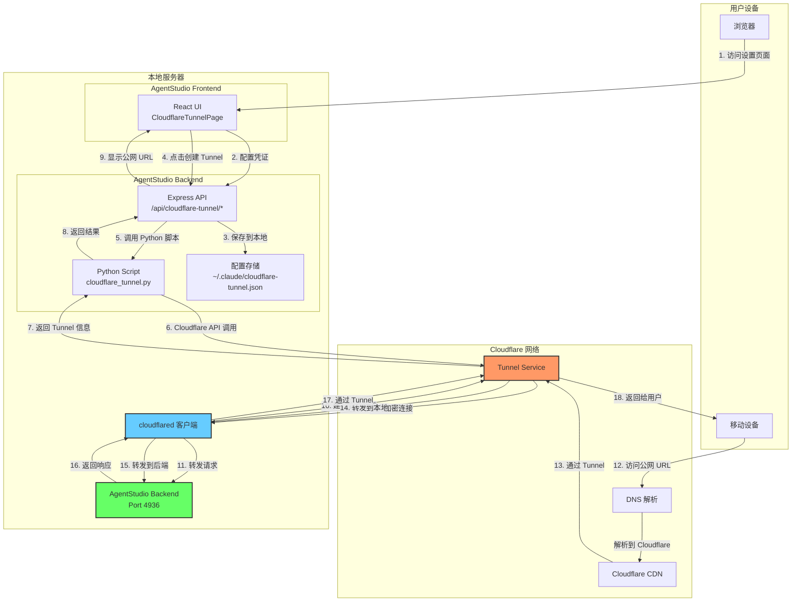
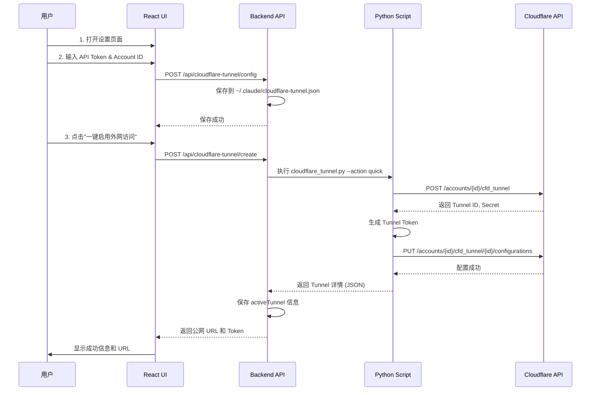
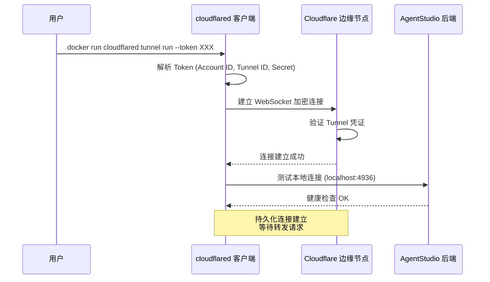
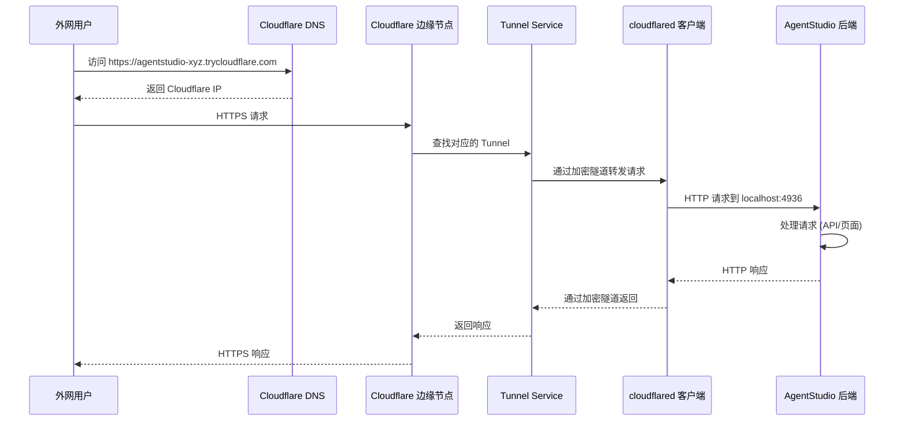
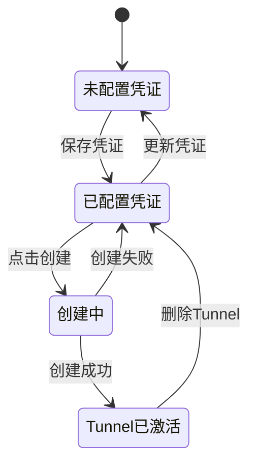
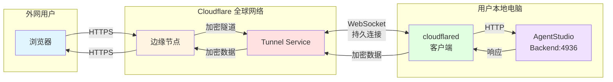
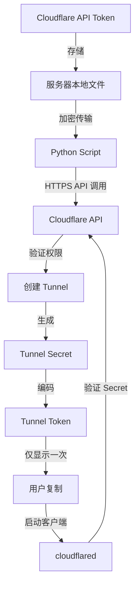
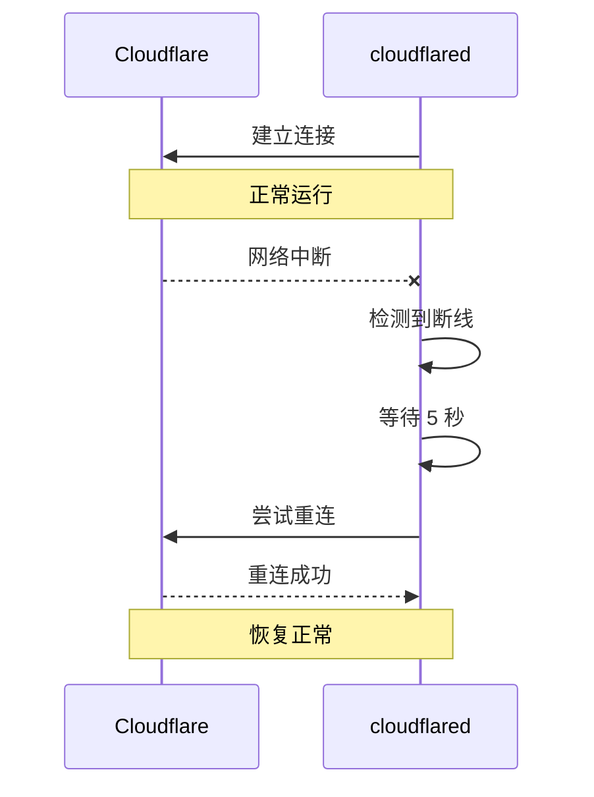

# Cloudflare Tunnel 架构设计

## 系统架构图



## 详细工作流程

### 阶段 1：配置和创建 Tunnel



### 阶段 2：启动 Tunnel 连接



### 阶段 3：外网访问流程



## 核心组件说明

### 1. Python Script (`cloudflare_tunnel.py`)

**职责**：封装 Cloudflare API 调用

**关键功能**：
- `create_tunnel()` - 创建 Tunnel 并生成凭证
- `create_dns_route()` - 配置 DNS 路由规则
- `get_tunnel_token()` - 生成 Base64 编码的 Tunnel Token
- `create_quick_tunnel()` - 一键创建完整配置

**API 调用流程**：
```python
# 1. 创建 Tunnel
POST https://api.cloudflare.com/client/v4/accounts/{account_id}/cfd_tunnel
Body: {
    "name": "agentstudio-xyz",
    "tunnel_secret": "<random_32_chars>",
    "config_src": "cloudflare"
}

# 2. 配置路由规则
PUT https://api.cloudflare.com/client/v4/accounts/{account_id}/cfd_tunnel/{tunnel_id}/configurations
Body: {
    "config": {
        "ingress": [
            {
                "hostname": "*.trycloudflare.com",
                "service": "http://localhost:4936"
            }
        ]
    }
}

# 3. 生成 Token
Base64({ "a": account_id, "t": tunnel_id, "s": tunnel_secret })
```

### 2. Backend API (`cloudflareTunnel.ts`)

**路由设计**：

| 端点 | 方法 | 功能 | 权限 |
|------|------|------|------|
| `/api/cloudflare-tunnel/config` | GET | 获取配置（脱敏） | JWT |
| `/api/cloudflare-tunnel/config` | POST | 保存 API 凭证 | JWT |
| `/api/cloudflare-tunnel/create` | POST | 创建 Tunnel | JWT |
| `/api/cloudflare-tunnel/delete/:id` | DELETE | 删除 Tunnel | JWT |
| `/api/cloudflare-tunnel/list` | GET | 列出所有 Tunnel | JWT |

**配置存储结构**：
```json
{
  "apiToken": "cloudflare_api_token_here",
  "accountId": "cloudflare_account_id_here",
  "activeTunnel": {
    "tunnelId": "abc-123-def-456",
    "tunnelName": "agentstudio-xyz789",
    "publicUrl": "https://agentstudio-xyz789.trycloudflare.com",
    "createdAt": "2025-01-14T12:00:00Z",
    "localPort": 4936
  }
}
```

### 3. Frontend UI (`CloudflareTunnelPage.tsx`)

**UI 状态机**：


**关键状态**：
- `config` - Tunnel 配置信息
- `tunnelDetails` - 新创建的 Tunnel 详情
- `loading/creating/saving` - 操作状态
- `error/success` - 消息提示

### 4. cloudflared 客户端

**作用**：在本地和 Cloudflare 之间建立安全隧道

**工作原理**：
```
┌─────────────────────────────────────────────────────────────┐
│  cloudflared 客户端                                          │
│                                                               │
│  1. 解析 Tunnel Token                                        │
│     Token = Base64({ account, tunnel_id, secret })          │
│                                                               │
│  2. 与 Cloudflare 建立 WebSocket 连接                       │
│     - 使用 TLS 加密                                          │
│     - 验证 Tunnel Secret                                     │
│     - 保持长连接                                             │
│                                                               │
│  3. 监听来自 Cloudflare 的请求                              │
│     - 接收 HTTP 请求                                         │
│     - 转发到 localhost:4936                                  │
│     - 返回响应给 Cloudflare                                  │
│                                                               │
│  4. 心跳和重连机制                                           │
│     - 定期发送心跳                                           │
│     - 断线自动重连                                           │
└─────────────────────────────────────────────────────────────┘
```

**启动命令**：
```bash
# 方式1: Docker
docker run cloudflare/cloudflared:latest tunnel run --token <TOKEN>

# 方式2: 本地安装
cloudflared tunnel run --token <TOKEN>
```

## 数据流向图



## 安全机制

### 1. 认证和授权



### 2. 数据加密

- **传输层**：所有连接使用 TLS 1.3 加密
- **隧道层**：cloudflared 使用 WebSocket + TLS
- **应用层**：外网用户访问使用 HTTPS

### 3. 访问控制

```
外网用户
    ↓
Cloudflare WAF (防火墙)
    ↓
DDoS 保护
    ↓
Tunnel Service (验证 Tunnel 存在)
    ↓
cloudflared (验证 Token)
    ↓
本地服务 (可选：JWT 认证)
```

## 性能优化

### 1. 全球边缘节点

- Cloudflare 在全球有 300+ 个数据中心
- 用户请求自动路由到最近的边缘节点
- 减少延迟，提升访问速度

### 2. 持久连接

- cloudflared 与 Cloudflare 保持长连接
- 避免每次请求重新建立连接
- 减少握手开销

### 3. 连接复用

```
单个 Tunnel 连接可以处理多个并发请求：

请求1 ──┐
请求2 ──┤
请求3 ──┼──> cloudflared <──> Cloudflare
请求4 ──┤
请求5 ──┘
```

## 故障处理

### 1. cloudflared 自动重连



### 2. 健康检查

- cloudflared 定期检查本地服务健康状态
- 如果本地服务宕机，返回 502 错误
- 服务恢复后自动继续转发

## 与传统方案对比

| 特性 | Cloudflare Tunnel | 传统端口映射 | VPN |
|------|-------------------|--------------|-----|
| 配置难度 | ⭐ 简单 | ⭐⭐⭐ 复杂 | ⭐⭐⭐⭐ 很复杂 |
| 公网 IP | ❌ 不需要 | ✅ 需要 | ✅ 需要 |
| 路由器配置 | ❌ 不需要 | ✅ 需要 | ✅ 需要 |
| 防火墙穿透 | ✅ 自动 | ❌ 手动 | ❌ 手动 |
| SSL 证书 | ✅ 自动 | ❌ 手动 | ❌ 手动 |
| DDoS 保护 | ✅ 内置 | ❌ 无 | ❌ 无 |
| 全球加速 | ✅ 是 | ❌ 否 | ❌ 否 |
| 成本 | 💰 免费 | 💰 ISP费用 | 💰💰 服务器成本 |

## 总结

Cloudflare Tunnel 的核心优势：

1. **无需公网 IP** - 适合家庭宽带
2. **零配置穿透** - 自动穿透 NAT 和防火墙
3. **全球加速** - 利用 Cloudflare CDN
4. **安全可靠** - 端到端加密 + DDoS 防护
5. **一键部署** - 从创建到运行只需几分钟

整个系统的精髓在于：**将复杂的网络配置交给 Cloudflare 处理，开发者只需关注应用本身**。
