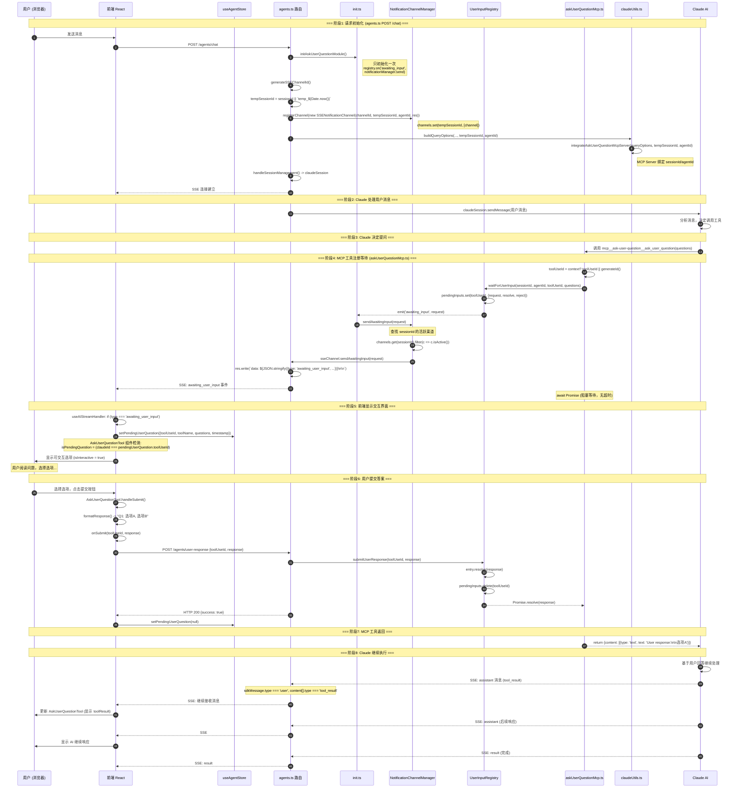
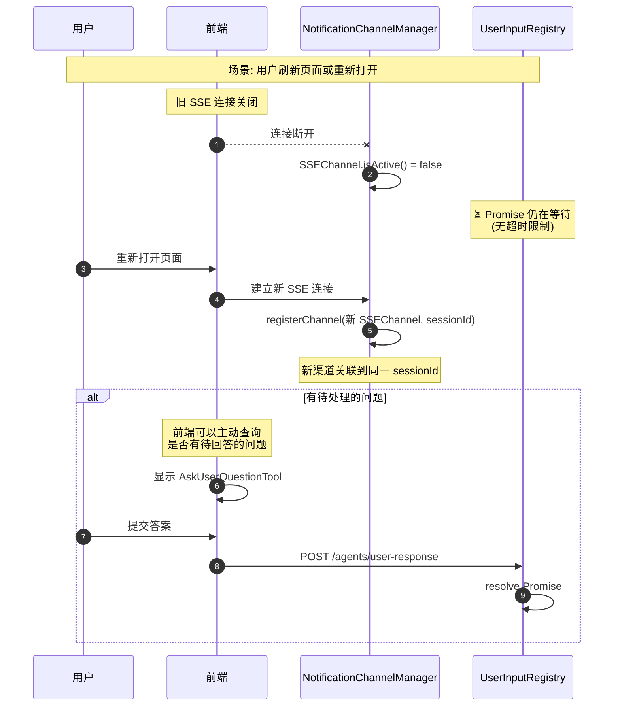
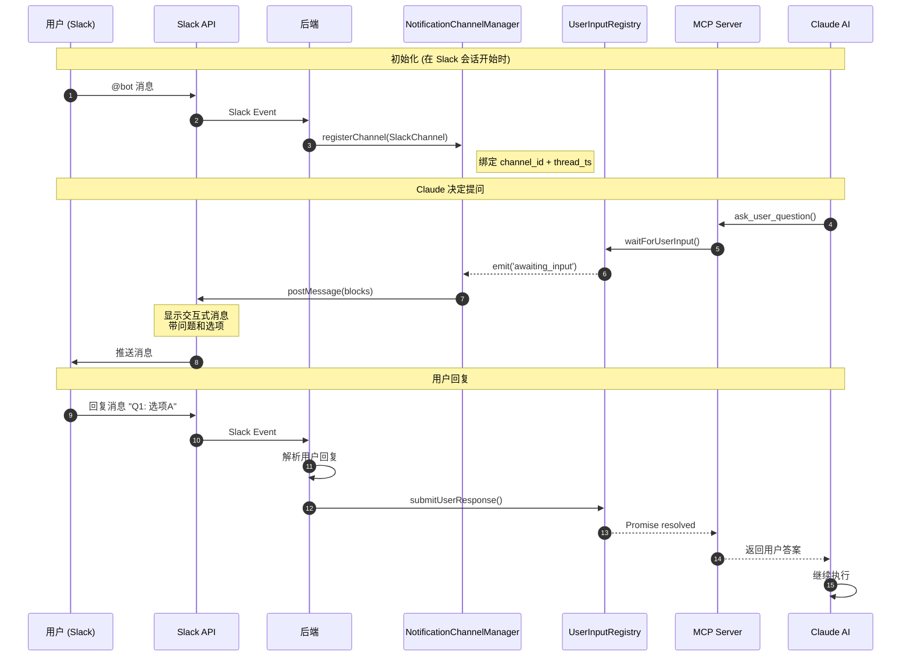

# AskUserQuestion 功能架构设计文档

## 概述

AskUserQuestion 是一个允许 AI Agent 在执行过程中向用户提问并等待回答的功能。不同于 Claude Code CLI 中的原生实现，本系统通过 MCP (Model Context Protocol) Server 实现，支持多种通知渠道（Web SSE、Slack、企业微信等）。

### 核心特性

- ✅ **多渠道通知**: 支持 SSE (Web)、Slack 等多种通知方式
- ✅ **无超时限制**: MCP 工具可以一直等待，直到用户响应
- ✅ **断线重连**: 支持浏览器刷新或重连后继续等待
- ✅ **Session 级别路由**: 基于 sessionId 路由通知，而非连接 ID
- ✅ **事件驱动**: MCP 工具与通知渠道解耦

---

## 架构设计

### 组件总览（最新）

```
┌─────────────────────────────────────────────────────────────────────────────────────────────────────┐
│                                    AskUserQuestion 完整架构                                          │
├─────────────────────────────────────────────────────────────────────────────────────────────────────┤
│                                                                                                     │
│  ┌────────────────────────────────────────────────────────────────────────────────────────────────┐ │
│  │                                    后端 (Backend)                                               │ │
│  │                                                                                                 │ │
│  │   ┌──────────────────┐     ┌─────────────────────┐      ┌──────────────────────────────────┐   │ │
│  │   │ agents.ts 路由    │     │ claudeUtils.ts      │      │ init.ts (事件连接)                │   │ │
│  │   │                  │     │                     │      │                                  │   │ │
│  │   │ POST /chat       │────▶│ buildQueryOptions() │      │ userInputRegistry.on(            │   │ │
│  │   │ - 初始化模块       │     │ - 集成 MCP Server   │      │   'awaiting_input', (req) =>     │   │ │
│  │   │ - 注册 SSE 渠道   │     │                     │      │   notificationManager.send(req)  │   │ │
│  │   │ - 更新 sessionId  │     └─────────────────────┘      │ )                                │   │ │
│  │   │                  │               │                   └──────────────────────────────────┘   │ │
│  │   │ POST /user-      │               ▼                              ▲                          │ │
│  │   │    response      │     ┌─────────────────────┐                  │ 事件驱动                   │ │
│  │   │ - 提交用户响应    │────▶│ askUserQuestionMcp  │                  │                          │ │
│  │   └──────────────────┘     │                     │      ┌───────────┴──────────────────────┐   │ │
│  │             │              │ MCP Server          │      │ UserInputRegistry (单例)          │   │ │
│  │             │              │ - 绑定 sessionId    │──────│                                  │   │ │
│  │             │              │ - 调用 registry     │      │ - Map<toolUseId, PendingInput>   │   │ │
│  │             │              │ - 阻塞等待 Promise  │      │ - waitForUserInput(): Promise    │   │ │
│  │             │              └─────────────────────┘      │ - submitUserResponse(): resolve  │   │ │
│  │             │                                           │ - emit('awaiting_input', req)    │   │ │
│  │             │                                           └──────────────────────────────────┘   │ │
│  │             │                                                       ▲                          │ │
│  │             │ submitUserResponse(toolUseId, response)               │                          │ │
│  │             └───────────────────────────────────────────────────────┘                          │ │
│  │                                                                                                 │ │
│  │   ┌──────────────────────────────────────────────────────────────────────────────────────────┐ │ │
│  │   │                         NotificationChannelManager (单例)                                 │ │ │
│  │   │                                                                                          │ │ │
│  │   │   Map<sessionId, NotificationChannel[]>                                                  │ │ │
│  │   │                                                                                          │ │ │
│  │   │   ┌────────────────────┐    ┌────────────────────┐    ┌────────────────────┐            │ │ │
│  │   │   │ SSENotification    │    │ SlackNotification  │    │ (可扩展)            │            │ │ │
│  │   │   │ Channel            │    │ Channel            │    │ WeChatChannel 等    │            │ │ │
│  │   │   │                    │    │                    │    │                    │            │ │ │
│  │   │   │ - res.write(SSE)   │    │ - Slack postMsg    │    │ - 实现接口即可       │            │ │ │
│  │   │   │ - isActive()       │    │ - 解析用户回复     │    │                    │            │ │ │
│  │   │   └────────────────────┘    └────────────────────┘    └────────────────────┘            │ │ │
│  │   └──────────────────────────────────────────────────────────────────────────────────────────┘ │ │
│  └────────────────────────────────────────────────────────────────────────────────────────────────┘ │
│                                              │ SSE                                                  │
│                                              ▼                                                      │
│  ┌────────────────────────────────────────────────────────────────────────────────────────────────┐ │
│  │                                    前端 (Frontend)                                              │ │
│  │                                                                                                 │ │
│  │   ┌───────────────────────────┐    ┌───────────────────────────────────────────────────────┐   │ │
│  │   │ useAIStreamHandler.ts     │    │ useAgentStore.ts                                       │   │ │
│  │   │                           │    │                                                        │   │ │
│  │   │ if (type === 'awaiting_   │───▶│ pendingUserQuestion: {                                 │   │ │
│  │   │     user_input') {        │    │   toolUseId: string,                                   │   │ │
│  │   │   setPendingUserQuestion  │    │   toolName: string,                                    │   │ │
│  │   │     (...)                 │    │   questions: Question[],                               │   │ │
│  │   │ }                         │    │   timestamp: number                                    │   │ │
│  │   └───────────────────────────┘    │ } | null                                               │   │ │
│  │                                    │                                                        │   │ │
│  │                                    │ setPendingUserQuestion(question | null)                │   │ │
│  │                                    └───────────────────────────────────────────────────────┘   │ │
│  │                                                     │                                          │ │
│  │                                                     ▼                                          │ │
│  │   ┌───────────────────────────────────────────────────────────────────────────────────────┐   │ │
│  │   │ AskUserQuestionTool.tsx (UI 组件)                                                      │   │ │
│  │   │                                                                                        │   │ │
│  │   │   - 监听 pendingUserQuestion 状态                                                      │   │ │
│  │   │   - 通过 claudeId 匹配当前工具                                                          │   │ │
│  │   │   - 渲染可交互选项 (isInteractive = isPendingQuestion && !toolResult)                   │   │ │
│  │   │   - 管理选择状态 (selections: Map<questionIndex, selectedLabels[]>)                     │   │ │
│  │   │   - 提交时调用 onSubmit(toolUseId, formattedResponse)                                   │   │ │
│  │   └───────────────────────────────────────────────────────────────────────────────────────┘   │ │
│  │                                      │                                                         │ │
│  │                                      ▼ onSubmit                                                │ │
│  │   ┌───────────────────────────────────────────────────────────────────────────────────────┐   │ │
│  │   │ AgentChatPanel.tsx                                                                     │   │ │
│  │   │                                                                                        │   │ │
│  │   │   handleAskUserQuestionSubmit(toolUseId, response) {                                   │   │ │
│  │   │     await authFetch('/agents/user-response', { toolUseId, response });                 │   │ │
│  │   │     setPendingUserQuestion(null);                                                      │   │ │
│  │   │   }                                                                                    │   │ │
│  │   └───────────────────────────────────────────────────────────────────────────────────────┘   │ │
│  └────────────────────────────────────────────────────────────────────────────────────────────────┘ │
└─────────────────────────────────────────────────────────────────────────────────────────────────────┘
```

### 核心组件

| 组件 | 文件 | 职责 |
|------|------|------|
| **UserInputRegistry** | `userInputRegistry.ts` | 管理等待用户输入的 Promise，发出事件，单例 |
| **NotificationChannelManager** | `notificationChannel.ts` | 管理所有通知渠道，按 sessionId 路由通知，单例 |
| **SSENotificationChannel** | `sseNotificationChannel.ts` | Web 浏览器 SSE 通知实现 |
| **SlackNotificationChannel** | `slackNotificationChannel.ts` | Slack 消息通知实现 |
| **MCP Server** | `askUserQuestionMcp.ts` | Claude SDK MCP 工具实现，绑定 sessionId |
| **初始化模块** | `init.ts` | 建立事件连接（只初始化一次） |
| **集成函数** | `askUserQuestionIntegration.ts` | 将 MCP Server 集成到 queryOptions |

### 前端组件

| 组件 | 文件 | 职责 |
|------|------|------|
| **useAgentStore** | `stores/useAgentStore.ts` | 存储 pendingUserQuestion 状态 |
| **useAIStreamHandler** | `hooks/agentChat/useAIStreamHandler.ts` | 处理 `awaiting_user_input` SSE 事件 |
| **AskUserQuestionTool** | `components/tools/AskUserQuestionTool.tsx` | 渲染可交互的问题选项 UI |
| **AgentChatPanel** | `components/AgentChatPanel.tsx` | 处理用户提交，调用后端 API |

---

## 时序流程图

### 完整交互流程（Web SSE）- 与实际代码对照



### 断线重连流程



### Slack 渠道流程



---

## 文件结构

### 后端文件

```
backend/src/services/askUserQuestion/
├── index.ts                      # 模块入口，导出所有组件
├── init.ts                       # 模块初始化，建立事件连接 (单例)
├── notificationChannel.ts        # 通知渠道接口 + NotificationChannelManager (单例)
├── sseNotificationChannel.ts     # SSE 渠道实现 (Web)
├── slackNotificationChannel.ts   # Slack 渠道实现
├── userInputRegistry.ts          # 用户输入 Promise 管理 (单例)
├── askUserQuestionMcp.ts         # MCP 工具实现
└── askUserQuestionIntegration.ts # Claude SDK 集成函数

backend/src/routes/agents.ts      # (修改) POST /chat 和 POST /user-response
backend/src/utils/claudeUtils.ts  # (修改) buildQueryOptions 集成 MCP server
```

### 前端文件

```
frontend/src/
├── stores/
│   └── useAgentStore.ts              # (修改) pendingUserQuestion 状态
├── hooks/agentChat/
│   └── useAIStreamHandler.ts         # (修改) 处理 awaiting_user_input 事件
├── components/
│   ├── AgentChatPanel.tsx            # (修改) handleAskUserQuestionSubmit
│   ├── ChatMessageRenderer.tsx       # (修改) 传递 onAskUserQuestionSubmit
│   ├── ToolUsage.tsx                 # (修改) 传递 onAskUserQuestionSubmit
│   ├── agentChat/ChatMessageList.tsx # (修改) 传递 onAskUserQuestionSubmit
│   └── tools/
│       ├── ToolRenderer.tsx          # (修改) 识别 MCP 工具名，传递回调
│       └── AskUserQuestionTool.tsx   # (修改) 可交互 UI，选项管理，提交
└── i18n/locales/
    ├── en-US/components.json         # (修改) 添加翻译
    └── zh-CN/components.json         # (修改) 添加翻译
```

---

## API 参考

### MCP 工具参数

```typescript
interface AskUserQuestionInput {
  questions: Array<{
    question: string;      // 问题文本
    header: string;        // 短标签 (最多12字符)
    options: Array<{
      label: string;       // 选项标签
      description: string; // 选项描述
    }>;
    multiSelect: boolean;  // 是否多选
  }>;
}
```

**限制:**
- `questions`: 1-4 个问题
- `options`: 每个问题 2-4 个选项
- `header`: 最多 12 个字符

### HTTP API

#### 提交用户响应

```http
POST /agents/user-response
Content-Type: application/json

{
  "toolUseId": "ask_1234567890_abc123",
  "response": "选项A"
}
```

**响应:**
```json
{
  "success": true,
  "message": "User response submitted successfully"
}
```

### SSE 事件

#### awaiting_user_input

当 AI 需要用户输入时发送：

```json
{
  "type": "awaiting_user_input",
  "toolUseId": "ask_1234567890_abc123",
  "toolName": "mcp__ask-user-question__ask_user_question",
  "toolInput": {
    "questions": [
      {
        "question": "你想使用哪种认证方式？",
        "header": "认证方式",
        "options": [
          {"label": "JWT", "description": "JSON Web Token"},
          {"label": "Session", "description": "传统会话认证"}
        ],
        "multiSelect": false
      }
    ]
  },
  "agentId": "claude-code",
  "sessionId": "session_abc123",
  "timestamp": 1702345678000
}
```

---

## 使用示例

### 在后端注册 SSE 渠道（实际代码 agents.ts）

```typescript
import { 
  userInputRegistry,
  notificationChannelManager, 
  SSENotificationChannel, 
  generateSSEChannelId,
  initAskUserQuestionModule 
} from '../services/askUserQuestion/index.js';

router.post('/chat', async (req, res) => {
  // 🎤 初始化 AskUserQuestion 模块（只会初始化一次）
initAskUserQuestionModule();
  
  // 🎤 生成 SSE channel ID（用于通知渠道管理）
  const sseChannelId = generateSSEChannelId();
  
  // 注意：SSE channel 需要 sessionId，但新会话还没有 sessionId
  // 我们使用临时 ID，稍后在收到 Claude SDK 的 sessionId 时更新
  const tempSessionId = sessionId || `temp_${Date.now()}`;
  const sseChannel = new SSENotificationChannel(sseChannelId, tempSessionId, agentId, res);
  notificationChannelManager.registerChannel(sseChannel);
  
  // 构建查询选项（包含 AskUserQuestion MCP 工具）
  const queryOptions = await buildQueryOptions(
    agent, projectPath, mcpTools, permissionMode, model, 
    claudeVersion, undefined, envVars, 
    tempSessionId, agentId  // <- 这两个参数用于 AskUserQuestion
  );
  
  // 当收到真实 sessionId 时更新渠道
  // (在 SSE 消息处理中)
  if (tempSessionId !== responseSessionId) {
    notificationChannelManager.updateChannelSession(sseChannelId, responseSessionId);
  }
  
  // ... 继续处理请求
});

// POST /agents/user-response - 用户提交答案
router.post('/user-response', async (req, res) => {
  const { toolUseId, response } = req.body;
  
  const success = userInputRegistry.submitUserResponse(toolUseId, response);
  
  if (success) {
    res.json({ success: true, message: 'User response submitted successfully' });
  } else {
    res.status(404).json({ success: false, error: 'No pending input found' });
  }
});
```

### 在后端注册 Slack 渠道

```typescript
import { 
  notificationChannelManager, 
  SlackNotificationChannel 
} from '../services/askUserQuestion';

// 在 Slack 消息处理中
async function handleSlackMessage(event: SlackEvent) {
  const slackChannel = new SlackNotificationChannel(
    slackClient,         // SlackClient 实例
    event.channel,       // Slack channel ID
    event.thread_ts,     // Thread timestamp
    sessionId,           // 会话 ID
    agentId              // Agent ID
  );
  
  notificationChannelManager.registerChannel(slackChannel);
}
```

### 前端处理 awaiting_user_input（实际代码 useAIStreamHandler.ts）

```typescript
// hooks/agentChat/useAIStreamHandler.ts

const { setPendingUserQuestion } = useAgentStore();

// 在 SSE 消息处理中
if (eventData.type === 'awaiting_user_input') {
  console.log('🎤 [AskUserQuestion] Received awaiting_user_input event:', eventData);
  
  const awaitingData = eventData as any;
  
  // 设置待回答的问题到 store
  setPendingUserQuestion({
    toolUseId: awaitingData.toolUseId,
    toolName: awaitingData.toolName,
    questions: awaitingData.toolInput?.questions || [],
    timestamp: Date.now()
  });
  
  // 不停止 AI 输入状态 - MCP 工具正在阻塞等待，Claude session 仍在运行
  // 当用户提交答案后，MCP 工具会返回，Claude 会继续执行
  return;
}
```

### 前端 Store 状态（实际代码 useAgentStore.ts）

```typescript
// stores/useAgentStore.ts

interface PendingUserQuestion {
  toolUseId: string;
  toolName: string;
  questions: Array<{
    question: string;
    options: Array<{ label: string; description?: string }>;
    multiSelect?: boolean;
    header?: string;
  }>;
  timestamp: number;
}

interface AgentState {
  // ... 其他状态
  pendingUserQuestion: PendingUserQuestion | null;
  setPendingUserQuestion: (question: PendingUserQuestion | null) => void;
}
```

### 前端 AskUserQuestionTool 组件（实际代码）

```typescript
// components/tools/AskUserQuestionTool.tsx

export const AskUserQuestionTool: React.FC<{ execution: BaseToolExecution; onSubmit?: Function }> = ({ execution, onSubmit }) => {
  const pendingUserQuestion = useAgentStore(state => state.pendingUserQuestion);
  const [selections, setSelections] = useState<Map<number, string[]>>(new Map());
  
  // 检查这个工具是否是当前待回答的问题（通过 claudeId 匹配）
  const isPendingQuestion = useMemo(() => {
    if (!pendingUserQuestion) return false;
    const claudeId = (execution as any).claudeId;
    return claudeId === pendingUserQuestion.toolUseId;
  }, [pendingUserQuestion, execution]);

  // 检查是否可以交互（只有待回答的问题才能交互）
  const isInteractive = isPendingQuestion && !execution.toolResult && !isSubmitting;

  // 提交回答
  const handleSubmit = async () => {
    const response = formatResponse(); // 格式化选择为字符串
    await onSubmit(pendingUserQuestion.toolUseId, response);
  };
  
  // 渲染选项，显示提交按钮...
};
```

### 前端提交用户响应（实际代码 AgentChatPanel.tsx）

```typescript
// components/AgentChatPanel.tsx

const { setPendingUserQuestion } = useAgentStore();

const handleAskUserQuestionSubmit = async (toolUseId: string, response: string) => {
  console.log('🎤 [AskUserQuestion] Submitting response for tool:', toolUseId);

  try {
  const apiResponse = await authFetch(`${API_BASE}/agents/user-response`, {
    method: 'POST',
    headers: { 'Content-Type': 'application/json' },
    body: JSON.stringify({ toolUseId, response }),
  });

    if (!apiResponse.ok) {
      const errorData = await apiResponse.json().catch(() => ({}));
      throw new Error(errorData.error || `HTTP ${apiResponse.status}`);
    }

    console.log('✅ [AskUserQuestion] Response submitted successfully');
    
    // 清除待回答的问题状态
    // MCP 工具会返回结果，Claude 会继续执行，SSE 会继续接收消息
    setPendingUserQuestion(null);
    
  } catch (error) {
    console.error('🎤 [AskUserQuestion] Submit failed:', error);
    // 提交失败时不清除待回答状态，让用户可以重试
  }
};

// 传递回调到组件链路
<ChatMessageList onAskUserQuestionSubmit={handleAskUserQuestionSubmit} />
```

---

## 扩展指南

### 添加新的通知渠道

1. **实现 `NotificationChannel` 接口**

```typescript
import type { NotificationChannel, UserInputRequest, ChannelType } from './notificationChannel';

export class WeChatNotificationChannel implements NotificationChannel {
  type: ChannelType = 'wechat';
  channelId: string;
  sessionId: string;
  agentId: string;
  createdAt: number;

  constructor(/* ... */) {
    // 初始化
  }

  isActive(): boolean {
    // 检查渠道是否活跃
  }

  async sendAwaitingInput(request: UserInputRequest): Promise<boolean> {
    // 发送通知到企业微信
  }

  close(): void {
    // 关闭渠道
  }
}
```

2. **在 `index.ts` 中导出**

```typescript
export { WeChatNotificationChannel } from './wechatNotificationChannel';
```

3. **在适当的地方注册渠道**

```typescript
const wechatChannel = new WeChatNotificationChannel(/* ... */);
notificationChannelManager.registerChannel(wechatChannel);
```

---

## 注意事项

### Session 管理

- MCP server 在创建时绑定 `sessionId`
- 新会话使用临时 ID，在收到 Claude SDK 的真实 `session_id` 后更新
- 渠道通过 `sessionId` 路由，而非连接 ID

### 无超时设计

- Promise 不设置超时，允许一直等待
- 用户可以随时响应，即使隔天再回来
- 如需取消，可调用 `userInputRegistry.cancelUserInput(toolUseId)`

### 多渠道支持

- 同一 `sessionId` 可以有多个活跃渠道
- 通知会发送到所有活跃渠道
- 任意渠道的响应都会 resolve Promise

---

## 故障排查

### 问题：通知未发送

**检查步骤:**
1. 确认 `initAskUserQuestionModule()` 已调用
2. 检查渠道是否正确注册到 `notificationChannelManager`
3. 确认 `sessionId` 匹配

**日志关键字:**
```
📡 [NotificationManager] Registered ... channel for session: xxx
📡 [UserInputRegistry] Emitting awaiting_input event
✅ [NotificationManager] Sent notification via ...
```

### 问题：用户响应未处理

**检查步骤:**
1. 确认 `toolUseId` 正确
2. 检查 `userInputRegistry` 是否有对应的 pending entry

**日志关键字:**
```
📝 [UserInputRegistry] Registering pending input for tool: xxx
📤 [UserInputRegistry] Submitting user response for tool: xxx
✅ [UserInputRegistry] Resolved input for tool: xxx
```

### 问题：断线重连后丢失状态

**原因:** 前端状态在页面刷新后丢失

**解决方案:**
1. 将 `pendingUserQuestion` 状态持久化到 localStorage
2. 或在重连后查询后端是否有待处理的问题

---

## 关键实现细节

### 1. Session ID 管理

新会话在创建时还没有真正的 Claude Session ID，代码使用临时 ID 的策略：

```typescript
// agents.ts
const tempSessionId = sessionId || `temp_${Date.now()}`;

// 当收到 Claude SDK 返回的真实 sessionId 时更新
if (tempSessionId !== responseSessionId) {
  notificationChannelManager.updateChannelSession(sseChannelId, responseSessionId);
}
```

### 2. MCP Server 绑定 Session

每个 chat 请求都会创建一个新的 MCP Server 实例，绑定当前的 sessionId 和 agentId：

```typescript
// askUserQuestionMcp.ts
export async function createAskUserQuestionMcpServer(sessionId: string, agentId: string) {
  const askUserQuestionTool = tool(
    'ask_user_question',
    TOOL_DESCRIPTION,
    schema,
    async (args, context) => {
      // sessionId 和 agentId 通过闭包捕获
      const userResponse = await userInputRegistry.waitForUserInput(
        sessionId, agentId, toolUseId, args.questions
      );
      return { content: [{ type: 'text', text: `User response:\n\n${userResponse}` }] };
    }
  );
}
```

### 3. 组件链路传递回调

`onAskUserQuestionSubmit` 回调需要从 `AgentChatPanel` 一路传递到 `AskUserQuestionTool`：

```
AgentChatPanel
  └── ChatMessageList (onAskUserQuestionSubmit)
        └── ChatMessageRenderer (onAskUserQuestionSubmit)
              └── ToolUsage (onAskUserQuestionSubmit)
                    └── ToolRenderer (onAskUserQuestionSubmit)
                          └── AskUserQuestionTool (onSubmit)
```

### 4. 工具匹配逻辑

前端需要判断当前工具是否是待回答的问题：

```typescript
// AskUserQuestionTool.tsx
const isPendingQuestion = useMemo(() => {
  if (!pendingUserQuestion) return false;
  // 通过 claudeId 匹配（claudeId 直接在 execution 对象上）
  const claudeId = (execution as any).claudeId;
  return execution.toolInput && claudeId === pendingUserQuestion.toolUseId;
}, [pendingUserQuestion, execution]);
```

`claudeId` 对应的是 Claude SDK 返回的 `tool_use_id`（如 `toolu_01xxx`）。

---

## 版本历史

| 版本 | 日期 | 变更 |
|------|------|------|
| 1.1.0 | 2024-12 | 更新架构文档，添加前端组件详情，同步最新代码实现 |
| 1.0.0 | 2024-12 | 初始实现：事件驱动架构，支持 SSE 和 Slack 渠道 |


